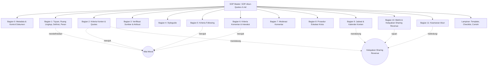
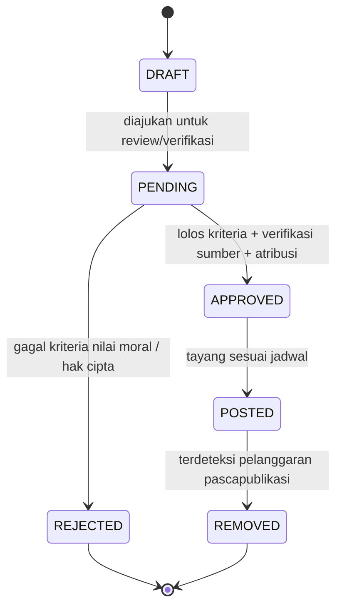
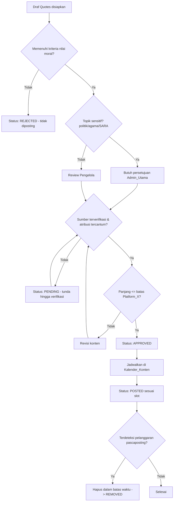
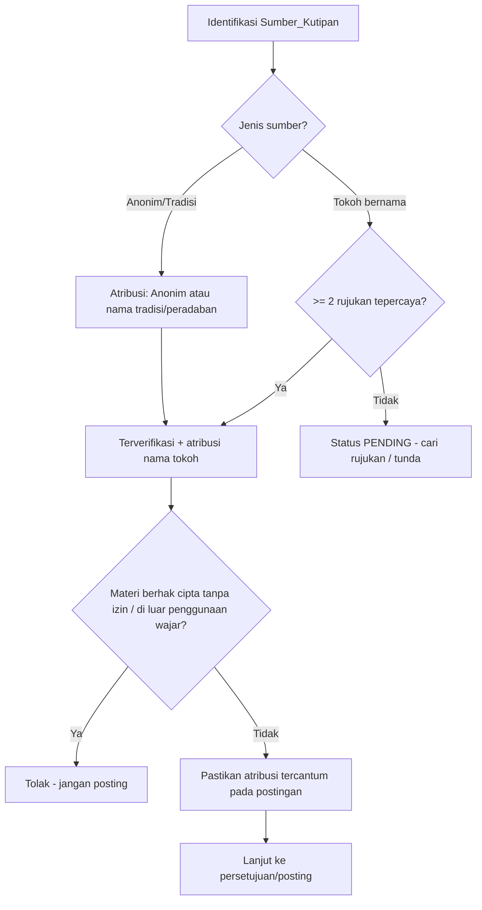
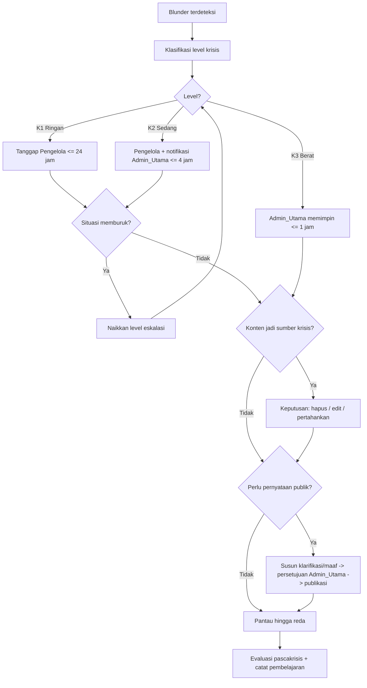
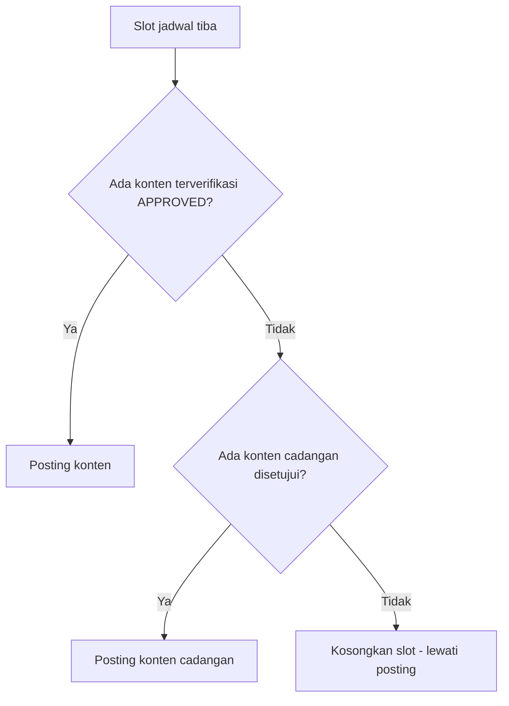

# Design Document

## Overview

Dokumen desain ini merancang **struktur dan pendekatan penyusunan dokumen SOP** untuk pengelolaan Akun_Quotes di Platform_X. Berbeda dengan spec perangkat lunak, keluaran akhir project ini adalah **artefak dokumentasi** (file Markdown), bukan kode. Oleh karena itu, "desain" di sini berarti:

- Rancangan **filosofi dan prinsip** yang memandu penulisan SOP.
- Rancangan **struktur/outline dokumen SOP final** dan pemetaannya ke-15 requirement.
- Rancangan **pendekatan konten** untuk setiap area operasional (konten, verifikasi sumber, styleguide, following, interaksi, moderasi, krisis, jadwal, metrik, keamanan).
- Rancangan **alur kerja (decision flow)**, **template**, **matriks peran**, dan **model data ringan** yang akan dituangkan ke dalam SOP.
- Rancangan **properti korektness** yang harus dipenuhi dokumen/prosedur SOP, yang diverifikasi melalui checklist review manusia (bukan pengujian otomatis).

### Filosofi Desain Dokumen SOP

SOP ini dibangun di atas empat prinsip yang tercermin langsung dalam strukturnya:

1. **Nilai moral sebagai poros.** Setiap area (konten, interaksi, following, moderasi) dirujuk kembali ke satu definisi "nilai moral" yang ditetapkan di bagian awal SOP, sehingga tidak ada aturan turunan yang bertentangan dengan prinsip inti. Struktur dokumen menempatkan definisi nilai moral sebagai *single source of truth* yang direferensikan seluruh bagian.
2. **Kelayakan sharing revenue sebagai tujuan terukur.** SOP menautkan aturan operasional (konsistensi posting, kualitas interaksi, keamanan) ke Metrik_Kelayakan yang menjadi syarat Program_Sharing_Revenue. Tujuan monetisasi tidak berdiri sendiri di satu bagian, melainkan disambungkan ke sebab operasionalnya.
3. **Dapat dijalankan dan diverifikasi.** Setiap ketentuan ditulis sebagai aturan yang dapat dicek keberadaannya dan dijalankan oleh Pengelola. Struktur SOP menyediakan checklist dan template agar aturan tidak berhenti sebagai pernyataan normatif.
4. **Aman gagal (fail-safe) dan progresif.** Ketika sebuah aturan/proses belum lengkap (mis. aturan terjemahan, proses peninjauan Admin_Utama), SOP mendefinisikan perilaku default yang aman: memblokir/menunda tindakan berisiko sambil menandai bagian yang belum lengkap untuk dilengkapi kemudian. Ini memungkinkan SOP dipakai bertahap tanpa mengorbankan keamanan reputasi.

### Cakupan

- **Termasuk:** Struktur dokumen, pendekatan tiap area, alur keputusan, template, matriks peran, model data ringan (status/level), properti korektness, dan rencana file keluaran.
- **Tidak termasuk:** Implementasi perangkat lunak, otomasi teknis, atau integrasi API Platform_X. Frasa "pemicuan otomatis" pada Requirement 10 dipahami sebagai *aturan/trigger prosedural* dalam SOP, bukan otomasi kode.

## Architecture

### Arsitektur Informasi Dokumen

Karena keluaran berupa dokumentasi, "arsitektur" di sini adalah **arsitektur informasi**: bagaimana bagian-bagian SOP disusun, saling merujuk, dan diberi versi.



### Pemetaan Struktur SOP ke Requirement

| Bagian SOP | Judul | Requirement yang dipenuhi |
|---|---|---|
| Bagian 0 | Metadata & Kontrol Dokumen (versi, tanggal berlaku, persetujuan, riwayat perubahan) | R1.3, R1.4, R1.5 |
| Bagian 1 | Tujuan, Ruang Lingkup, Definisi Istilah, Pihak Bertanggung Jawab | R1.1, R1.2 |
| Bagian 2 | Kriteria Konten & Quotes yang Diposting | R2.1–R2.7 |
| Bagian 3 | Verifikasi Sumber & Atribusi Kutipan | R3.1–R3.6 |
| Bagian 4 | Format Penulisan & Tata Bahasa (Styleguide) | R4.1–R4.8 |
| Bagian 5 | Kriteria Akun yang Diikuti (Following) | R5.1–R5.6 |
| Bagian 6 | Kriteria Isi Komentar & Interaksi | R6.1–R6.7 |
| Bagian 7 | Moderasi Komentar | R7.1–R7.5 |
| Bagian 8 | Prosedur Eskalasi Krisis | R8.1–R8.6 |
| Bagian 9 | Jadwal Posting & Kalender Konten | R9.1–R9.6 |
| Bagian 10 | Metrik & Kelayakan Program Sharing Revenue | R10.1–R10.7 |
| Bagian 11 | Keamanan Akun | R11.1–R11.6 |
| Lampiran (`operasional-konten/`) | Template, Checklist, Contoh Format, Log Pembelajaran (berkas `lampiran-template.md`, `lampiran-checklist.md`, `lampiran-contoh.md` berada di `operasional-konten/`) | Pendukung R2, R3, R4, R8 |
| Lampiran (`operasional-konten/lampiran-monetisasi-x.md`) | Peraturan Boleh & Tidak Boleh Monetisasi (acuan Content Monetization Standards X) | R10.7 (mendukung R10.1, R10.6) |
| Bisnis (`operasional-bisnis/modal-dan-bagi-hasil.md`) | Modal Awal, Dana Cadangan Langganan & Sistem Bagi Hasil (SOP-B.1–SOP-B.5) | R12.1–R12.5 |
| Bisnis (`operasional-bisnis/ketentuan-bisnis.md`) | Kepemilikan, peran Founder, pengeluaran, pencatatan, tata kelola/sengketa (SOP-B.6–SOP-B.10) | R12.6–R12.10 |
| Legal (`legal-kepatuhan/kebijakan-hak-cipta-privasi.md`) | Hak cipta & fair use, klaim/takedown, perlindungan data pribadi/UU PDP, disclosure iklan, disclaimer (SOP-L.1–SOP-L.5) | R13.1–R13.5 |
| Legal (`legal-kepatuhan/kebijakan-penggunaan-ai.md`) | Ruang lingkup AI, verifikasi wajib, larangan, keaslian/tanggung jawab manusia, privasi data pada alat AI (SOP-AI.1–SOP-AI.5) | R14.1–R14.5 |
| Konten (`operasional-konten/panduan-brand-identitas.md`) | Identitas verbal, identitas visual, bio profil, konsistensi/Template_Baku, do & don't visual (SOP-BR.1–SOP-BR.5) | R15.1–R15.5 |

### Prinsip Penomoran & Hierarki Heading

- Heading level 1 (`#`): Judul dokumen SOP.
- Heading level 2 (`##`): Bagian bernomor (`## Bagian N: ...`).
- Heading level 3 (`###`): Sub-aturan bernomor `N.x`.
- Setiap aturan operasional diberi ID stabil `SOP-N.x` agar dapat dirujuk silang dari checklist, template, dan riwayat revisi.
- Setiap aturan menyertakan anotasi keterlacakan ke requirement, format: `(Requirement R{n}.{m})`.

### Model Kontrol Dokumen & Versi

- **Header dokumen** memuat: Nomor Versi (semver dokumen, mis. `v1.0.0`), Tanggal Berlaku, Pihak yang Menyetujui (Admin_Utama).
- **Tabel Riwayat Perubahan** memuat kolom: Tanggal, Versi, Ringkasan Perubahan, Penanggung Jawab Revisi.
- **Penanda ketidaklengkapan**: bagian yang belum lengkap ditandai `> [TODO: <deskripsi>]`. Revisi tetap boleh disimpan meskipun riwayat perubahan belum lengkap, namun penanda ketidaklengkapan wajib selalu ditegakkan pada setiap bagian yang belum selesai (R1.5).

## Components and Interfaces

Karena SOP adalah dokumen, "komponen" adalah **modul aturan** dan "interface" adalah **titik integrasi antaraturan** (referensi silang, gerbang keputusan, dan artefak bersama seperti status Quotes atau level Krisis). Berikut pendekatan tiap area.

### Bagian 1 — Tujuan, Ruang Lingkup, Definisi, Peran (R1)

- Menyajikan tujuan project (kelayakan & optimasi sharing revenue berlandaskan nilai moral), ruang lingkup, dan glosarium (mengadopsi Glossary requirements).
- Menetapkan **matriks peran & wewenang** sebagai antarmuka bersama yang dirujuk seluruh bagian (lihat Data Models).
- Menegaskan daftar bagian wajib SOP (R1.2) sebagai daftar isi kontraktual.

### Bagian 2 — Kriteria Konten & Quotes (R2)

- **Definisi nilai moral** dan larangan mutlak (ujaran kebencian, diskriminasi SARA, pornografi) — R2.1.
- **Daftar tema diizinkan vs dilarang** dalam bentuk tabel dua kolom — R2.2.
- **Gerbang topik sensitif**: Quotes bertopik politik/agama/isu sensitif memerlukan persetujuan Admin_Utama — R2.3.
- **Aturan penolakan pra-posting** untuk Quotes yang gagal kriteria — R2.4.
- **Prosedur penghapusan pascapublikasi** dengan batas waktu eksplisit (mis. hapus ≤ 60 menit sejak terdeteksi) — R2.5.
- **Batas panjang karakter** selaras batas Platform_X — R2.6.
- **Gerbang persetujuan wajib**: setiap Quotes harus menyelesaikan proses persetujuan sebelum tayang, termasuk yang sudah lolos kriteria namun masih menunggu review (status PENDING → APPROVED → POSTED) — R2.7.

Interface utama bagian ini adalah **status lifecycle Quotes** (lihat Data Models) yang juga dipakai Bagian 3 dan Bagian 9.

### Bagian 3 — Verifikasi Sumber & Atribusi (R3)

- **Tokoh bernama**: verifikasi minimal dua rujukan tepercaya sebelum posting — R3.1.
- **Sumber anonim/tradisi**: atribusi "Anonim" atau nama tradisi/peradaban — R3.2.
- **Sumber tak terverifikasi**: set status PENDING dan tunda hingga verifikasi selesai — R3.3.
- **Hak cipta**: larangan memposting materi berhak cipta tanpa izin/di luar penggunaan wajar — R3.4.
- **Kewajiban atribusi tercantum**: setiap postingan wajib memuat Atribusi; tipe atribusi boleh apa pun termasuk label anonim — R3.5.
- **Kategori sumber perolehan (metadata internal)**: original / website-media sosial / AI, dicatat untuk audit; tiap kategori memicu pemeriksaan sesuai (verifikasi R3.1, hak cipta R3.4, kebijakan AI R14) (SOP-3.6) — R3.6.

### Bagian 4 — Styleguide (R4)

- Ejaan baku PUEBI untuk konten Bahasa Indonesia — R4.1.
- Aturan tanda baca, huruf kapital, format kutipan (tanda petik, pemisah atribusi) — R4.2.
- **Inisial admin penanggung jawab**: setiap Quotes yang diposting wajib mencantumkan Inisial_Admin Pengelola/Admin_Utama penanggung jawab pada **akhir baris atribusi**, dipisahkan dari Atribusi sumber dengan tanda koma, tanpa menggantikan Atribusi sumber (SOP-4.3) — R4.3.
- Aturan tagar: minimum 1, maksimum 5 per postingan, plus daftar tagar baku — R4.4.
- Tone of voice: moral, sopan, reflektif — R4.5.
- **Kebijakan terjemahan sebagai kebijakan umum** yang selalu ada meski seluruh Quotes saat ini berbahasa Indonesia — R4.6.
- Minimal tiga contoh format postingan benar (di Lampiran) — R4.7.
- **Gerbang bahasa asing**: jika aturan terjemahan belum ditetapkan, blokir posting Quotes berbahasa asing — R4.8.

### Bagian 5 — Kriteria Following (R5)

- **Syarat simultan** (ketiganya wajib): relevansi tema DAN reputasi positif DAN kesesuaian nilai moral — R5.1.
- Daftar kategori akun dilarang diikuti — R5.2.
- **Peninjauan Admin_Utama** untuk kandidat berisu komentar (mengevaluasi isu komentar dan relevansi tema), tunda hingga selesai — R5.3.
- **Fail-safe**: jika proses peninjauan belum tersedia sementara kandidat berisu, blokir following — R5.4.
- Peninjauan ulang & opsi unfollow bagi akun yang kemudian kontroversial — R5.5.
- Frekuensi peninjauan berkala daftar Following — R5.6.

### Bagian 6 — Kriteria Komentar & Interaksi (R6)

- **Kriteria komentar diperbolehkan (OR logic)**: memenuhi minimal salah satu dari sopan / relevan / mendukung nilai moral; jika tidak satu pun terpenuhi maka dilarang — R6.1.
- Klasifikasi komentar dilarang: provokatif, ujaran kebencian, perdebatan SARA — R6.2.
- Balasan mengikuti Styleguide & nada sopan — R6.3.
- Larangan balasan emosional terhadap komentar provokatif; ikuti prosedur moderasi — R6.4.
- Interaksi pada konten akun lain hanya bila selaras nilai moral — R6.5.
- **Frekuensi keterlibatan minimum**: minimum 10 balasan/komentar per hari tanpa batas maksimum pada akun berpengaruh (pengikut tinggi ATAU impressions tinggi), setiap balasan mematuhi gerbang nilai moral (R6.5) dan Styleguide/nada sopan (R6.3), guna mendukung pertumbuhan keterlibatan untuk Program_Sharing_Revenue (Bagian 10) (SOP-6.6) — R6.6.
- **Opini pribadi orisinal pada balasan**: setiap balasan pada akun berpengaruh (per R6.6) wajib memuat pendapat pribadi (opini) orisinal Pengelola/Admin_Utama yang relevan dengan konteks postingan — bukan templat, ucapan generik, tempelan kutipan tanpa tanggapan, maupun balasan seragam massal — sebagai mitigasi spam, sambil tetap mematuhi gerbang nilai moral (R6.5) dan Styleguide/nada sopan (R6.3) (SOP-6.6) — R6.7.

### Bagian 7 — Moderasi Komentar (R7)

- Kriteria komentar yang wajib disembunyikan/dihapus (spam, ujaran kebencian, tautan berbahaya) — R7.1.
- Langkah tindakan (sembunyikan/hapus/blokir) **dieksekusi manual** oleh Pengelola — R7.2.
- Daftar kata kunci sensitif yang dipantau — R7.3.
- Frekuensi pemeriksaan kolom komentar — R7.4.
- **Eskalasi area abu-abu** ke Admin_Utama; jika seluruh kasus jelas, SOP boleh beroperasi tanpa aturan eskalasi yang telah ditetapkan sebelumnya — R7.5.

### Bagian 8 — Prosedur Eskalasi Krisis (R8)

- Definisi & level Krisis beserta indikator per level — R8.1.
- Langkah tanggap awal + batas waktu respons per level — R8.2.
- Urutan eskalasi & penanggung jawab per level — R8.3.
- Kriteria keputusan hapus/edit/pertahankan konten sumber krisis — R8.4.
- Aturan penyusunan & persetujuan klarifikasi/permintaan maaf sebelum publikasi — R8.5.
- Evaluasi pascakrisis & pencatatan pembelajaran — R8.6.

### Bagian 9 — Jadwal & Kalender Konten (R9)

- Frekuensi posting harian: minimum 10 postingan per hari tanpa batas maksimum, setiap postingan yang dihitung wajib berstatus APPROVED sebelum diposting — R9.1.
- Rentang jam posting yang direkomendasikan — R9.2.
- Kalender_Konten merencanakan Quotes minimal satu minggu ke depan — R9.3.
- **Fallback konten cadangan** jika slot tidak terisi konten terverifikasi — R9.4.
- **Fallback kedua**: jika tak ada konten terverifikasi maupun cadangan disetujui, kosongkan slot dan lewati posting — R9.5.
- **Pengelompokan thread (utas)**: karena frekuensi minimum harian tinggi (R9.1), beberapa Quotes bertema sama/terkait wajib dikelompokkan dan diterbitkan sebagai satu utas (thread) — bukan postingan terpisah beruntun dalam jendela waktu singkat — sebagai mitigasi spam; setiap Quotes dalam utas tetap mematuhi format posting (Atribusi, Inisial_Admin, batas tagar) dan berstatus APPROVED sebelum tayang; penomoran utas (mis. 1/n) direkomendasikan; **postingan pembuka utas wajib dimulai dengan kalimat/paragraf pembuka yang disesuaikan dengan tema Quotes di dalam utas (memperkenalkan tema utas), dan kalimat/paragraf pembuka tersebut wajib mematuhi Styleguide dan nada komunikasi (R4.5) serta batas maksimum karakter Platform_X (R2.6)** (SOP-9.1) — R9.6.

### Bagian 10 — Metrik & Kelayakan Sharing Revenue (R10)

- Syarat kelayakan Program_Sharing_Revenue Platform_X — R10.1.
- Daftar Metrik_Kelayakan yang dipantau (pengikut, impressions, engagement) — R10.2.
- Frekuensi peninjauan & pelaporan metrik — R10.3.
- **Trigger tindakan perbaikan** saat metrik di bawah ambang, termasuk kondisi zero activity — R10.4.
- **Fail-safe pengawasan manual** jika trigger otomatis gagal aktif sementara metrik masih di bawah ambang — R10.5.
- Kepatuhan kebijakan monetisasi Platform_X — R10.6.
- **Lampiran monetisasi khusus**: bagian/lampiran tersendiri yang menetapkan konten dan perilaku akun yang **diperbolehkan** dan yang **dilarang** untuk menjaga kelayakan monetisasi, merujuk [Content Monetization Standards Platform_X](https://help.x.com/en/rules-and-policies/content-monetization-standards), mencakup prasyarat kelayakan, kategori konten diperbolehkan, kategori konten dilarang, dan perilaku manipulasi platform yang dilarang; diwujudkan sebagai `lampiran-monetisasi-x.md` (SOP-M.1–SOP-M.5) — R10.7.

### Bagian 11 — Keamanan Akun (R11)

- Wajib 2FA — R11.1.
- Kebijakan kata sandi: kompleksitas minimum & frekuensi pembaruan — R11.2.
- **Kelonggaran tahap penyiapan awal**: izinkan akun Admin_Utama sementara dengan kata sandi sementara sebelum kebijakan penuh — R11.3.
- Daftar Pengelola berikut tingkat wewenang — R11.4.
- **Pencabutan akses** saat Pengelola berhenti dalam batas waktu + kepatuhan bahwa akses benar-benar dicabut — R11.5.
- Langkah tanggap keamanan saat akses tidak sah terdeteksi (amankan akun + beri tahu Admin_Utama) — R11.6.

### Bagian Bisnis — Operasional & Ketentuan Bisnis (R12)

Berbeda dengan Bagian 1–11 yang mengatur **operasional konten**, ketentuan bisnis hidup pada folder terpisah `operasional-bisnis/` (di luar SOP konten) karena bersifat **kesepakatan antar-Founder** (permodalan, bagi hasil, kepemilikan, tata kelola keuangan). Folder ini tetap tunduk pada kontrol dokumen (Bagian 0) dan memakai konvensi ID beraturan `SOP-B.x`. Modul aturannya:

- **Modal_Awal 6× Premium+** disediakan bersama oleh Founder dan Co-Founder untuk membiayai langganan awal dan menopang kelayakan monetisasi (SOP-10.1) — SOP-B.1 (R12.1).
- **Struktur satu Founder dan satu Co-Founder, Kepemilikan_Ekuitas 70:30 (Founder 70%, Co-Founder 30%)**; namun Pembagian_Hasil pada waterfall bagi hasil tetap setara 50:50 antara Founder dan Co-Founder sebagai pembedaan yang disengaja dari kepemilikan (70:30 kepemilikan ≠ 50:50 distribusi); keputusan finansial material wajib disetujui Founder dan Co-Founder — SOP-B.2 (R12.2).
- **Dana_Cadangan_Langganan** dengan Target_Cadangan 12× Biaya_Langganan (runway 12 periode), dipakai membayar Premium+ tiap periode — SOP-B.3 (R12.3).
- **Sistem bagi hasil (waterfall)** berdasarkan status cadangan — SOP-B.4 (R12.4):
  - **Fase 1 (cadangan BELUM_PENUH, < 12×):** 50% Pendapatan_Bersih → Dana_Cadangan_Langganan, 50% dibagi rata ke Founder dan Co-Founder (masing-masing 25%).
  - **Fase 2 (cadangan PENUH, ≥ 12×):** 100% Pendapatan_Bersih dibagi rata ke Founder dan Co-Founder (masing-masing 50%).
  - **Periode transisi:** hanya **kekurangan** menuju 12× yang disisihkan ke cadangan; sisanya dibagi rata — tidak ada penyisihan melebihi Target_Cadangan.
- **Distribusi berkala, pencatatan, dan transparansi** bagi Founder dan Co-Founder; pembayaran langganan tepat waktu menjaga kelayakan monetisasi — SOP-B.5 (R12.5).
- **Kepemilikan bersama** Akun_Quotes & aset terkait (termasuk Dana_Cadangan_Langganan); pemindahtanganan aset wajib disetujui Founder dan Co-Founder — SOP-B.6 (R12.6).
- **Peran operasional Founder** diselaraskan dengan Matriks Peran & Wewenang (SOP-1.6), sekurang-kurangnya satu Founder berperan Admin_Utama — SOP-B.7 (R12.7).
- **Pengeluaran di luar Biaya_Langganan** wajib disetujui Founder dan Co-Founder sebelum dibelanjakan dan dicatat — SOP-B.8 (R12.8).
- **Pemeliharaan catatan keuangan & pelaporan berkala** (pemasukan, pengeluaran, saldo cadangan, distribusi) yang dapat diakses Founder dan Co-Founder — SOP-B.9 (R12.9).
- **Tata kelola perubahan kesepakatan, penyelesaian sengketa, dan keluarnya Founder**, termasuk pencabutan akses selaras R11.5 — SOP-B.10 (R12.10).

Interface utama bagian ini adalah **status fase cadangan** `BELUM_PENUH`/`PENUH` (lihat Data Models) yang menentukan alokasi waterfall pada SOP-B.4.

### Bagian Legal & Kepatuhan (R13)

Ketentuan legal & kepatuhan hidup pada folder terpisah `legal-kepatuhan/` (di luar SOP konten Bagian 0–11) karena bersifat **kebijakan hukum lintas-operasional** yang memperkuat aturan konten (khususnya R3.4) dan menopang kelayakan monetisasi. Folder ini tetap tunduk pada kontrol dokumen (Bagian 0) dan memakai konvensi ID beraturan `SOP-L.x`. Diwujudkan sebagai `legal-kepatuhan/kebijakan-hak-cipta-privasi.md`. Modul aturannya:

- **Hak cipta & Penggunaan_Wajar (fair use)**: larangan penyalinan substansial tanpa izin, pengutamaan Sumber_Kutipan dari domain publik atau berlisensi, penggunaan aset gambar berlisensi disertai bukti lisensi, dan prinsip fail-safe untuk menahan konten bila status hak cipta meragukan (pendalaman R3.4) — SOP-L.1 (R13.1).
- **Penanganan klaim & Takedown**: prosedur cepat mencakup penilaian klaim, penurunan/penyuntingan konten bila klaim berdasar, pendokumentasian klaim dan tindakan, serta penggunaan kanal resmi Platform_X — SOP-L.2 (R13.2).
- **Perlindungan data pribadi selaras UU_PDP**: minimalisasi pengumpulan data, larangan Doxxing, kerahasiaan isi pesan langsung (DM), dan penanganan permintaan subjek data — SOP-L.3 (R13.3).
- **Disclosure iklan / Konten_Berbayar**: pengungkapan jelas atas hubungan komersial (endorsement, sponsor, kerja sama) disertai kejujuran hubungan tersebut dan tetap selaras Nilai_Moral — SOP-L.4 (R13.4).
- **Disclaimer**: penegasan bahwa Quotes bukan nasihat profesional, penghormatan tokoh tanpa menyiratkan endorsement, dan larangan memotong kutipan hingga menyesatkan makna aslinya — SOP-L.5 (R13.5).

### Bagian Kebijakan Penggunaan AI (R14)

Kebijakan penggunaan AI diwujudkan sebagai `legal-kepatuhan/kebijakan-penggunaan-ai.md` di dalam folder `legal-kepatuhan/`, memakai konvensi ID beraturan `SOP-AI.x`, dan menegakkan aturan verifikasi sumber (R3.1, R3.3), perlindungan data (R13.3), serta keamanan akun (Requirement 11). Modul aturannya:

- **Ruang lingkup penggunaan AI yang diperbolehkan**: ide dan kurasi tema, penyuntingan bahasa, penyusunan draf teks pendukung yang wajib disunting manusia sebelum tayang, dan riset awal; AI bukan pengganti penilaian manusia — SOP-AI.1 (R14.1).
- **Verifikasi wajib**: setiap Quotes/Atribusi berbantuan AI wajib melewati verifikasi manusia terhadap minimal dua rujukan tepercaya sebelum tayang; AI tidak boleh menjadi satu-satunya sumber (penegakan R3.1, R3.3) — SOP-AI.2 (R14.2).
- **Larangan**: fabrikasi kutipan/Atribusi, produksi konten menyesatkan atau media manipulatif, pelanggaran hak cipta, dan manipulasi keterlibatan — SOP-AI.3 (R14.3).
- **Keaslian & tanggung jawab manusia**: tanggung jawab akhir atas setiap konten berada pada manusia (Pengelola/Admin_Utama), suara akun tetap sesuai persona, dan keterbukaan penandaan konten ber-AI selaras keaslian yang disyaratkan Platform_X — SOP-AI.4 (R14.4).
- **Privasi data pada alat AI**: larangan memasukkan data pribadi atau sensitif ke alat AI pihak ketiga (selaras R13.3 dan Requirement 11) — SOP-AI.5 (R14.5).

### Panduan Brand & Identitas (R15)

Panduan brand & identitas berada di folder `operasional-konten/` sebagai berkas `panduan-brand-identitas.md`, memakai konvensi ID beraturan `SOP-BR.x`, dan selaras dengan nada komunikasi (R4.5) serta aturan atribusi/inisial (R3.5, R4.3). Modul aturannya:

- **Identitas_Verbal**: nama tampil, @handle, tagline, dan persona suara yang konsisten dengan tone of voice R4.5 — SOP-BR.1 (R15.1).
- **Identitas_Visual**: avatar, banner, palet warna dengan kontras aksesibel, tipografi, dan gaya kartu kutipan — SOP-BR.2 (R15.2).
- **Bio_Profil**: identitas singkat, nilai/tema, Disclaimer ringkas, dan tautan resmi, serta tidak menyesatkan — SOP-BR.3 (R15.3).
- **Konsistensi & Template_Baku**: kewajiban konsistensi Identitas_Verbal dan Identitas_Visual pada seluruh materi serta penggunaan Template_Baku; perubahan identitas dicatat melalui kontrol dokumen (Bagian 0) — SOP-BR.4 (R15.4).
- **Do & Don't visual**: batasan keterbacaan dan kontras serta pencantuman Atribusi dan Inisial_Admin pada kartu kutipan (selaras R3.5, R4.3) — SOP-BR.5 (R15.5).

## Data Models

Model data di sini bersifat **ringan dan prosedural** — bukan skema basis data, melainkan definisi status/level yang dipakai konsisten di seluruh SOP dan checklist.

### Matriks Peran & Wewenang

| Kewenangan | Pengelola | Admin_Utama |
|---|---|---|
| Menyiapkan draf Quotes | ✅ | ✅ |
| Menyetujui Quotes reguler | ✅ | ✅ |
| Menyetujui Quotes topik sensitif (politik/agama/SARA) | ❌ | ✅ (wajib) |
| Verifikasi sumber & atribusi | ✅ | ✅ |
| Moderasi komentar (sembunyikan/hapus/blokir) | ✅ (manual) | ✅ |
| Memutuskan area abu-abu moderasi | ❌ (eskalasi) | ✅ |
| Menyetujui following kandidat berisu | ❌ | ✅ |
| Menyatakan & memimpin penanganan Krisis | ↑ eskalasi | ✅ |
| Menyetujui klarifikasi/permintaan maaf publik | ❌ | ✅ |
| Mengelola keamanan akun & akses (2FA, pencabutan) | ❌ | ✅ |
| Menyetujui & memberi versi dokumen SOP | ❌ | ✅ |

### Lifecycle Status Quotes



| Status | Makna | Requirement terkait |
|---|---|---|
| DRAFT | Quotes disiapkan, belum diajukan | R2.7 |
| PENDING | Menunggu review/verifikasi (termasuk sumber tak terverifikasi) | R2.7, R3.3 |
| APPROVED | Lolos kriteria, verifikasi, dan atribusi; siap tayang | R2.7, R3.1, R3.5 |
| POSTED | Sudah tayang di Platform_X | R2.7 |
| REJECTED | Ditolak sebelum tayang | R2.4 |
| REMOVED | Dihapus pascapublikasi dalam batas waktu | R2.5 |

Aturan invarian: sebuah Quotes hanya boleh mencapai `POSTED` melalui `APPROVED`; tidak ada transisi langsung dari `DRAFT`/`PENDING` ke `POSTED`.

### Level Krisis

| Level | Nama | Indikator (contoh acuan) | Batas Waktu Respons Awal | Penanggung Jawab |
|---|---|---|---|---|
| K1 | Ringan | Keluhan sporadis, komentar negatif terbatas | ≤ 24 jam | Pengelola |
| K2 | Sedang | Lonjakan komentar negatif, mention massal, mulai menyebar | ≤ 4 jam | Pengelola + Admin_Utama |
| K3 | Berat | Viral negatif, liputan luas, ancaman reputasi/hukum | ≤ 1 jam | Admin_Utama (memimpin) |

Level dan batas waktu ini adalah acuan desain; angka final ditetapkan di SOP (R8.1–R8.3).

### Status Following

| Status | Makna | Requirement terkait |
|---|---|---|
| CANDIDATE | Diusulkan untuk diikuti | R5.1 |
| UNDER_REVIEW | Ditinjau Admin_Utama karena isu komentar | R5.3 |
| BLOCKED | Diblokir following (fail-safe, peninjauan belum tersedia) | R5.4 |
| FOLLOWED | Sudah diikuti | R5.1 |
| UNFOLLOWED | Dilepas setelah kontroversi | R5.5 |

### Status Metrik_Kelayakan

| Status | Makna | Requirement terkait |
|---|---|---|
| MEMENUHI | Semua metrik ≥ ambang | R10.1, R10.2 |
| DI_BAWAH_AMBANG | ≥ 1 metrik di bawah ambang | R10.4 |
| ZERO_ACTIVITY | Tidak ada aktivitas terukur | R10.4 |
| PERBAIKAN_MANUAL | Trigger otomatis gagal, pengawasan manual aktif | R10.5 |

### Status Fase Cadangan (Bagi Hasil)

Status ini menentukan alokasi waterfall Pendapatan_Bersih pada SOP-B.4 dan dipakai konsisten di folder `operasional-bisnis/`.

| Status | Makna | Alokasi Pendapatan_Bersih | Requirement terkait |
|---|---|---|---|
| BELUM_PENUH | Saldo Dana_Cadangan_Langganan < 12× Biaya_Langganan (Fase 1) | 50% ke cadangan, 50% dibagi rata (50:50) antara Founder dan Co-Founder (masing-masing 25%) | R12.3, R12.4 |
| PENUH | Saldo Dana_Cadangan_Langganan ≥ 12× Biaya_Langganan (Fase 2) | 100% dibagi rata (50:50) antara Founder dan Co-Founder (masing-masing 50%) | R12.3, R12.4 |

> Catatan: distribusi bagi hasil dibagi rata 50:50 antara Founder dan Co-Founder meskipun Kepemilikan_Ekuitas 70:30 — pemisahan antara kepemilikan (70:30) dan distribusi (50:50) bersifat disengaja.

Aturan invarian transisi: pada periode saldo mencapai 12×, hanya **kekurangan** menuju Target_Cadangan yang disisihkan ke cadangan; tidak ada penyisihan yang membuat saldo melampaui Target_Cadangan.

## Alur Kerja (Decision Flows)

Alur berikut akan dituangkan ke dalam SOP sebagai diagram dan langkah bernomor.

### Alur Persetujuan Konten (R2, R3)



### Alur Verifikasi Sumber & Atribusi (R3)



### Alur Eskalasi Krisis Bertingkat (R8)



### Alur Pengisian Slot Jadwal (R9)



## Template & Contoh

Template berikut menjadi Lampiran SOP dan acuan operasional harian.

### Template Format Postingan Quotes (acuan R4.7)

```
"{isi kutipan}"
— {Atribusi: nama tokoh / "Anonim" / nama tradisi-peradaban}

{1–5 tagar baku, mis. #Renungan #NilaiMoral}
```

Tiga contoh benar akan disediakan di SOP mencakup: (1) kutipan tokoh bernama terverifikasi, (2) kutipan anonim, (3) kutipan tradisi/peradaban.

### Template Klarifikasi / Permintaan Maaf Krisis (acuan R8.5)

```
[Pernyataan Resmi Akun_Quotes]
1. Pengakuan situasi secara ringkas dan jujur.
2. Empati kepada pihak terdampak.
3. Langkah koreksi yang telah/akan diambil (mis. konten dihapus/diedit).
4. Komitmen pada nilai moral dan pencegahan ke depan.

Disetujui oleh: {Admin_Utama}   Tanggal: {tgl}   Level Krisis: {K1/K2/K3}
```

### Template Pencatatan Pembelajaran Pascakrisis (acuan R8.6)

| Field | Isi |
|---|---|
| Tanggal kejadian | |
| Level krisis | K1 / K2 / K3 |
| Ringkasan blunder | |
| Akar penyebab | |
| Tindakan yang diambil | |
| Waktu respons aktual vs target | |
| Pembelajaran & pencegahan | |
| Perubahan SOP yang diusulkan | (rujuk ID SOP-N.x) |

### Checklist Pra-Posting (acuan R2, R3, R4)

- [ ] Sesuai nilai moral & bebas larangan mutlak (R2.1)
- [ ] Tema termasuk daftar diizinkan (R2.2)
- [ ] Bila sensitif: disetujui Admin_Utama (R2.3)
- [ ] Sumber terverifikasi / atribusi anonim sesuai (R3.1–R3.3)
- [ ] Tidak melanggar hak cipta (R3.4)
- [ ] Atribusi tercantum (R3.5)
- [ ] Panjang ≤ batas Platform_X (R2.6)
- [ ] Ejaan/tanda baca/tagar sesuai Styleguide (R4.1, R4.2, R4.4)
- [ ] Inisial admin penanggung jawab tercantum di akhir baris atribusi, dipisah koma (R4.3)
- [ ] Status = APPROVED sebelum tayang (R2.7)

## Rencana Output File SOP Final

**Keputusan desain:** menggunakan **model dokumen master tunggal dengan lampiran modular**, yang **dikelompokkan ke dalam tiga domain paralel** plus satu indeks utama di root. Alasan: SOP dibaca sebagai satu pedoman utuh saat onboarding, namun template/checklist yang sering direvisi dipisah agar mudah diperbarui tanpa mengubah dokumen inti. Pengelompokan tiga domain memisahkan **operasional konten** (dokumen master + lampiran, Bagian 0–11, termasuk panduan brand & identitas R15), **operasional bisnis** (kesepakatan antar-Founder, R12), dan **legal & kepatuhan** (kebijakan hukum dan penggunaan AI, R13–R14) sehingga tiap domain dapat berkembang secara independen; `README.md` di root berfungsi sebagai indeks utama yang menautkan ketiga domain.

Struktur file keluaran di root `sop/`:

```
sop/
├─ README.md                     # Indeks utama, menautkan kedua domain
├─ operasional-konten/           # SOP konten: dokumen master + lampiran (Bagian 0–11)
│  ├─ README.md                  # Indeks & ringkasan folder konten
│  ├─ SOP-Akun-Quotes-X.md       # Dokumen master (Bagian 0–11), sumber utama
│  ├─ lampiran-template.md        # Template postingan, klarifikasi, log pembelajaran
│  ├─ lampiran-checklist.md       # Checklist pra-posting, moderasi, keamanan
│  ├─ lampiran-contoh.md          # Minimal 3 contoh format postingan (R4.6)
│  ├─ lampiran-monetisasi-x.md    # Peraturan boleh & tidak boleh monetisasi, acuan standar X (R10.7)
│  └─ panduan-brand-identitas.md  # Identitas verbal/visual, bio, konsistensi/template, do & don't (SOP-BR.1–BR.5, R15.1–R15.5)
├─ operasional-bisnis/           # Folder ketentuan bisnis antar-Founder (R12)
│  ├─ README.md                  # Indeks & ringkasan folder bisnis, hubungan ke SOP konten
│  ├─ modal-dan-bagi-hasil.md    # Modal awal 6× Premium+, dana cadangan 12×, waterfall bagi hasil (SOP-B.1–B.5, R12.1–R12.5)
│  └─ ketentuan-bisnis.md        # Kepemilikan, peran Founder, pengeluaran, pencatatan, tata kelola/sengketa (SOP-B.6–B.10, R12.6–R12.10)
└─ legal-kepatuhan/              # Folder legal & kepatuhan (R13–R14)
   ├─ README.md                  # Indeks & ringkasan folder legal, hubungan ke SOP konten
   ├─ kebijakan-hak-cipta-privasi.md  # Hak cipta & fair use, klaim/takedown, data pribadi, disclosure, disclaimer (SOP-L.1–L.5, R13.1–R13.5)
   └─ kebijakan-penggunaan-ai.md      # Ruang lingkup AI, verifikasi wajib, larangan, keaslian, privasi data (SOP-AI.1–AI.5, R14.1–R14.5)
```

Konvensi penamaan:
- Dokumen master: `SOP-Akun-Quotes-X.md` (PascalCase-dashed, mencerminkan nama akun).
- Lampiran: prefiks `lampiran-` + topik kebab-case.
- ID aturan internal: `SOP-{nomorBagian}.{nomorAturan}` (mis. `SOP-3.1`).
- Referensi requirement: `(Requirement R{n}.{m})` pada setiap aturan untuk keterlacakan.

Alternatif (jika tim memilih penuh modular): tiap bagian jadi file terpisah `NN-nama-bagian.md` dengan satu `README.md` sebagai indeks. Model master-tunggal dipilih sebagai default karena lebih ringkas untuk SOP berukuran sedang ini.

## Correctness Properties

*Sebuah properti adalah karakteristik atau perilaku yang harus selalu benar pada setiap eksekusi valid sebuah sistem — pernyataan formal tentang apa yang harus dilakukan sistem. Properti menjadi jembatan antara spesifikasi yang dapat dibaca manusia dan jaminan korektness yang dapat diverifikasi.*

Karena keluaran project ini adalah **dokumen SOP** (bukan perangkat lunak), properti di bawah bukan diuji dengan property-based testing otomatis, melainkan **invarian dokumen/prosedur** yang **diverifikasi melalui review dan checklist manusia**. Setiap properti tetap ditulis sebagai pernyataan universal ("Untuk setiap ...") dan dipetakan ke requirement, sehingga reviewer dapat memeriksa apakah dokumen dan praktik operasional memenuhinya.

### Property 1: Kelengkapan lifecycle persetujuan sebelum tayang

Untuk setiap Quotes yang berstatus POSTED, Quotes tersebut sebelumnya harus melewati status APPROVED, telah lolos kriteria nilai moral, telah menyelesaikan verifikasi sumber, dan — jika bertopik sensitif — telah memperoleh persetujuan Admin_Utama.

**Validates: Requirements 2.3, 2.7, 3.1, 3.3**

### Property 2: Setiap postingan memiliki atribusi valid berikut inisial penanggung jawab

Untuk setiap Quotes yang POSTED, terdapat Atribusi yang tercantum dengan tipe sesuai jenis sumbernya (nama tokoh terverifikasi, "Anonim", atau nama tradisi/peradaban), dan baris atribusi tersebut diakhiri dengan Inisial_Admin penanggung jawab yang dipisahkan dari Atribusi sumber dengan tanda koma tanpa menggantikan Atribusi sumber.

**Validates: Requirements 3.2, 3.5, 4.3**

### Property 3: Konten yang gagal kriteria tidak pernah tayang permanen

Untuk setiap Quotes yang tidak memenuhi kriteria nilai moral, Quotes tersebut tidak berstatus POSTED; dan jika sempat terlanjur tayang, ia berpindah ke REMOVED dalam batas waktu yang ditetapkan.

**Validates: Requirements 2.4, 2.5**

### Property 4: Batas panjang karakter dipatuhi

Untuk setiap Quotes yang POSTED, jumlah karakternya tidak melebihi batas maksimum Platform_X yang ditetapkan SOP.

**Validates: Requirements 2.6**

### Property 5: Batas jumlah tagar dipatuhi

Untuk setiap postingan, jumlah tagar berada dalam rentang minimum satu hingga maksimum lima.

**Validates: Requirements 4.4**

### Property 6: Gerbang bahasa asing saat aturan terjemahan absen

Untuk setiap Quotes berbahasa asing, selama aturan terjemahan belum ditetapkan, Quotes tersebut tidak berstatus POSTED (diblokir).

**Validates: Requirements 4.6, 4.8**

### Property 7: Semua akun yang diikuti memenuhi syarat simultan

Untuk setiap akun berstatus FOLLOWED, ketiga syarat terpenuhi secara bersamaan: relevansi tema, reputasi positif, dan kesesuaian nilai moral; dan tidak ada akun kandidat berisu komentar yang FOLLOWED tanpa peninjauan Admin_Utama.

**Validates: Requirements 5.1, 5.3, 5.4**

### Property 8: Klasifikasi komentar konsisten dengan aturan

Untuk setiap komentar, komentar diperbolehkan jika dan hanya jika memenuhi minimal salah satu dari sopan, relevan, atau mendukung nilai moral, dan tidak menunjukkan karakteristik provokatif, ujaran kebencian, atau perdebatan SARA.

**Validates: Requirements 6.1, 6.2**

### Property 9: Interaksi keluar dan balasan selaras nilai moral serta Styleguide

Untuk setiap Interaksi keluar (balasan, komentar, repost) yang dilakukan Akun_Quotes, interaksi hanya menyasar konten yang selaras nilai moral dan mengikuti Styleguide dengan nada sopan.

**Validates: Requirements 6.3, 6.5**

### Property 10: Setiap komentar pelanggar ditindak secara manual

Untuk setiap komentar pengguna yang melanggar kriteria moderasi, terdapat tindakan (sembunyikan, hapus, atau blokir) yang dieksekusi secara manual oleh Pengelola.

**Validates: Requirements 7.1, 7.2**

### Property 11: Setiap level krisis memiliki penanganan lengkap

Untuk setiap tingkatan (level) Krisis yang didefinisikan, terdapat langkah tanggap awal, batas waktu respons, urutan eskalasi, dan penanggung jawab yang ditetapkan.

**Validates: Requirements 8.1, 8.2, 8.3**

### Property 12: Pernyataan publik krisis selalu disetujui sebelum terbit

Untuk setiap klarifikasi atau permintaan maaf publik terkait Krisis, terdapat persetujuan Admin_Utama yang mendahului publikasinya.

**Validates: Requirements 8.5**

### Property 13: Setiap krisis selesai menghasilkan catatan pembelajaran

Untuk setiap Krisis yang telah selesai ditangani, terdapat evaluasi pascakrisis dan catatan pembelajaran yang terdokumentasi.

**Validates: Requirements 8.6**

### Property 14: Kalender konten selalu terisi minimal satu minggu

Untuk setiap titik waktu operasional, Kalender_Konten memuat rencana Quotes untuk sekurang-kurangnya tujuh hari ke depan; dan setiap slot yang tidak memiliki konten terverifikasi maupun cadangan disetujui dikosongkan (dilewati), tidak diisi konten belum disetujui.

**Validates: Requirements 9.3, 9.4, 9.5**

### Property 15: Metrik di bawah ambang selalu memicu tindakan

Untuk setiap Metrik_Kelayakan yang berada di bawah ambang syarat program (termasuk kondisi zero activity), terdapat tindakan perbaikan yang terpicu; dan jika pemicuan otomatis gagal aktif, pengawasan manual oleh Pengelola menggantikannya.

**Validates: Requirements 10.4, 10.5**

### Property 16: Setiap penandaan ketidaklengkapan ditegakkan lintas revisi

Untuk setiap revisi SOP dan setiap bagian yang belum lengkap pada revisi tersebut, terdapat penanda ketidaklengkapan yang tegak, terlepas dari status kelengkapan pada revisi sebelumnya; penyimpanan revisi tetap diizinkan meski riwayat perubahan belum lengkap.

**Validates: Requirements 1.4, 1.5**

### Property 17: Pencabutan akses tepat waktu saat offboarding

Untuk setiap Pengelola yang berhenti dari project, aksesnya dicabut dalam batas waktu yang ditetapkan, dan terdapat bukti kepatuhan bahwa akses benar-benar telah dicabut.

**Validates: Requirements 11.5**

### Property 18: Frekuensi keterlibatan minimum pada akun berpengaruh

Untuk setiap hari operasional, Akun_Quotes melakukan sekurang-kurangnya 10 balasan/komentar (tanpa batas maksimum) pada akun berpengaruh (pengikut tinggi atau impressions tinggi), dan setiap balasan tersebut selaras nilai moral serta mengikuti Styleguide dengan nada sopan.

**Validates: Requirements 6.6**

### Property 19: Balasan pada akun berpengaruh memuat opini orisinal kontekstual

Untuk setiap balasan yang dilakukan Akun_Quotes pada akun berpengaruh, terdapat opini/pendapat pribadi orisinal yang relevan dengan konteks postingan (bukan templat, ucapan generik, tempelan kutipan tanpa tanggapan, maupun balasan seragam massal), sebagai mitigasi spam, sambil tetap selaras nilai moral dan Styleguide/nada sopan.

**Validates: Requirements 6.7**

### Property 20: Quotes bertema sama disajikan sebagai satu thread

Untuk setiap rangkaian Quotes bertema sama atau terkait yang memenuhi volume posting harian tinggi, penyajian dilakukan sebagai satu utas (thread) — bukan postingan tunggal terpisah yang beruntun dalam jendela waktu singkat — dan setiap Quotes di dalam utas tersebut berstatus APPROVED serta memenuhi format posting (Atribusi, Inisial_Admin, batas tagar); dan postingan pembuka utas tersebut memuat kalimat/paragraf pembuka yang disesuaikan dengan tema Quotes di dalam utas (memperkenalkan tema utas), yang mematuhi Styleguide/nada komunikasi (R4.5) serta batas maksimum karakter Platform_X (R2.6).

**Validates: Requirements 9.6**

### Property 21: Cakupan konten/perilaku monetisasi ditetapkan boleh atau dilarang

Untuk setiap kategori konten atau perilaku akun yang tercakup lampiran monetisasi, SOP menetapkannya secara eksplisit sebagai diperbolehkan atau dilarang selaras Content Monetization Standards Platform_X, mencakup minimum prasyarat kelayakan, kategori konten diperbolehkan, kategori konten dilarang, dan perilaku manipulasi platform yang dilarang.

**Validates: Requirements 10.7**

### Property 22: Alokasi bagi hasil sesuai fase status cadangan

Untuk setiap periode distribusi, alokasi Pendapatan_Bersih mengikuti fase status Dana_Cadangan_Langganan: pada Fase 1 (BELUM_PENUH, < 12× Biaya_Langganan) 50% disisihkan ke cadangan dan 50% dibagi rata ke Founder dan Co-Founder; pada Fase 2 (PENUH, ≥ 12×) 100% dibagi rata ke Founder dan Co-Founder; dan pada periode transisi hanya kekurangan menuju 12× yang disisihkan ke cadangan sedangkan sisanya dibagi rata — dan pada seluruh kasus bagian Founder dan Co-Founder selalu setara (50:50 atas porsi yang dialokasikan kepada mereka, terlepas dari Kepemilikan_Ekuitas 70:30).

**Validates: Requirements 12.4**

### Property 23: Cadangan tidak melampaui target dan langganan dibayar dari cadangan

Untuk setiap periode distribusi, saldo Dana_Cadangan_Langganan tidak pernah disisihkan melampaui Target_Cadangan 12× Biaya_Langganan, dan Biaya_Langganan periode berjalan dibayar dari Dana_Cadangan_Langganan tepat waktu sehingga kelayakan monetisasi (SOP-10.1, SOP-10.6) tetap terjaga.

**Validates: Requirements 12.3, 12.5**

### Property 24: Keputusan finansial material dan pemindahtanganan aset memerlukan persetujuan Founder dan Co-Founder

Untuk setiap keputusan finansial material, setiap pemindahtanganan aset milik bersama, dan setiap pengeluaran di luar Biaya_Langganan, tindakan tersebut hanya dieksekusi bila terdapat persetujuan Founder dan Co-Founder, dan setiap pengeluaran demikian tercatat.

**Validates: Requirements 12.2, 12.6, 12.8**

### Property 25: Kepatuhan hak cipta & penanganan klaim

Untuk setiap konten yang POSTED, tidak terdapat materi berhak cipta yang digunakan tanpa izin atau di luar batas Penggunaan_Wajar; dan untuk setiap klaim pelanggaran atau permintaan Takedown yang berdasar, terdapat penurunan atau penyuntingan konten yang terdokumentasi (penilaian klaim, tindakan, dan kanal resmi).

**Validates: Requirements 13.1, 13.2**

### Property 26: Perlindungan data & keterbukaan komersial

Untuk setiap konten dan interaksi Akun_Quotes, tidak terdapat Doxxing atau penyebaran data pribadi tanpa izin; dan untuk setiap Konten_Berbayar (endorsement, sponsor, atau kerja sama), terdapat pengungkapan yang jelas atas hubungan komersial tersebut.

**Validates: Requirements 13.3, 13.4**

### Property 27: Konten ber-AI tetap terverifikasi & tidak difabrikasi

Untuk setiap Quotes atau Atribusi yang diperoleh atau disusun dengan bantuan AI, terdapat verifikasi manusia terhadap minimal dua rujukan tepercaya sebelum tayang (AI bukan satu-satunya sumber), dan tidak terdapat kutipan/atribusi yang difabrikasi atau salah atribusi (misattribution).

**Validates: Requirements 14.2, 14.3**

### Property 28: Konsistensi identitas brand

Untuk setiap materi yang diterbitkan Akun_Quotes, materi tersebut konsisten dengan Identitas_Verbal dan Identitas_Visual yang ditetapkan serta memakai Template_Baku; dan setiap perubahan identitas dicatat melalui kontrol dokumen (Bagian 0).

**Validates: Requirements 15.4, 15.1, 15.2**

### Property 29: Kategori sumber perolehan diklasifikasikan & diperiksa

Untuk setiap Quotes yang naik ke APPROVED, terdapat Kategori_Sumber_Perolehan yang tercatat (original / website-media sosial / AI) dan pemeriksaan sesuai kategori telah dipenuhi: original wajib benar-benar orisinal (selaras Nilai_Moral dan Styleguide); website/media sosial wajib verifikasi Sumber_Kutipan (R3.1) bila dinisbahkan pada tokoh bernama, menghormati hak cipta (R3.4), dan mencatat asal/tautan sumber; AI tunduk pada kebijakan penggunaan AI (Requirement 14), termasuk verifikasi manusia terhadap minimal dua rujukan tepercaya dan larangan fabrikasi.

**Validates: Requirements 3.6**

## Error Handling

Dalam konteks SOP, "error handling" berarti **penanganan kondisi tidak ideal, kegagalan proses, dan area abu-abu**. SOP menganut prinsip *fail-safe*: bila ragu atau proses belum siap, ambil tindakan paling aman bagi reputasi dan nilai moral.

| Kondisi tidak ideal | Perilaku default SOP | Requirement |
|---|---|---|
| Quotes gagal kriteria nilai moral | Tolak (REJECTED), jangan posting | R2.4 |
| Quotes melanggar lolos ke publik | Hapus (REMOVED) dalam batas waktu | R2.5 |
| Sumber tak dapat diverifikasi | Set PENDING, tunda hingga verifikasi selesai | R3.3 |
| Aturan terjemahan belum ada + Quotes asing | Blokir posting hingga aturan ditetapkan | R4.8 |
| Kandidat following berisu, proses tinjau belum ada | Blokir following | R5.4 |
| Akun terikut kemudian kontroversial | Tinjau ulang + opsi unfollow | R5.5 |
| Komentar masuk provokatif/menyerang | Jangan balas emosional, jalankan moderasi | R6.4 |
| Komentar area abu-abu | Eskalasi ke Admin_Utama | R7.5 |
| Situasi krisis memburuk | Naikkan level eskalasi, ikuti alur bertingkat | R8.2, R8.3 |
| Slot jadwal tanpa konten terverifikasi | Pakai konten cadangan disetujui | R9.4 |
| Slot tanpa konten terverifikasi & cadangan | Kosongkan slot, lewati posting | R9.5 |
| Metrik di bawah ambang / zero activity | Picu tindakan perbaikan | R10.4 |
| Trigger perbaikan otomatis gagal | Pengawasan manual Pengelola | R10.5 |
| Riwayat perubahan belum lengkap | Izinkan simpan revisi, tegakkan penanda TODO | R1.5 |
| Akses tidak sah terdeteksi | Amankan akun + beri tahu Admin_Utama | R11.6 |
| Tahap penyiapan awal, kebijakan penuh belum ada | Izinkan akun/kata sandi sementara terbatas | R11.3 |

Prinsip umum penanganan: (1) **tunda/blokir sebelum memposting** ketika ada keraguan; (2) **eskalasi ke Admin_Utama** untuk keputusan berisiko; (3) **dokumentasikan** setiap tindakan penanganan agar dapat ditinjau.

## Testing Strategy

Karena keluaran adalah **dokumen SOP**, bukan kode, **property-based testing (PBT) otomatis tidak diterapkan**. Alasan: SOP tidak memiliki fungsi dengan input/output yang dapat digeneralisasi menjadi pengujian acak; korektnessnya bersifat kelengkapan, konsistensi, dan keterlacakan dokumen. Sebagai gantinya, strategi verifikasi menggunakan **review terstruktur berbasis checklist** dan **audit operasional berkala**.

### Metode Verifikasi

1. **Checklist Kelengkapan Dokumen (presence review).**
   Memverifikasi kriteria bertipe presence (EXAMPLE): keberadaan seluruh bagian wajib, daftar, header versi/tanggal/penyetuju, contoh format (>=3), dan aturan-aturan yang harus tercantum. Mencakup R1.1–R1.3, R2.2, R4.2, R4.5, R4.6, R4.7, R5.2, R5.6, R7.1, R7.3, R7.4, R8.1, R8.4, R9.1, R9.2, R10.1, R10.2, R10.3, R10.6, R10.7, R11.1, R11.2, R11.4, R13.1, R13.3, R13.5, R14.1, R14.3, R14.4, R14.5, R15.1, R15.2, R15.3, R15.5.

2. **Review Konsistensi & Keterlacakan.**
   Memastikan setiap aturan memiliki ID `SOP-N.x` dan anotasi `(Requirement R{n}.{m})`, tidak ada requirement tanpa aturan, dan tidak ada kontradiksi antaraturan (mis. definisi nilai moral tunggal dirujuk konsisten).

3. **Verifikasi Properti (Correctness Properties) via Review.**
   Setiap properti pada bagian Correctness Properties diperiksa sebagai **invarian yang harus dipenuhi dokumen/prosedur**. Reviewer menelusuri apakah teks SOP memaksa properti tersebut selalu benar (mis. Property 1: tidak ada jalur menuju POSTED yang melewati APPROVED).

4. **Audit Operasional Berkala (edge cases & invarian jalan).**
   Setelah SOP dijalankan, dilakukan audit sampel terhadap Quotes, komentar, following, jadwal, metrik, insiden keamanan/krisis, catatan keuangan/distribusi bagi hasil, penanganan klaim/takedown & data pribadi, penggunaan AI, serta konsistensi identitas brand untuk memverifikasi invarian universal (Property 1–29) dan penanganan edge case benar-benar dipraktikkan. Mencakup R2.4, R2.5, R3.3, R3.6, R5.4, R5.5, R6.4, R6.7, R7.5, R9.4, R9.5, R9.6, R10.4, R10.5, R11.3, R11.6, ketentuan bisnis R12.2, R12.4, R12.6, R12.8, serta R13.1, R13.2, R13.3, R13.4, R14.2, R14.3, R15.4.

### Tabel Rencana Verifikasi

| Jenis | Fokus | Frekuensi | Contoh cakupan |
|---|---|---|---|
| Presence review | Kelengkapan bagian & aturan | Saat draf & tiap revisi | R1.1–1.3, R2.2, R4.7 |
| Consistency review | Keterlacakan & non-kontradiksi | Tiap revisi | ID SOP-N.x, anotasi requirement |
| Property review | Invarian dokumen/prosedur | Tiap revisi besar | Property 1–29 |
| Operational audit | Praktik nyata sesuai SOP | Berkala (mis. bulanan) | Atribusi (P2), tagar (P5), kalender (P14), thread (P20), bagi hasil (P22–P24), hak cipta/takedown & data (P25–P26), verifikasi konten ber-AI (P27), konsistensi brand (P28), kategori sumber perolehan (P29) |

### Definition of Done Dokumen SOP

- Seluruh 15 requirement terpetakan ke minimal satu bagian/aturan (keterlacakan penuh).
- Seluruh Correctness Property (1–29) dapat ditelusuri ke teks aturan yang menegakkannya.
- Checklist presence lulus tanpa item tertinggal (atau item tertinggal ditandai `> [TODO]` sesuai R1.5).
- Header kontrol dokumen (versi, tanggal berlaku, penyetuju) dan tabel riwayat perubahan tersedia.
- Lampiran template & contoh (>=3) tersedia sesuai rencana output file.
