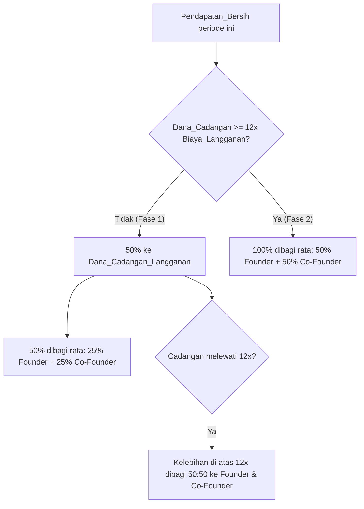

# Modal Awal & Sistem Bagi Hasil

> Dokumen ini menetapkan **permodalan awal**, **dana cadangan langganan**, dan **sistem bagi hasil** untuk **Founder** dan **Co-Founder** Akun_Quotes. Bagian dari folder `operasional-bisnis/`. Konvensi: ID aturan `SOP-B.x`, penanda `> [TODO: ...]`. Dokumen ini bersifat kesepakatan bisnis antara Founder dan Co-Founder dan tunduk pada kontrol dokumen (Bagian 0 SOP).

## Definisi

- **Founder**: Orang yang mendirikan dan memimpin project Akun_Quotes; memegang **70%** kepemilikan (ekuitas). Berbeda dari peran operasional Pengelola/Admin_Utama pada SOP konten.
- **Co-Founder**: Rekan Founder yang turut mendirikan dan memodali project; memegang **30%** kepemilikan (ekuitas).
- **Kepemilikan (ekuitas)**: Porsi kepemilikan project **70:30** (Founder:Co-Founder). Penting: porsi kepemilikan ini **berbeda** dari **pembagian hasil pada waterfall** (SOP-B.4) yang disepakati **setara 50:50**; keduanya sengaja dibedakan.
- **Biaya_Langganan**: Biaya berlangganan **Premium+** Platform_X per periode (mis. per bulan) yang diperlukan untuk menopang kelayakan monetisasi.
- **Modal_Awal**: Dana awal untuk memulai operasi, setara **6× Biaya_Langganan**.
- **Dana_Cadangan_Langganan**: Kas khusus yang disisihkan untuk membiayai perpanjangan langganan Premium+ ke depan.
- **Target_Cadangan**: Ambang Dana_Cadangan_Langganan yang setara **12× Biaya_Langganan** (runway 12 periode ke depan).
- **Pendapatan_Bersih**: Pendapatan dari Program_Sharing_Revenue Platform_X pada satu periode, setelah dikurangi biaya wajib langsung bila ada (mis. biaya transaksi/pajak). Biaya_Langganan periode berjalan dibayar dari Dana_Cadangan_Langganan, bukan dari Pendapatan_Bersih.

> [TODO: Tetapkan nominal Biaya_Langganan Premium+ per periode (sesuai harga resmi Platform_X di wilayah operasi) dan definisikan komponen "biaya wajib langsung" yang boleh dikurangkan dari Pendapatan_Bersih.]

## SOP-B.1 — Modal Awal (6× Premium+)

**SOP-B.1** — Modal_Awal project ditetapkan sebesar **6× Biaya_Langganan** Premium+, disediakan bersama oleh Founder dan Co-Founder. Modal ini digunakan untuk:

1. **Membayar langganan Premium+** pada periode-periode awal agar akun memenuhi syarat monetisasi (SOP-10.1) sebelum pendapatan stabil.
2. **Menutup biaya operasional awal** lain yang disepakati (bila ada).

Kontribusi modal mengikuti porsi kepemilikan **70:30** (Founder:Co-Founder) kecuali disepakati dan dicatat lain. *(Requirement R12.1)*

> [TODO: Catat besaran kontribusi Founder dan Co-Founder serta tanggal penyetoran modal.]

## SOP-B.2 — Struktur Founder, Kepemilikan, & Hak Bagi Hasil

**SOP-B.2** — Project dijalankan oleh **satu Founder dan satu Co-Founder** dengan **kepemilikan (ekuitas) 70:30** (Founder 70%, Co-Founder 30%). Meskipun kepemilikan 70:30, **pembagian hasil pada waterfall (SOP-B.4) disepakati setara 50:50** atas porsi yang dialokasikan kepada kedua pihak — pemisahan ini disengaja dan konsisten dijadikan acuan. Keputusan finansial material (mis. mengubah skema bagi hasil, menarik dana, menambah rekan) memerlukan **persetujuan Founder dan Co-Founder**. *(Requirement R12.2)*

## SOP-B.3 — Dana Cadangan Langganan & Target 12×

**SOP-B.3** — Project memelihara **Dana_Cadangan_Langganan** yang bertujuan mengamankan keberlanjutan langganan Premium+. Ketentuan:

1. **Target_Cadangan** = **12× Biaya_Langganan** (runway minimal 12 periode ke depan).
2. Dana_Cadangan_Langganan **dipakai membayar** Biaya_Langganan tiap periode; saldo dijaga menuju/di atas Target_Cadangan melalui alokasi bagi hasil (SOP-B.4).
3. Status cadangan menentukan fase bagi hasil: **BELUM_PENUH** (saldo < 12× Biaya_Langganan) atau **PENUH** (saldo ≥ 12× Biaya_Langganan). *(Requirement R12.3)*

## SOP-B.4 — Sistem Bagi Hasil (Waterfall)

**SOP-B.4** — Pada setiap periode distribusi, **Pendapatan_Bersih** dibagi menurut fase status Dana_Cadangan_Langganan:

### Fase 1 — Cadangan BELUM_PENUH (< 12× Biaya_Langganan)

- **50%** Pendapatan_Bersih → **Dana_Cadangan_Langganan** (untuk memperpanjang langganan hingga terkumpul setidaknya 12× ke depan).
- **50%** Pendapatan_Bersih → **dibagi rata (50:50) antara Founder dan Co-Founder** (masing-masing **25%** dari Pendapatan_Bersih).

### Fase 2 — Cadangan PENUH (≥ 12× Biaya_Langganan)

- **100%** Pendapatan_Bersih → **dibagi rata (50:50) antara Founder dan Co-Founder** (masing-masing **50%**).

### Periode Transisi (cadangan mencapai 12× di tengah periode)

- Alokasikan ke Dana_Cadangan_Langganan **hanya sebesar** kekurangan menuju Target_Cadangan (12×); **seluruh sisanya** dibagi rata (50:50) antara Founder dan Co-Founder. Dengan kata lain, tidak ada dana yang disisihkan ke cadangan melebihi Target_Cadangan.

> **Catatan penting:** pembagian hasil pada waterfall ini **setara 50:50**, terlepas dari porsi kepemilikan 70:30 (SOP-B.2). Pemisahan ini disengaja: 70:30 mengatur kepemilikan/ekuitas, sedangkan 50:50 mengatur distribusi kas bagi hasil.

*(Requirement R12.4)*

## SOP-B.5 — Distribusi, Pencatatan, dan Transparansi

**SOP-B.5** — Ketentuan pelaksanaan bagi hasil:

1. **Frekuensi distribusi** — bagi hasil dihitung dan didistribusikan secara berkala (mis. bulanan) setelah pembayaran Biaya_Langganan periode berjalan.
2. **Pencatatan** — setiap periode dicatat: Pendapatan_Bersih, pembayaran langganan, saldo Dana_Cadangan_Langganan, alokasi cadangan, dan bagian Founder serta Co-Founder.
3. **Transparansi** — catatan keuangan dapat diakses Founder dan Co-Founder; rekonsiliasi dilakukan tiap periode.
4. **Kaitan kelayakan** — pembayaran langganan tepat waktu dari Dana_Cadangan_Langganan menjaga syarat kelayakan monetisasi (SOP-10.1, SOP-10.6). *(Requirement R12.5)*

> [TODO: Tetapkan frekuensi distribusi pasti (mis. bulanan/tanggal berapa), metode pencatatan (spreadsheet/alat), dan penanggung jawab rekonsiliasi keuangan.]

## Contoh Ilustratif

Misal Biaya_Langganan = `P` per periode. Target_Cadangan = `12P`. Modal_Awal = `6P`. Pembagian ke pihak = setara 50:50 (Founder : Co-Founder).

- **Fase 1**, Pendapatan_Bersih periode = `8P`:
  - Ke cadangan: `4P` (50%).
  - Ke pihak: `4P` → Founder `2P`, Co-Founder `2P`.
- **Transisi**: saldo cadangan `10P`, Pendapatan_Bersih `8P`. Kekurangan menuju `12P` = `2P`.
  - Ke cadangan: `2P` (hanya sampai 12×), sisanya `6P` dibagi rata → Founder `3P`, Co-Founder `3P`.
- **Fase 2** (cadangan sudah `12P`), Pendapatan_Bersih `8P`:
  - Ke pihak: `8P` → Founder `4P`, Co-Founder `4P`; cadangan tidak ditambah kecuali dipakai lalu perlu diisi ulang.

> [TODO: Ganti `P` dengan nominal Biaya_Langganan aktual dan tambahkan contoh dengan angka nyata setelah harga Premium+ dikonfirmasi.]

## Keterlacakan

| Aturan | Ringkasan | Requirement |
|---|---|---|
| SOP-B.1 | Modal awal 6× Premium+ | R12.1 |
| SOP-B.2 | Founder + Co-Founder; kepemilikan 70:30, bagi hasil waterfall 50:50 | R12.2 |
| SOP-B.3 | Dana cadangan langganan, target 12× | R12.3 |
| SOP-B.4 | Waterfall bagi hasil (Fase 1/2 + transisi) | R12.4 |
| SOP-B.5 | Distribusi, pencatatan, transparansi | R12.5 |
