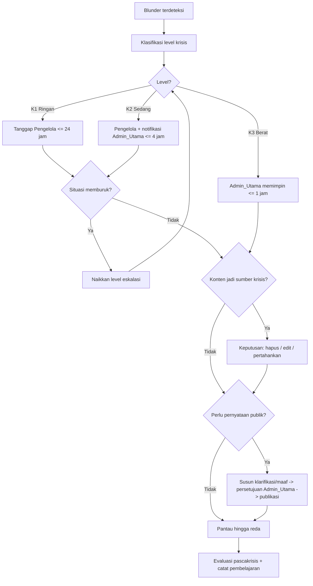
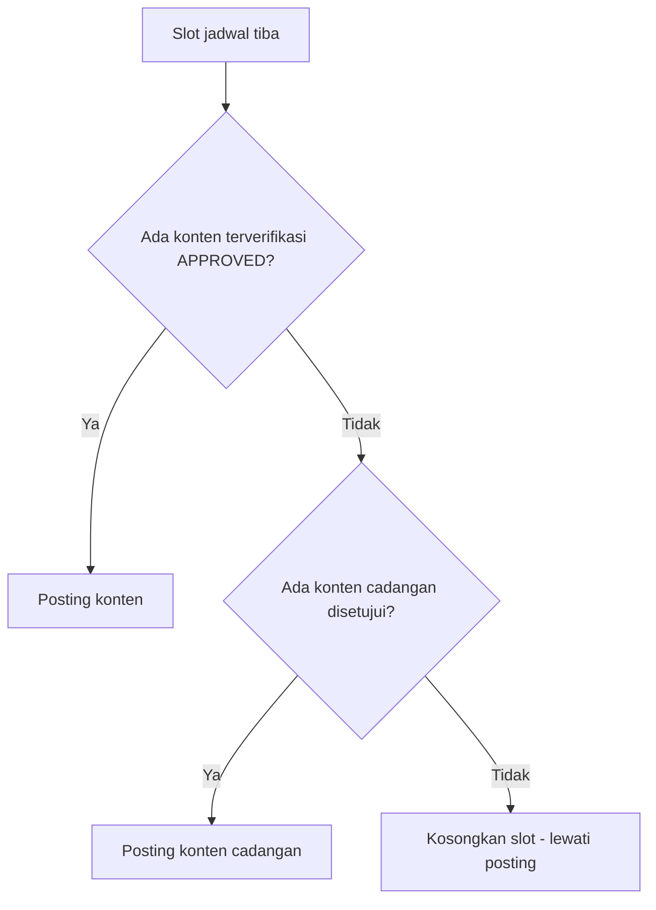
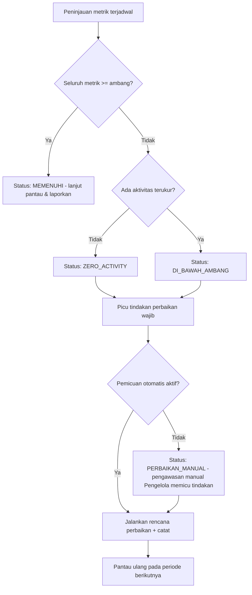
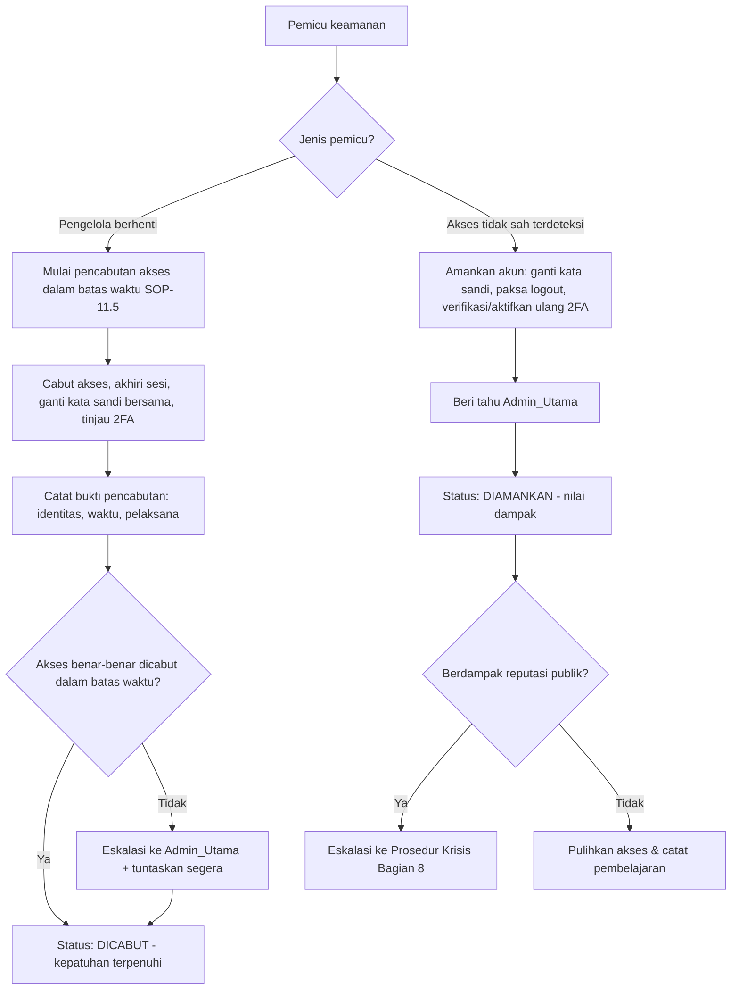

# SOP Pengelolaan Akun Quotes X

> **Catatan Pembuka — Konvensi Dokumen**
>
> Dokumen ini adalah **Standar Operasional Prosedur (SOP)** pengelolaan Akun_Quotes di Platform_X. Agar konsisten, dapat dirujuk silang, dan dapat diverifikasi, seluruh isi SOP mengikuti konvensi berikut:
>
> 1. **Hierarki & penomoran heading:**
>    - Heading level 1 (`#`) — judul dokumen SOP (hanya satu di berkas ini).
>    - Heading level 2 (`##`) — bagian bernomor, format `## Bagian N: <Judul>`.
>    - Heading level 3 (`###`) — sub-aturan bernomor, format `### N.x <Judul aturan>`.
> 2. **ID aturan stabil:** setiap aturan operasional diberi ID stabil `SOP-N.x` (mis. `SOP-3.1`), sehingga dapat dirujuk silang dari checklist, template, riwayat revisi, dan catatan pembelajaran.
> 3. **Anotasi keterlacakan:** setiap aturan menyertakan anotasi keterlacakan ke requirement sumbernya dengan format `(Requirement R{n}.{m})` — mis. `(Requirement R2.3)`. Satu aturan boleh memetakan lebih dari satu requirement.
> 4. **Penanda ketidaklengkapan:** bagian atau aturan yang belum lengkap **wajib** ditandai dengan penanda `> [TODO: <deskripsi ringkas apa yang belum lengkap>]`. Penanda ini selalu ditegakkan pada setiap revisi hingga bagian tersebut selesai, dan tidak boleh dihilangkan hanya karena revisi disimpan (R1.5).
>
> Lampiran dokumen ini terpisah dalam berkas modular: `lampiran-template.md`, `lampiran-checklist.md`, dan `lampiran-contoh.md`.

## Bagian 0: Metadata & Kontrol Dokumen

Bagian ini menetapkan identitas versi dokumen, pihak yang menyetujui, riwayat perubahan, serta aturan kontrol dokumen (penyimpanan revisi dan penegakan penanda ketidaklengkapan). Bagian ini menjadi acuan tata kelola bagi seluruh revisi SOP.

### Identitas Dokumen

| Field | Nilai |
|---|---|
| Judul Dokumen | SOP Pengelolaan Akun Quotes X |
| Nomor Versi | `v1.0.0` |
| Tanggal Berlaku | `> [TODO: Isi tanggal berlaku aktual saat dokumen disahkan, format YYYY-MM-DD]` |
| Pihak yang Menyetujui | Admin_Utama |
| Status Dokumen | Draf awal (dalam penyusunan) |

> [TODO: Tanggal Berlaku masih placeholder — lengkapi dengan tanggal pengesahan aktual oleh Admin_Utama sebelum dokumen dinyatakan berlaku.]

### 0.1 Identitas & Persetujuan Dokumen

**SOP-0.1** — Setiap terbitan SOP wajib mencantumkan **Nomor Versi** (mengikuti semver dokumen, mis. `v1.0.0`), **Tanggal Berlaku**, dan **Pihak yang Menyetujui**. Persetujuan dan pemberian versi dokumen SOP merupakan wewenang **Admin_Utama**. Dokumen tidak dinyatakan berlaku sebelum ketiga field tersebut terisi dan disetujui Admin_Utama. Kenaikan versi mengikuti pola: `MAJOR` untuk perubahan aturan substansial, `MINOR` untuk penambahan aturan/bagian, `PATCH` untuk koreksi redaksional. *(Requirement R1.3)*

### 0.2 Riwayat Perubahan (Change History)

**SOP-0.2** — Setiap kali SOP direvisi, perubahan wajib dicatat pada **Tabel Riwayat Perubahan** di bawah ini. Setiap baris memuat: **Tanggal**, **Versi**, **Ringkasan Perubahan**, dan **Penanggung Jawab Revisi**. Baris awal (`v1.0.0`) menandai penerbitan dokumen. *(Requirement R1.4)*

| Tanggal | Versi | Ringkasan Perubahan | Penanggung Jawab Revisi |
|---|---|---|---|
| `> [TODO: tgl sahih]` | `v1.0.0` | Penerbitan awal SOP: penyusunan struktur dokumen (Bagian 0–11) dan kontrol dokumen. | Admin_Utama |

> [TODO: Tanggal baris v1.0.0 masih placeholder — samakan dengan Tanggal Berlaku aktual saat pengesahan. Tambahkan baris baru pada setiap revisi berikutnya.]

### 0.3 Aturan Penyimpanan Revisi & Penegakan Penanda Ketidaklengkapan

**SOP-0.3** — Revisi SOP **boleh disimpan meskipun dokumentasi riwayat perubahan belum lengkap** (mis. ringkasan perubahan atau tanggal belum final). Ketidaklengkapan riwayat tidak boleh menjadi penghalang untuk menyimpan kemajuan revisi. *(Requirement R1.5)*

**SOP-0.4** — Pada **setiap** revisi, penanda ketidaklengkapan `> [TODO: <deskripsi>]` **wajib selalu ditegakkan** pada setiap bagian atau aturan yang belum selesai — **terlepas dari status ketidaklengkapan pada revisi sebelumnya**. Artinya: (a) bagian yang belum lengkap tidak boleh dibiarkan tanpa penanda; (b) penanda tidak boleh dihapus hanya karena revisi disimpan; (c) penanda hanya boleh dihilangkan setelah bagian bersangkutan benar-benar selesai dan diverifikasi. Aturan ini berlaku konsisten lintas revisi sehingga tidak ada bagian belum lengkap yang lolos tanpa penandaan. *(Requirement R1.5, R1.4)*

## Bagian 1: Tujuan, Ruang Lingkup, Definisi Istilah, dan Pihak Bertanggung Jawab

Bagian ini menetapkan fondasi seluruh SOP: **tujuan** project, **ruang lingkup** keberlakuan, **definisi istilah** (glosarium) yang menjadi rujukan makna tunggal di seluruh dokumen, **daftar bagian wajib SOP** sebagai daftar isi kontraktual, dan **matriks peran & wewenang** yang menjadi antarmuka bersama yang dirujuk seluruh bagian berikutnya. Isi bagian ini menjadi *single source of truth* untuk istilah dan pembagian wewenang; setiap aturan pada Bagian 2–11 dibaca dalam kerangka yang ditetapkan di sini.

### 1.1 Tujuan Project

**SOP-1.1** — Tujuan project Akun_Quotes adalah **memenuhi syarat kelayakan dan mengoptimalkan partisipasi dalam Program_Sharing_Revenue** Platform_X, dengan landasan yang tidak dapat ditawar berupa **nilai moral**. Kelayakan sharing revenue dikejar sebagai tujuan yang terukur (lihat Bagian 10), namun **tidak pernah dengan mengorbankan nilai moral** yang menjadi poros seluruh konten dan interaksi (lihat Bagian 2). Bila terjadi ketegangan antara optimasi pendapatan dan nilai moral, nilai moral selalu diutamakan. *(Requirement R1.1)*

### 1.2 Ruang Lingkup

**SOP-1.2** — SOP ini berlaku untuk **seluruh aktivitas operasional harian** Akun_Quotes di Platform_X, mencakup: penyiapan dan persetujuan konten (Quotes), verifikasi sumber dan atribusi, format penulisan (Styleguide), pengelolaan Following, interaksi dan komentar, moderasi, penanganan krisis, penjadwalan konten, pemantauan metrik kelayakan, dan keamanan akun. SOP ini **mengikat seluruh Pengelola dan Admin_Utama** yang menjalankan Akun_Quotes. *(Requirement R1.1)*

**SOP-1.3** — Yang **berada di luar ruang lingkup** SOP ini: pembangunan perangkat lunak, otomasi teknis, dan integrasi API Platform_X. Frasa "pemicuan otomatis" pada aturan metrik (Bagian 10) dipahami sebagai **trigger prosedural** yang dijalankan/diawasi manusia, bukan otomasi kode. *(Requirement R1.1)*

### 1.3 Definisi Istilah (Glosarium)

**SOP-1.4** — Istilah berikut memiliki makna baku yang berlaku konsisten di seluruh SOP. Setiap penggunaan istilah pada Bagian 0–11 dan lampiran merujuk definisi di tabel ini. *(Requirement R1.1)*

| Istilah | Definisi |
|---|---|
| **SOP** | Dokumen Standar Operasional Prosedur yang menjadi keluaran akhir spec ini, memuat seluruh aturan pengelolaan akun. |
| **Akun_Quotes** | Akun media sosial di Platform_X yang menjadi objek pengelolaan, berfokus pada konten kutipan bernilai moral. |
| **Platform_X** | Platform media sosial tempat Akun_Quotes beroperasi dan mengikuti program sharing revenue. |
| **Program_Sharing_Revenue** | Program bagi hasil pendapatan dari Platform_X yang menjadi tujuan monetisasi Akun_Quotes. |
| **Pengelola** | Orang atau tim yang bertanggung jawab menjalankan operasional Akun_Quotes berdasarkan SOP. |
| **Admin_Utama** | Pengelola dengan wewenang tertinggi yang bertanggung jawab atas keputusan strategis, keamanan akun, dan eskalasi krisis. |
| **Quotes** | Konten utama berupa kutipan kata bernilai moral yang diposting oleh Akun_Quotes. |
| **Sumber_Kutipan** | Asal-usul sebuah Quotes, dapat berupa tokoh bernama, karya literasi, tradisi peradaban/bangsa, atau anonim. |
| **Atribusi** | Pencantuman Sumber_Kutipan pada sebuah Quotes. |
| **Styleguide** | Panduan format penulisan dan tata bahasa untuk seluruh konten dan interaksi Akun_Quotes (lihat Bagian 4). |
| **Interaksi** | Aktivitas komentar, balasan, repost, like, dan mention yang dilakukan Akun_Quotes terhadap konten atau pengguna lain. |
| **Following** | Daftar akun lain yang diikuti oleh Akun_Quotes (lihat Bagian 5). |
| **Blunder** | Kesalahan konten atau interaksi yang berpotensi menimbulkan reaksi negatif publik atau merusak reputasi Akun_Quotes. |
| **Krisis** | Situasi eskalasi reaksi negatif publik akibat Blunder yang memerlukan penanganan khusus (lihat Bagian 8). |
| **Prosedur_Eskalasi** | Rangkaian langkah penanganan Krisis yang terdefinisi dalam SOP. |
| **Kalender_Konten** | Jadwal terencana berisi rencana posting Quotes beserta waktu tayang (lihat Bagian 9). |
| **Metrik_Kelayakan** | Indikator kinerja yang menjadi syarat kelayakan dan optimasi Program_Sharing_Revenue (lihat Bagian 10). |
| **Nilai Moral** | Prinsip inti Akun_Quotes; definisi operasional dan larangan mutlaknya ditetapkan pada Bagian 2 sebagai *single source of truth* yang dirujuk seluruh bagian. |

### 1.4 Daftar Bagian Wajib SOP (Daftar Isi Kontraktual)

**SOP-1.5** — SOP ini **wajib memuat** seluruh bagian berikut. Daftar ini bersifat **kontraktual**: tidak ada bagian yang boleh dihilangkan, dan setiap bagian yang belum lengkap wajib ditandai `> [TODO: ...]` sesuai aturan kontrol dokumen (SOP-0.4). *(Requirement R1.2)*

| Bagian | Judul | Cakupan Operasional |
|---|---|---|
| Bagian 0 | Metadata & Kontrol Dokumen | Versi, tanggal berlaku, persetujuan, riwayat perubahan |
| Bagian 1 | Tujuan, Ruang Lingkup, Definisi Istilah, dan Peran | Fondasi & antarmuka bersama |
| Bagian 2 | Kriteria Konten & Quotes yang Diposting | **Kriteria konten** |
| Bagian 3 | Verifikasi Sumber & Atribusi Kutipan | Verifikasi sumber & atribusi |
| Bagian 4 | Format Penulisan & Tata Bahasa | **Styleguide** |
| Bagian 5 | Kriteria Akun yang Diikuti | **Kriteria following** |
| Bagian 6 | Kriteria Isi Komentar & Interaksi | **Kriteria interaksi/komentar** |
| Bagian 7 | Moderasi Komentar | **Moderasi** |
| Bagian 8 | Prosedur Eskalasi Krisis | **Eskalasi krisis** |
| Bagian 9 | Jadwal Posting & Kalender Konten | **Jadwal posting** |
| Bagian 10 | Metrik & Kelayakan Program Sharing Revenue | **Metrik program sharing revenue** |
| Bagian 11 | Keamanan Akun | **Keamanan akun** |

Bagian-bagian ini didukung oleh lampiran modular (`lampiran-template.md`, `lampiran-checklist.md`, `lampiran-contoh.md`) yang memuat template, checklist, dan contoh format. *(Requirement R1.2)*

### 1.5 Matriks Peran & Wewenang

**SOP-1.6** — Matriks berikut menetapkan pembagian wewenang antara **Pengelola** dan **Admin_Utama**. Matriks ini adalah **antarmuka bersama** yang dirujuk seluruh bagian SOP: setiap aturan yang menyebut persetujuan, eskalasi, atau kewenangan tertentu tunduk pada matriks ini. Tanda ✅ berarti berwenang; ❌ berarti tidak berwenang (wajib eskalasi); ↑ berarti wajib mengeskalasikan ke Admin_Utama. *(Requirement R1.1, R1.2)*

| Kewenangan | Pengelola | Admin_Utama | Rujukan |
|---|---|---|---|
| Menyiapkan draf Quotes | ✅ | ✅ | Bagian 2 |
| Menyetujui Quotes reguler | ✅ | ✅ | Bagian 2 |
| Menyetujui Quotes topik sensitif (politik/agama/SARA) | ❌ | ✅ (wajib) | R2.3 |
| Verifikasi sumber & atribusi | ✅ | ✅ | Bagian 3 |
| Moderasi komentar (sembunyikan/hapus/blokir) | ✅ (manual) | ✅ | Bagian 7 |
| Memutuskan area abu-abu moderasi | ❌ (eskalasi ↑) | ✅ | R7.5 |
| Menyetujui following kandidat berisu | ❌ | ✅ | R5.3, R5.4 |
| Menyatakan & memimpin penanganan Krisis | ↑ eskalasi | ✅ | Bagian 8 |
| Menyetujui klarifikasi/permintaan maaf publik | ❌ | ✅ | R8.5 |
| Mengelola keamanan akun & akses (2FA, pencabutan) | ❌ | ✅ | Bagian 11 |
| Menyetujui & memberi versi dokumen SOP | ❌ | ✅ | R1.3 |

**SOP-1.7** — Prinsip umum kewenangan: (a) keputusan **berisiko tinggi** bagi reputasi, keamanan, atau kepatuhan (topik sensitif, area abu-abu moderasi, following berisu, krisis, pernyataan publik, keamanan akun, pemberian versi dokumen) merupakan wewenang **Admin_Utama**; (b) untuk keputusan yang bukan wewenangnya, Pengelola **wajib mengeskalasikan** kepada Admin_Utama alih-alih memutuskan sendiri; (c) bila ragu terhadap batas wewenang, berlaku prinsip *fail-safe*: tunda tindakan dan eskalasikan. *(Requirement R1.1, R1.2)*

## Bagian 2: Kriteria Konten & Quotes yang Diposting

Bagian ini menetapkan **kriteria konten** yang mengikat setiap Quotes sebelum, saat, dan sesudah tayang di Platform_X. Di sinilah **definisi operasional Nilai Moral** ditetapkan sebagai *single source of truth*: seluruh bagian lain (Following pada Bagian 5, Interaksi pada Bagian 6, Moderasi pada Bagian 7) merujuk definisi ini dan tidak boleh menetapkan makna nilai moral yang bertentangan dengannya. Bagian ini juga menetapkan **gerbang persetujuan** dan **lifecycle status Quotes** yang menjamin tidak ada konten tayang tanpa melewati persetujuan. Alur keputusan lengkap divisualisasikan pada *Alur Persetujuan Konten* (lihat design) dan diringkas pada sub-aturan di bawah.

### 2.1 Definisi Nilai Moral & Larangan Mutlak (Single Source of Truth)

**SOP-2.1** — **Definisi Nilai Moral (rujukan tunggal).** Setiap Quotes yang diposting Akun_Quotes **wajib berlandaskan nilai moral**, yaitu prinsip yang menjunjung kebajikan, kebijaksanaan, penghormatan terhadap martabat manusia, kejujuran, dan kesantunan, serta memberi manfaat reflektif bagi pembaca. Definisi ini adalah **satu-satunya rujukan (single source of truth)** makna "nilai moral" di seluruh SOP; setiap penyebutan "nilai moral" atau "selaras nilai moral" pada Bagian 1–11 dan lampiran **wajib merujuk aturan SOP-2.1 ini** dan tidak boleh ditafsirkan bertentangan dengannya. *(Requirement R2.1)*

**SOP-2.2** — **Larangan Mutlak.** Terlepas dari tema atau sumbernya, sebuah Quotes **dilarang mutlak** apabila memuat salah satu dari unsur berikut. Larangan ini bersifat absolut (tidak dapat disetujui oleh siapa pun, termasuk Admin_Utama) dan menjadi kriteria kegagalan otomatis pada penyaringan konten:

1. **Ujaran kebencian** — merendahkan, menghasut permusuhan, atau menyerang individu/kelompok.
2. **Diskriminasi SARA** — membeda-bedakan atau menyudutkan berdasarkan suku, agama, ras, atau antargolongan.
3. **Pornografi** — muatan seksual eksplisit atau vulgar dalam bentuk apa pun.

Quotes yang melanggar larangan mutlak ini **tidak pernah lolos** ke status APPROVED maupun POSTED. *(Requirement R2.1)*

### 2.2 Tema Diizinkan vs Tema Dilarang

**SOP-2.3** — Tema Quotes dikelompokkan menjadi **tema yang diperbolehkan** dan **tema yang dilarang** sesuai tabel dua kolom berikut. Daftar ini menjadi acuan penyaringan tema pada tahap penyiapan draf. *(Requirement R2.2)*

| Tema Diizinkan | Tema Dilarang |
|---|---|
| Kebijaksanaan hidup & renungan | Ujaran kebencian terhadap individu/kelompok |
| Nilai moral, etika, & kebajikan | Diskriminasi & provokasi SARA |
| Motivasi, ketekunan, & pengembangan diri | Pornografi & muatan seksual eksplisit |
| Ilmu pengetahuan & literasi peradaban | Kekerasan, sadisme, atau ajakan menyakiti |
| Kearifan lokal, tradisi, & budaya luhur | Hoaks, disinformasi, & fitnah |
| Syukur, kesabaran, & pengendalian diri | Ujaran yang melecehkan martabat manusia |
| Persahabatan, keluarga, & kasih sayang | Promosi kebencian antargolongan |
| Refleksi kemanusiaan & perdamaian | Konten yang melanggar hukum atau kebijakan Platform_X |

**SOP-2.4** — **Gerbang topik sensitif.** WHERE sebuah Quotes menyentuh topik **politik**, **agama**, atau **isu sensitif** lain (mis. konflik sosial, isu SARA yang dibahas secara reflektif), Quotes tersebut **wajib memperoleh persetujuan Admin_Utama sebelum diposting** — persetujuan Pengelola reguler tidak cukup. Selama persetujuan Admin_Utama belum diberikan, Quotes tetap berstatus PENDING dan **tidak boleh** naik ke APPROVED/POSTED. Kewenangan ini sesuai Matriks Peran & Wewenang (SOP-1.6). *(Requirement R2.3)*

### 2.3 Penolakan Pra-Posting (REJECTED) & Penghapusan Pascapublikasi (REMOVED)

**SOP-2.5** — **Penolakan pra-posting (REJECTED).** IF sebuah Quotes tidak memenuhi kriteria nilai moral (melanggar SOP-2.1/SOP-2.2, masuk tema dilarang pada SOP-2.3, atau gagal gerbang topik sensitif SOP-2.4), THEN Quotes tersebut **ditolak dan tidak diposting**. Statusnya ditetapkan menjadi **REJECTED**, dan tidak ada jalur bagi Quotes REJECTED untuk tayang tanpa perbaikan dan pengajuan ulang dari awal. *(Requirement R2.4)*

**SOP-2.6** — **Penghapusan pascapublikasi (REMOVED) dengan batas waktu.** IF sebuah Quotes yang **tidak memenuhi** kriteria nilai moral lolos penyaringan awal dan **terlanjur diposting**, THEN Quotes tersebut **wajib dihapus** dari Platform_X dan statusnya ditetapkan menjadi **REMOVED**. Penghapusan dilakukan **selambat-lambatnya 60 (enam puluh) menit sejak pelanggaran terdeteksi**. Setiap penghapusan dicatat (waktu deteksi, waktu penghapusan aktual, dan alasan) untuk keperluan audit dan, bila memicu reaksi publik, ditangani lebih lanjut sesuai Prosedur Eskalasi Krisis (Bagian 8). *(Requirement R2.5)*

### 2.4 Batas Panjang Karakter & Gerbang Persetujuan Berbasis Lifecycle

**SOP-2.7** — **Batas panjang karakter.** Setiap Quotes yang diposting **wajib tidak melebihi batas panjang maksimum karakter Platform_X**. Batas baku yang digunakan SOP ini adalah **280 karakter** (mengikuti batas standar unggahan Platform_X), sudah termasuk isi kutipan, atribusi, dan tagar. Quotes yang melebihi batas ini **wajib direvisi** hingga memenuhi batas sebelum dapat naik ke status APPROVED. *(Requirement R2.6)*

> [TODO: Konfirmasi batas 280 karakter terhadap kebijakan Platform_X terbaru; sesuaikan bila Platform_X menetapkan batas berbeda untuk jenis akun/postingan tertentu.]

**SOP-2.8** — **Gerbang persetujuan wajib (lifecycle Quotes).** WHEN sebuah Quotes akan diposting, Quotes tersebut **wajib menyelesaikan proses persetujuan terlebih dahulu** — termasuk Quotes yang telah memenuhi seluruh kriteria namun masih menunggu review. Proses ini mengikuti **lifecycle status Quotes** (lihat diagram *Lifecycle Status Quotes* pada design):

```
DRAFT → PENDING → APPROVED → POSTED
              ↘ REJECTED (gagal kriteria pra-posting, SOP-2.5)
POSTED ↘ REMOVED (pelanggaran pascapublikasi, SOP-2.6)
```

| Status | Makna | Aturan terkait |
|---|---|---|
| **DRAFT** | Quotes disiapkan, belum diajukan | SOP-2.8 |
| **PENDING** | Menunggu review/verifikasi (termasuk menunggu persetujuan Admin_Utama untuk topik sensitif, atau sumber belum terverifikasi) | SOP-2.4, SOP-2.8 |
| **APPROVED** | Lolos kriteria nilai moral, verifikasi sumber, dan atribusi; siap tayang | SOP-2.8 |
| **POSTED** | Sudah tayang di Platform_X | SOP-2.8 |
| **REJECTED** | Ditolak sebelum tayang karena gagal kriteria | SOP-2.5 |
| **REMOVED** | Dihapus pascapublikasi dalam batas waktu | SOP-2.6 |

Lifecycle ini menegakkan gerbang persetujuan wajib: tidak ada Quotes yang tayang tanpa menyelesaikan proses persetujuan terlebih dahulu. *(Requirement R2.7)*

**SOP-2.9** — **Invarian lifecycle.** Sebuah Quotes **hanya boleh mencapai status POSTED melalui status APPROVED**. **Tidak ada** transisi langsung dari DRAFT atau PENDING menuju POSTED. Dengan demikian, setiap Quotes yang tayang dijamin telah melewati persetujuan (dan persetujuan Admin_Utama bila bertopik sensitif sesuai SOP-2.4). *(Requirement R2.7)*

Rincian tahap verifikasi sumber dan atribusi yang menjadi syarat transisi PENDING → APPROVED ditetapkan pada Bagian 3.

## Bagian 3: Verifikasi Sumber & Atribusi Kutipan

Bagian ini menetapkan prosedur **verifikasi Sumber_Kutipan** dan **atribusi** yang wajib dilalui setiap Quotes agar akurat, terhindar dari kesalahan penisbahan (*misattribution*), dan bebas dari pelanggaran hak cipta. Tahapan pada bagian ini merupakan **syarat transisi lifecycle Quotes dari PENDING menuju APPROVED** yang ditetapkan pada Bagian 2 (SOP-2.8, SOP-2.9): sebuah Quotes tidak boleh naik ke APPROVED — apalagi POSTED — sebelum sumbernya terverifikasi (atau atribusinya sah sebagai anonim/tradisi) dan atribusinya dipastikan tercantum. Kewenangan verifikasi sumber & atribusi berada pada Pengelola dan Admin_Utama sesuai Matriks Peran & Wewenang (SOP-1.6).

Alur keputusan lengkap divisualisasikan pada diagram **Alur Verifikasi Sumber & Atribusi (R3)** pada design, dan diringkas sebagai berikut:

```
Identifikasi Sumber_Kutipan
        │
        ▼
   Jenis sumber?
   ├─ Tokoh bernama ──▶ ≥ 2 rujukan tepercaya?
   │                     ├─ Ya  ─▶ Terverifikasi + atribusi nama tokoh
   │                     └─ Tidak ─▶ Status PENDING (cari rujukan / tunda)
   └─ Anonim/Tradisi ─▶ Atribusi: "Anonim" atau nama tradisi/peradaban ─▶ Terverifikasi
        │
        ▼
   Materi berhak cipta tanpa izin / di luar penggunaan wajar?
   ├─ Ya  ─▶ Tolak (jangan posting)
   └─ Tidak ─▶ Pastikan atribusi tercantum pada postingan ─▶ Lanjut ke persetujuan/posting
```

### 3.1 Verifikasi Sumber Tokoh Bernama

**SOP-3.1** — **Verifikasi minimal dua rujukan tepercaya.** WHEN sebuah Quotes berasal dari **tokoh bernama** (mis. filsuf, penulis, pemuka, atau figur sejarah), Sumber_Kutipan tersebut **wajib diverifikasi menggunakan minimal dua (2) rujukan tepercaya sebelum posting**. Rujukan tepercaya adalah sumber yang kredibel dan dapat ditelusuri, seperti karya asli tokoh, buku/terbitan akademik, arsip resmi, atau basis data kutipan yang bereputasi; media sosial anonim, forum tanpa sumber, dan situs agregat tanpa rujukan asli **tidak dihitung** sebagai rujukan tepercaya. Bila kedua rujukan telah terpenuhi dan konsisten, Quotes dinyatakan **terverifikasi** dengan atribusi berupa **nama tokoh** yang bersangkutan. *(Requirement R3.1)*

### 3.2 Atribusi Sumber Anonim atau Tradisi/Peradaban

**SOP-3.2** — **Atribusi anonim atau tradisi.** WHEN sebuah Quotes berasal dari **sumber anonim** atau **tradisi peradaban/bangsa** (tidak dapat dinisbahkan pada satu tokoh bernama tertentu), Atribusi **wajib dicantumkan** sebagai **"Anonim"** atau **nama tradisi/peradaban terkait** (mis. "Pepatah Minang", "Kearifan Jawa", "Peribahasa Melayu"). Untuk kategori ini, syarat dua rujukan tepercaya pada SOP-3.1 tidak berlaku karena sumber memang tidak berupa tokoh bernama; namun atribusi kategori tetap **wajib akurat** dan tidak boleh mengklaim tokoh bernama tanpa verifikasi. *(Requirement R3.2)*

### 3.3 Penundaan Sumber Tak Terverifikasi (Status PENDING)

**SOP-3.3** — **Tunda dan set status PENDING.** IF Sumber_Kutipan sebuah Quotes **tidak dapat diverifikasi** — misalnya Quotes dinisbahkan pada tokoh bernama namun rujukan tepercaya belum mencapai dua, atau rujukan yang ada saling bertentangan — THEN Quotes tersebut **wajib ditunda** dengan menetapkan statusnya menjadi **PENDING** hingga verifikasi selesai. Selama berstatus PENDING, Quotes **tidak boleh** naik ke APPROVED maupun POSTED (konsisten dengan invarian lifecycle SOP-2.9). Verifikasi dapat dilanjutkan dengan mencari rujukan tambahan; bila akhirnya sumber tetap tidak dapat diverifikasi, Quotes dapat dialihkan menjadi atribusi "Anonim" sesuai SOP-3.2 (bila layak) atau ditolak. Status PENDING di sini adalah status lifecycle yang sama sebagaimana didefinisikan pada Bagian 2 (SOP-2.8). *(Requirement R3.3)*

### 3.4 Penghormatan Hak Cipta

**SOP-3.4** — **Larangan pelanggaran hak cipta.** Akun_Quotes **dilarang memposting materi berhak cipta tanpa izin atau di luar batas penggunaan wajar (*fair use*)**. Sebelum sebuah Quotes naik ke APPROVED, Pengelola wajib memastikan bahwa isi kutipan bukan merupakan penyalinan substansial atas karya berhak cipta (mis. lirik lagu, puisi utuh, atau kutipan panjang dari buku) yang memerlukan izin. Jika materi teridentifikasi berhak cipta dan tidak ada izin atau tidak memenuhi batas penggunaan wajar, Quotes tersebut **ditolak dan tidak diposting** (statusnya REJECTED sesuai SOP-2.5). Bila status hak cipta masih meragukan, berlaku prinsip *fail-safe*: tunda (PENDING) dan eskalasikan sesuai kewenangan (SOP-1.7). *(Requirement R3.4)*

### 3.5 Kewajiban Atribusi Tercantum pada Setiap Postingan

**SOP-3.5** — **Atribusi wajib tercantum.** WHEN sebuah Quotes diposting, Atribusi **wajib benar-benar tercantum pada postingan tersebut**. Tidak ada Quotes yang boleh tayang (POSTED) tanpa atribusi. Tipe atribusi **boleh berupa apa pun** sesuai jenis sumbernya, termasuk **label anonim**, yaitu:

- **Nama tokoh** — untuk sumber tokoh bernama yang telah terverifikasi (SOP-3.1);
- **"Anonim"** — untuk sumber anonim (SOP-3.2);
- **Nama tradisi/peradaban** — untuk sumber tradisi/peradaban (SOP-3.2).

Selain atribusi sumber, baris atribusi setiap postingan **wajib diakhiri dengan inisial Pengelola/Admin_Utama penanggung jawab** penayangan, sesuai format pemisah yang ditetapkan pada SOP-4.3 (dipisahkan tanda koma, mis. `— Nelson Mandela, AR`). Inisial ini adalah penanda akuntabilitas dan **tidak menggantikan** atribusi sumber yang tetap wajib tercantum.

Kepatuhan atas kewajiban ini **wajib dipastikan** sebelum transisi ke APPROVED dan diperiksa kembali sebelum POSTED (lihat Checklist Pra-Posting pada `lampiran-checklist.md` dan Template Format Postingan pada `lampiran-template.md`). Dengan aturan ini, setiap postingan dijamin memiliki atribusi valid yang sesuai jenis sumbernya serta inisial penanggung jawab. *(Requirement R3.5)*

### 3.6 Kategori Sumber Perolehan Postingan

**SOP-3.6** — **Klasifikasi kategori sumber perolehan.** Selain *jenis sumber kutipan* (tokoh bernama / anonim / tradisi) pada SOP-3.1–SOP-3.2, setiap Quotes **wajib diklasifikasikan menurut kategori sumber perolehan** — yaitu dari mana/bagaimana materi diperoleh — dan kategori ini **dicatat** pada Kalender_Konten/catatan produksi untuk audit. Kategori tersebut menentukan pemeriksaan tambahan yang berlaku:

1. **Karangan sendiri / Original** — materi ditulis sendiri oleh Pengelola/Admin_Utama. Ketentuan: (a) wajib benar-benar orisinal, bukan penyalinan terselubung dari karya lain; (b) tetap tunduk pada Nilai Moral (SOP-2.1) dan Styleguide (Bagian 4); (c) atribusi yang ditampilkan mengikuti SOP-3.5 (mis. nama akun sendiri/"Original", atau "Anonim" bila tanpa penulis spesifik); (d) syarat dua rujukan (SOP-3.1) hanya berlaku bila materi mengklaim kutipan tokoh bernama.
2. **Website / media sosial** — materi dikutip atau diadaptasi dari situs web atau platform media sosial. Ketentuan: (a) **wajib verifikasi sumber** sesuai SOP-3.1 bila dinisbahkan pada tokoh bernama (media sosial/agregat anonim **tidak** dihitung sebagai rujukan tepercaya); (b) **wajib menghormati hak cipta** (SOP-3.4 dan lampiran legal `../../legal-kepatuhan/kebijakan-hak-cipta-privasi.md`, SOP-L.1); (c) **catat tautan/asal sumber** pada catatan produksi; (d) bila sumber tak terverifikasi, berlaku penundaan PENDING (SOP-3.3).
3. **AI (kecerdasan buatan)** — materi dihasilkan atau dibantu alat AI. Ketentuan: **tunduk penuh pada Kebijakan Penggunaan AI** (`../../legal-kepatuhan/kebijakan-penggunaan-ai.md`, SOP-AI.1–SOP-AI.5), khususnya **verifikasi manusia atas minimal dua rujukan tepercaya** (SOP-AI.2 menegakkan SOP-3.1), **larangan fabrikasi kutipan/atribusi** (SOP-AI.3), dan tanggung jawab akhir pada manusia (SOP-AI.4). AI **tidak boleh** menjadi satu-satunya sumber kebenaran kutipan/atribusi.

Catatan: kategori sumber perolehan ini bersifat **metadata internal** (untuk audit dan pemilihan pemeriksaan), sedangkan **atribusi yang tampil pada postingan** tetap mengikuti SOP-3.5. Sebuah Quotes hanya boleh naik ke APPROVED setelah pemeriksaan sesuai kategorinya terpenuhi. *(Requirement R3.6)*

## Bagian 4: Format Penulisan & Tata Bahasa (Styleguide)

Bagian ini menetapkan **Styleguide** — panduan baku format penulisan dan tata bahasa untuk **seluruh konten dan interaksi** Akun_Quotes (istilah "Styleguide" sesuai glosarium SOP-1.4). Styleguide berlaku pada isi Quotes, atribusi, tagar, balasan komentar, dan seluruh teks yang diterbitkan atas nama Akun_Quotes. Aturan pada bagian ini menjadi **syarat kelayakan tampilan** yang diperiksa sebelum sebuah Quotes naik ke status APPROVED (Bagian 2, SOP-2.8/SOP-2.9) dan wajib dipatuhi bersama batas panjang karakter 280 karakter (SOP-2.7). Nada komunikasi yang ditetapkan di sini (SOP-4.5) juga dirujuk oleh aturan balasan dan interaksi pada Bagian 6.

Karena format kutipan, atribusi, dan tagar saling terkait, contoh format postingan yang benar dikumpulkan secara terpisah pada `lampiran-contoh.md` (≥3 contoh) dan template dasarnya pada `lampiran-template.md`, sebagaimana dirujuk pada SOP-4.7.

### 4.1 Ejaan Baku Bahasa Indonesia (PUEBI)

**SOP-4.1** — **Ejaan baku PUEBI.** Seluruh konten berbahasa Indonesia — isi Quotes, atribusi, tagar deskriptif, maupun balasan komentar — **wajib menggunakan ejaan Bahasa Indonesia yang baku sesuai PUEBI** (Pedoman Umum Ejaan Bahasa Indonesia). Ketentuan minimum yang ditegakkan:

1. **Kata baku** — gunakan bentuk baku sesuai KBBI (mis. "aktivitas" bukan "aktifitas"; "praktik" bukan "praktek"; "silakan" bukan "silahkan"); hindari singkatan tidak baku dan bahasa gaul ("yg", "gak", "aja") pada konten resmi.
2. **Penulisan imbuhan, kata depan, dan partikel** — bedakan penulisan "di-" sebagai imbuhan (dirangkai, mis. "ditulis") dan "di" sebagai kata depan (dipisah, mis. "di rumah").
3. **Penulisan unsur serapan** — gunakan bentuk serapan baku; istilah asing yang belum diserap ditulis miring (*italic*) bila memungkinkan.
4. **Angka dan bilangan** — ikuti kaidah PUEBI untuk penulisan bilangan dan lambang bilangan.

Kepatuhan ejaan diperiksa pada Checklist Pra-Posting (`lampiran-checklist.md`) sebelum status APPROVED. *(Requirement R4.1)*

### 4.2 Tanda Baca, Huruf Kapital, dan Format Kutipan

**SOP-4.2** — **Tanda baca dan huruf kapital.** Penggunaan tanda baca dan huruf kapital **wajib mengikuti kaidah PUEBI**:

1. **Huruf kapital** — digunakan pada huruf pertama awal kalimat, nama diri/tokoh, nama tempat, nama tradisi/peradaban, dan judul; **tidak** menggunakan kapital seluruhnya (ALL CAPS) untuk menegaskan, kecuali pada penulisan tagar bergaya *CamelCase* (lihat SOP-4.3).
2. **Tanda baca** — akhiri kalimat dengan tanda titik/tanya/seru yang tepat; gunakan koma sesuai kaidah; hindari tanda baca berlebihan (mis. "!!!", "???") yang menurunkan kesan reflektif.
3. **Konsistensi** — gunakan satu gaya tanda baca yang konsisten dalam satu postingan.

*(Requirement R4.2)*

**SOP-4.3** — **Format kutipan dan pemisah atribusi.** Setiap Quotes ditulis dengan format kutipan baku berikut agar konsisten di seluruh postingan:

1. **Tanda petik** — isi kutipan diapit **tanda petik ganda** (`"…"`). Bila di dalam kutipan terdapat kutipan lain, gunakan tanda petik tunggal (`'…'`) untuk kutipan bagian dalam.
2. **Pemisah atribusi** — atribusi ditulis pada baris baru dan **diawali tanda pisah em dash dan spasi** (`— `), diikuti nama tokoh, "Anonim", atau nama tradisi/peradaban. Contoh pemisah: `— Nama Tokoh`.
3. **Inisial admin penanggung jawab** — pada **setiap** postingan, di **akhir baris atribusi** wajib dicantumkan **inisial Pengelola/Admin_Utama yang menyetujui dan menayangkan** postingan tersebut, **dipisahkan dari atribusi dengan tanda koma dan spasi** (`, `). Inisial ditulis **huruf kapital, 2–3 huruf** (mis. `AR`, `SNU`) agar mudah dibedakan dari nama sumber. Inisial ini berfungsi sebagai penanda akuntabilitas: menunjukkan siapa yang bertanggung jawab atas penayangan (rujuk daftar Pengelola & wewenang SOP-1.6, SOP-11.4). Contoh: `— Nelson Mandela, AR`.
4. **Kesesuaian dengan Bagian 3** — jenis dan isi atribusi mengikuti aturan atribusi pada Bagian 3 (SOP-3.1, SOP-3.2, SOP-3.5); Styleguide hanya mengatur *bentuk penulisannya*.

Format baku (acuan): 

```
"{isi kutipan}"
— {Atribusi: nama tokoh / "Anonim" / nama tradisi-peradaban}, {INISIAL_ADMIN}

{1–5 tagar baku}
```

Inisial admin dihitung sebagai bagian dari batas 280 karakter (SOP-2.7). Contoh penerapan lengkap tersedia pada `lampiran-contoh.md` (lihat SOP-4.7). *(Requirement R4.2, R4.3)*

### 4.3 Aturan Tagar (Hashtag) dan Daftar Tagar Baku

**SOP-4.4** — **Batas dan daftar tagar.** Setiap postingan **wajib menyertakan minimum 1 (satu) tagar dan maksimum 5 (lima) tagar**. Postingan tanpa tagar atau dengan lebih dari lima tagar **tidak boleh** naik ke status APPROVED hingga diperbaiki. Ketentuan tagar:

1. **Rentang jumlah** — 1 ≤ jumlah tagar ≤ 5 per postingan.
2. **Penulisan** — tagar ditulis tanpa spasi; untuk gabungan kata gunakan gaya *CamelCase* (mis. `#NilaiMoral`) agar terbaca.
3. **Relevansi** — tagar wajib relevan dengan tema Quotes dan selaras nilai moral (SOP-2.1); dilarang menggunakan tagar menyesatkan, provokatif, atau tak berkaitan demi jangkauan.
4. **Perhitungan panjang** — tagar dihitung sebagai bagian dari batas 280 karakter (SOP-2.7).

**Daftar tagar baku akun** (gunakan sebagai pilihan utama; kombinasikan seperlunya dalam batas 1–5):

| Tagar Baku | Penggunaan |
|---|---|
| `#Renungan` | Kutipan reflektif dan perenungan |
| `#NilaiMoral` | Penegasan pesan moral inti akun |
| `#KataBijak` | Kutipan kebijaksanaan hidup umum |
| `#Kebijaksanaan` | Kearifan dan kebijaksanaan |
| `#Motivasi` | Kutipan pembangkit semangat & ketekunan |
| `#Inspirasi` | Kutipan yang menginspirasi |
| `#KearifanLokal` | Pepatah/tradisi/peribahasa Nusantara |
| `#Literasi` | Kutipan dari karya literasi/peradaban |
| `#Refleksi` | Ajakan merenung dan introspeksi |
| `#QuotesHarian` | Penanda kanal harian akun |

> [TODO: Tinjau dan perluas daftar tagar baku secara berkala sesuai tema kampanye/kalender konten; pertahankan konsistensi penulisan CamelCase dan relevansi nilai moral.]

*(Requirement R4.4)*

### 4.4 Nada Komunikasi (Tone of Voice)

**SOP-4.5** — **Tone of voice moral, sopan, dan reflektif.** Seluruh konten dan interaksi Akun_Quotes **wajib menggunakan nada komunikasi yang mencerminkan nilai moral, sopan, dan reflektif**:

1. **Moral** — pesan selaras dengan definisi nilai moral (SOP-2.1); mengangkat kebajikan, kebijaksanaan, dan penghormatan pada martabat manusia.
2. **Sopan** — bahasa santun dan menghormati pembaca; **dilarang** kasar, merendahkan, menyindir tajam, sarkastik, atau provokatif.
3. **Reflektif** — mengajak merenung dan berpikir, bukan menggurui, memaksakan, atau menghakimi; hindari nada sensasional dan klik umpan (*clickbait*).

Nada ini juga **wajib dipatuhi pada balasan komentar dan seluruh interaksi keluar** sesuai Bagian 6 (SOP terkait R6.3 dan R6.5), sehingga suara akun konsisten di konten maupun percakapan. *(Requirement R4.5)*

### 4.5 Kebijakan Terjemahan (Kebijakan Umum yang Selalu Ada)

**SOP-4.6** — **Kebijakan terjemahan sebagai kebijakan umum SOP.** SOP ini **selalu menetapkan** kebijakan penyertaan terjemahan Bahasa Indonesia sebagai **kebijakan umum yang permanen**, **meskipun seluruh Quotes saat ini berbahasa Indonesia**. Kebijakan ini tidak boleh dihapus dengan alasan "belum ada konten asing"; ia harus tetap ada agar SOP siap ketika suatu saat muncul kebutuhan memublikasikan kutipan dari sumber berbahasa asing. Isi kebijakan umum:

1. **Wajib terjemahan** — setiap Quotes yang bersumber dari bahasa asing **wajib disertai terjemahan Bahasa Indonesia** yang akurat dan setia makna, dan terjemahan menjadi teks utama yang tunduk pada seluruh aturan Styleguide (SOP-4.1–SOP-4.5).
2. **Aturan terjemahan spesifik belum ditetapkan** — tata cara rinci (penempatan teks asli vs terjemahan, atribusi penerjemah, penanganan idiom) **belum ditetapkan** pada versi SOP ini dan harus dilengkapi sebelum konten berbahasa asing boleh tayang. Selama itu berlaku gerbang bahasa asing pada SOP-4.8.

> [TODO: Tetapkan aturan terjemahan spesifik (format penempatan teks asli & terjemahan, atribusi penerjemah, penanganan idiom/ayat) sebelum memublikasikan Quotes berbahasa asing. Hingga aturan ini lengkap, gerbang SOP-4.8 tetap memblokir posting berbahasa asing.]

*(Requirement R4.6)*

### 4.6 Contoh Format Postingan (Rujukan Lampiran)

**SOP-4.7** — **Minimal tiga contoh format.** SOP ini **wajib menyediakan minimal tiga (3) contoh format postingan Quotes yang benar** sebagai acuan operasional. Ketiga contoh tersebut dikumpulkan pada berkas **`lampiran-contoh.md`** dan mencakup: (1) kutipan **tokoh bernama terverifikasi**, (2) kutipan **anonim**, dan (3) kutipan **tradisi/peradaban**. Setiap contoh mematuhi format kutipan dan pemisah atribusi (SOP-4.3), batas 1–5 tagar (SOP-4.4), batas 280 karakter (SOP-2.7), dan kewajiban atribusi tercantum (SOP-3.5). Template dasar format postingan tersedia pada `lampiran-template.md`. *(Requirement R4.7)*

### 4.7 Gerbang Bahasa Asing (Fail-Safe)

**SOP-4.8** — **Blokir posting Quotes berbahasa asing tanpa aturan terjemahan.** IF aturan terjemahan spesifik belum ditetapkan (lihat SOP-4.6), THEN Akun_Quotes **dilarang memposting Quotes berbahasa asing** hingga aturan terjemahan tersebut ditetapkan. Ketentuan gerbang ini bersifat *fail-safe*:

1. **Blokir default** — setiap Quotes yang isinya berbahasa asing (tanpa terjemahan Bahasa Indonesia sesuai kebijakan umum SOP-4.6) **tidak boleh** naik ke status APPROVED maupun POSTED; statusnya ditahan (PENDING) atau ditolak (REJECTED) sesuai lifecycle Bagian 2.
2. **Kondisi pembukaan gerbang** — gerbang hanya terbuka setelah aturan terjemahan spesifik selesai ditetapkan dan diverifikasi; sejak saat itu Quotes berbahasa asing yang telah disertai terjemahan Bahasa Indonesia yang memenuhi Styleguide dapat diproses seperti Quotes biasa.
3. **Status saat ini** — karena seluruh Quotes saat ini berbahasa Indonesia, gerbang ini praktis tidak menghambat operasional harian, namun tetap berlaku sebagai pengaman bila konten asing muncul sebelum aturan terjemahan lengkap.

Dengan aturan ini, tidak ada Quotes berbahasa asing yang tayang selama aturan terjemahan belum ditetapkan, sejalan dengan prinsip *fail-safe* SOP. *(Requirement R4.8, R4.6)*

## Bagian 5: Kriteria Akun yang Diikuti (Following)

Bagian ini menetapkan **kriteria Following** — aturan tentang akun mana yang boleh diikuti (*follow*) oleh Akun_Quotes, akun mana yang dilarang diikuti, dan bagaimana daftar Following ditinjau serta dipelihara. Tujuannya adalah memastikan daftar akun yang diikuti **mendukung reputasi** Akun_Quotes dan **tidak menimbulkan asosiasi** dengan akun bermasalah atau isu komentar yang merusak citra. Seluruh penilaian "kesesuaian nilai moral" pada bagian ini merujuk **definisi tunggal Nilai Moral pada SOP-2.1** (*single source of truth*) dan tidak boleh ditafsirkan bertentangan dengannya. Kewenangan menyetujui following kandidat berisu berada pada **Admin_Utama** sesuai Matriks Peran & Wewenang (SOP-1.6).

Untuk memastikan setiap keputusan following konsisten dan dapat diaudit, bagian ini memakai **model status Following** dengan lima status: **CANDIDATE**, **UNDER_REVIEW**, **BLOCKED**, **FOLLOWED**, dan **UNFOLLOWED**. Alur keputusan following diringkas sebagai berikut:

```
Usulan akun untuk diikuti → Status: CANDIDATE
        │
        ▼
   Memenuhi KETIGA syarat simultan? (relevansi tema DAN reputasi positif DAN kesesuaian nilai moral, SOP-5.1)
   ├─ Tidak ─▶ Tidak diikuti (tetap CANDIDATE / tolak)
   └─ Ya ─▶ Termasuk kategori dilarang? (SOP-5.2)
             ├─ Ya ─▶ Tidak diikuti (dilarang)
             └─ Tidak ─▶ Ada riwayat isu komentar bermasalah?
                          ├─ Tidak ─▶ Status: FOLLOWED
                          └─ Ya ─▶ Proses peninjauan Admin_Utama tersedia?
                                    ├─ Ya  ─▶ Status: UNDER_REVIEW (tunda hingga tinjauan selesai, SOP-5.3)
                                    │          └─ hasil tinjauan → FOLLOWED atau tolak
                                    └─ Tidak ─▶ Status: BLOCKED (fail-safe, SOP-5.4)
        │
        ▼
   Akun sudah FOLLOWED kemudian kontroversial? (SOP-5.5) ─▶ tinjau ulang → pertahankan atau UNFOLLOWED
   Peninjauan berkala daftar Following (SOP-5.6)
```

**Model Status Following** (dirujuk dari design):

| Status | Makna | Aturan terkait |
|---|---|---|
| **CANDIDATE** | Akun diusulkan untuk diikuti, belum dievaluasi tuntas | SOP-5.1 |
| **UNDER_REVIEW** | Ditinjau Admin_Utama karena riwayat isu komentar bermasalah | SOP-5.3 |
| **BLOCKED** | Diblokir untuk diikuti karena proses peninjauan belum tersedia (fail-safe) | SOP-5.4 |
| **FOLLOWED** | Sudah diikuti; memenuhi ketiga syarat simultan | SOP-5.1 |
| **UNFOLLOWED** | Dilepas (unfollow) setelah terlibat kontroversi/isu komentar | SOP-5.5 |

### 5.1 Syarat Simultan Akun yang Boleh Diikuti

**SOP-5.1** — **Tiga syarat wajib dipenuhi secara simultan.** Sebuah akun **hanya boleh diikuti** (naik ke status FOLLOWED) apabila **ketiga** syarat berikut terpenuhi **secara bersamaan** — bukan salah satu, melainkan seluruhnya (logika **DAN**):

1. **Relevansi tema** — akun memiliki keterkaitan tema dengan fokus Akun_Quotes (mis. kutipan, kebijaksanaan hidup, literasi, kearifan lokal, motivasi bernilai moral); akun tanpa relevansi tema tidak memenuhi syarat.
2. **Reputasi positif** — akun memiliki rekam jejak yang baik dan kredibel, tidak dikenal sebagai penyebar konten bermasalah, dan tidak sedang terbelit kontroversi yang merusak citra.
3. **Kesesuaian dengan nilai moral** — konten dan perilaku akun selaras dengan definisi Nilai Moral pada **SOP-2.1**; tidak bertentangan dengan larangan mutlak (SOP-2.2).

Jika **salah satu** dari ketiga syarat tidak terpenuhi, akun **tidak boleh** diikuti dan tetap berstatus CANDIDATE (atau ditolak). Tidak ada akun berstatus FOLLOWED yang boleh melewati pemenuhan ketiga syarat ini. *(Requirement R5.1)*

### 5.2 Kategori Akun yang Dilarang Diikuti

**SOP-5.2** — **Daftar kategori terlarang.** Terlepas dari relevansi temanya, Akun_Quotes **dilarang mengikuti** akun yang termasuk salah satu kategori berikut. Akun kategori ini gagal syarat reputasi positif dan/atau kesesuaian nilai moral (SOP-5.1), dan **tidak dapat disetujui oleh siapa pun**, termasuk Admin_Utama:

| Kategori Akun Dilarang Diikuti | Alasan |
|---|---|
| Penyebar ujaran kebencian | Bertentangan dengan larangan mutlak SOP-2.2 dan nilai moral SOP-2.1 |
| Penyebar hoaks & disinformasi | Merusak kredibilitas dan menyesatkan audiens |
| Konten kontroversial/provokatif | Menimbulkan asosiasi negatif dan risiko reputasi |
| Diskriminasi & provokasi SARA | Bertentangan dengan larangan mutlak SOP-2.2 |
| Pornografi & muatan seksual eksplisit | Bertentangan dengan larangan mutlak SOP-2.2 |
| Kekerasan, sadisme, atau ajakan menyakiti | Bertentangan dengan nilai moral SOP-2.1 |
| Penipuan, judi, atau aktivitas melanggar hukum | Melanggar hukum & kebijakan Platform_X |
| Akun spam/bot tanpa nilai konten | Tidak relevan tema & merusak kualitas Following |

Daftar ini bersifat terbuka untuk diperluas melalui revisi SOP; setiap penambahan kategori mengikuti aturan kontrol dokumen (Bagian 0). *(Requirement R5.2)*

### 5.3 Peninjauan Admin_Utama untuk Kandidat Berisu Komentar

**SOP-5.3** — **Peninjauan Admin_Utama & penundaan (UNDER_REVIEW).** WHEN sebuah akun kandidat following memiliki **riwayat isu komentar bermasalah** (mis. kolom komentarnya kerap memuat perdebatan SARA, provokasi, atau ujaran kebencian, meskipun akun tersebut relevan secara tema), following akun tersebut **wajib ditinjau oleh Admin_Utama** sebelum diputuskan. Peninjauan **mengevaluasi kedua aspek** sekaligus:

1. **Isu komentar** — seberapa serius dan berulang isu komentar bermasalah pada akun kandidat, dan sejauh mana mengikutinya menimbulkan risiko asosiasi negatif bagi Akun_Quotes.
2. **Relevansi tema** — apakah relevansi tema dan manfaatnya cukup kuat untuk mempertimbangkan following meskipun ada isu komentar.

Selama peninjauan berlangsung, akun kandidat berstatus **UNDER_REVIEW** dan following **ditunda** — akun **tidak boleh** naik ke FOLLOWED hingga peninjauan Admin_Utama selesai. Hasil peninjauan dapat berupa: (a) **disetujui** → FOLLOWED, bila Admin_Utama menilai relevansi tema mengalahkan risiko dan syarat SOP-5.1 tetap terpenuhi; atau (b) **ditolak** → tidak diikuti. Kewenangan menyetujui following kandidat berisu ada pada Admin_Utama (SOP-1.6). *(Requirement R5.3)*

### 5.4 Fail-Safe Pemblokiran Following Saat Proses Peninjauan Belum Tersedia

**SOP-5.4** — **Blokir following (BLOCKED) sebagai fail-safe.** IF proses peninjauan Admin_Utama **belum tersedia** (mis. Admin_Utama belum ditunjuk, sedang tidak dapat dihubungi, atau mekanisme peninjauan belum ditetapkan) **sementara** akun kandidat memiliki **isu komentar bermasalah**, THEN following akun tersebut **wajib diblokir** dengan menetapkan statusnya menjadi **BLOCKED** hingga proses peninjauan tersedia. Ketentuan fail-safe:

1. **Blokir default** — selama peninjauan belum tersedia, akun kandidat berisu **tidak boleh** diikuti dalam kondisi apa pun; keraguan selalu diselesaikan dengan tidak mengikuti (prinsip *fail-safe* SOP-1.7).
2. **Kondisi pembukaan** — status BLOCKED hanya dapat berubah setelah proses peninjauan Admin_Utama tersedia; akun kemudian dipindahkan ke **UNDER_REVIEW** dan diproses sesuai SOP-5.3.
3. **Tujuan** — mencegah Akun_Quotes terlanjur mengikuti akun berisu tanpa evaluasi berwenang, sehingga reputasi terlindungi meski proses tata kelola belum lengkap.

*(Requirement R5.4)*

### 5.5 Peninjauan Ulang & Opsi Unfollow bagi Akun yang Kemudian Kontroversial

**SOP-5.5** — **Tinjau ulang dan opsi unfollow (UNFOLLOWED).** IF sebuah akun yang **telah diikuti** (FOLLOWED) kemudian **terlibat kontroversi** atau **isu komentar bermasalah**, THEN Akun_Quotes **wajib meninjau ulang** kelayakan following akun tersebut dan **menyediakan opsi unfollow**. Ketentuan:

1. **Pemicu** — laporan/temuan bahwa akun terikut terlibat kontroversi, menyebarkan konten bermasalah, atau kolom komentarnya berkembang menjadi isu yang merusak citra.
2. **Peninjauan ulang** — kelayakan akun dievaluasi kembali terhadap ketiga syarat SOP-5.1 dan kategori terlarang SOP-5.2; untuk kasus berat/berisiko tinggi, keputusan dieskalasikan ke Admin_Utama (SOP-1.6, SOP-1.7).
3. **Keputusan** — bila akun **tidak lagi memenuhi** syarat atau risiko asosiasinya tinggi, Akun_Quotes **melakukan unfollow** dan status akun ditetapkan menjadi **UNFOLLOWED**; bila hasil tinjauan menilai isu tidak substansial dan syarat tetap terpenuhi, following **dapat dipertahankan** (tetap FOLLOWED) dengan catatan tinjauan.
4. **Pencatatan** — setiap keputusan unfollow dicatat (akun, alasan, tanggal, penanggung jawab) untuk audit.

*(Requirement R5.5)*

### 5.6 Frekuensi Peninjauan Berkala Daftar Following

**SOP-5.6** — **Peninjauan berkala daftar Following.** Daftar Following Akun_Quotes **wajib ditinjau secara berkala** untuk memastikan seluruh akun yang diikuti masih memenuhi syarat SOP-5.1 dan tidak ada yang jatuh ke kategori terlarang SOP-5.2. Ketentuan frekuensi:

1. **Peninjauan rutin** — daftar Following ditinjau **minimal satu kali setiap bulan (30 hari)** oleh Pengelola.
2. **Peninjauan insidental** — di luar jadwal rutin, peninjauan **wajib dipicu segera** ketika muncul indikasi kontroversi pada akun terikut (memicu SOP-5.5).
3. **Tindak lanjut** — akun yang tidak lagi memenuhi syarat pada saat peninjauan diproses sesuai SOP-5.5 (tinjau ulang → pertahankan atau UNFOLLOWED).
4. **Pencatatan** — hasil setiap peninjauan berkala dicatat (tanggal, jumlah akun ditinjau, temuan, tindakan) untuk keperluan audit dan pelaporan.

> [TODO: Konfirmasi frekuensi baku peninjauan berkala (default: bulanan) terhadap kapasitas operasional tim; sesuaikan bila volume Following bertambah signifikan.]

*(Requirement R5.6)*

## Bagian 6: Kriteria Isi Komentar & Interaksi

Bagian ini menetapkan **kriteria isi komentar dan Interaksi** Akun_Quotes: komentar seperti apa yang **diperbolehkan** di kolom komentar dan percakapan, komentar yang **dilarang**, bagaimana Akun_Quotes **membalas** komentar pengguna, serta batasan **interaksi keluar** (balasan, komentar, repost, like, mention) pada konten akun lain. Tujuannya adalah menjaga agar setiap Interaksi Akun_Quotes **melindungi reputasi** dan **mencerminkan nilai moral**. Seluruh penilaian "selaras nilai moral" pada bagian ini merujuk **definisi tunggal Nilai Moral pada SOP-2.1** (*single source of truth*) dan tidak boleh ditafsirkan bertentangan dengannya; seluruh nada balasan dan interaksi tunduk pada **tone of voice** yang ditetapkan pada Styleguide (SOP-4.5). Tindakan lanjutan terhadap komentar yang dilarang atau menyerang (menyembunyikan, menghapus, memblokir, atau mengeskalasikan) diatur pada **Bagian 7: Moderasi Komentar** — bagian ini menetapkan *kriteria*, sedangkan Bagian 7 menetapkan *prosedur penindakan*.

Bagian ini membedakan dua arah aktivitas:

- **Komentar masuk** — komentar dari pengguna lain di kolom komentar Akun_Quotes; dinilai dengan kriteria diperbolehkan/dilarang (SOP-6.1, SOP-6.2) dan ditangani lewat moderasi (Bagian 7).
- **Interaksi keluar** — balasan, komentar, repost, like, atau mention yang **dilakukan** Akun_Quotes terhadap pengguna/konten lain; tunduk pada aturan balasan (SOP-6.3, SOP-6.4), gerbang keselarasan nilai moral (SOP-6.5), dan frekuensi minimum balasan pada akun berpengaruh (SOP-6.6).

### 6.1 Kriteria Isi Komentar yang Diperbolehkan (Logika OR)

**SOP-6.1** — **Kriteria komentar diperbolehkan (logika OR) dan larangan bila tak satu pun terpenuhi.** Sebuah komentar **diperbolehkan** apabila memenuhi **minimal salah satu (logika OR)** dari ketiga kriteria berikut:

1. **Sopan** — disampaikan dengan bahasa santun dan menghormati, tanpa penghinaan, kata kasar, atau nada merendahkan.
2. **Relevan** — berkaitan dengan isi Quotes atau topik yang sedang dibahas.
3. **Mendukung nilai moral** — memperkuat, merenungkan, atau selaras dengan definisi Nilai Moral pada **SOP-2.1**.

Cukup **satu** kriteria terpenuhi agar sebuah komentar tergolong diperbolehkan. Sebaliknya, **IF** sebuah komentar **tidak memenuhi satu pun** dari ketiga kriteria tersebut (tidak sopan **dan** tidak relevan **dan** tidak mendukung nilai moral), **THEN** komentar tersebut **tidak diperbolehkan** dan menjadi sasaran penindakan moderasi (Bagian 7).

Dengan demikian berlaku hubungan **biconditional** yang tegas: sebuah komentar **diperbolehkan jika dan hanya jika** ia memenuhi minimal satu dari {sopan, relevan, mendukung nilai moral} **dan** tidak tergolong komentar dilarang menurut SOP-6.2. Rumusan ini konsisten dengan invarian dokumen pada *Correctness Property 8* (klasifikasi komentar konsisten dengan aturan). *(Requirement R6.1)*

### 6.2 Klasifikasi Komentar yang Dilarang

**SOP-6.2** — **Klasifikasi komentar dilarang.** WHEN sebuah komentar menunjukkan salah satu karakteristik berikut, komentar tersebut **diklasifikasikan sebagai komentar yang dilarang** — terlepas dari apakah ia tampak memenuhi salah satu kriteria SOP-6.1, karena karakteristik ini bertentangan dengan larangan mutlak (SOP-2.2) dan nilai moral (SOP-2.1):

| Klasifikasi | Karakteristik |
|---|---|
| **Provokatif** | Memancing pertengkaran, menghasut emosi negatif, atau sengaja memantik konflik tanpa maksud reflektif. |
| **Ujaran kebencian** | Merendahkan, menghina, atau menghasut permusuhan terhadap individu/kelompok. |
| **Perdebatan SARA** | Menyulut atau memperpanjang perdebatan berbasis suku, agama, ras, atau antargolongan. |

Komentar yang masuk salah satu klasifikasi ini **tidak diperbolehkan** dan wajib ditindak sesuai prosedur moderasi (Bagian 7: menyembunyikan, menghapus, atau memblokir pengguna, dengan eskalasi area abu-abu ke Admin_Utama bila diperlukan). Klasifikasi ini melengkapi kriteria SOP-6.1: komentar dilarang bila termasuk salah satu klasifikasi di atas **atau** bila gagal memenuhi seluruh kriteria diperbolehkan pada SOP-6.1. *(Requirement R6.2)*

### 6.3 Aturan Balasan Akun_Quotes (Styleguide & Nada Sopan)

**SOP-6.3** — **Balasan mengikuti Styleguide dan menjaga nada sopan.** WHEN Akun_Quotes **membalas komentar pengguna**, balasan tersebut **wajib mengikuti Styleguide** (Bagian 4) dan **menjaga nada sopan**. Ketentuan:

1. **Kepatuhan Styleguide** — balasan tunduk pada ejaan baku PUEBI (SOP-4.1), tanda baca dan huruf kapital (SOP-4.2), serta tone of voice moral, sopan, dan reflektif (SOP-4.5), sama seperti konten Quotes.
2. **Nada sopan** — balasan santun dan menghormati lawan bicara; **dilarang** kasar, menyindir tajam, sarkastik, merendahkan, atau menggurui.
3. **Konsistensi suara akun** — balasan mempertahankan suara akun yang reflektif dan bernilai moral, sehingga percakapan tidak menurunkan citra Akun_Quotes.

Aturan ini menjadikan seluruh balasan sebagai bagian dari "interaksi keluar" yang tunduk pada standar yang sama dengan konten terbit. *(Requirement R6.3)*

### 6.4 Larangan Balasan Emosional & Kepatuhan pada Moderasi

**SOP-6.4** — **Tidak membalas secara emosional; ikuti prosedur moderasi.** IF sebuah komentar dari pengguna lain bersifat **provokatif** atau **menyerang**, THEN Akun_Quotes **dilarang membalas secara emosional** dan **wajib mengikuti prosedur moderasi** pada **Bagian 7**. Ketentuan:

1. **Larangan reaksi emosional** — jangan terpancing membalas dengan nada marah, defensif, sarkastik, atau menyerang balik; jangan terlibat dalam adu argumen yang memperkeruh keadaan.
2. **Utamakan moderasi** — tindakan yang benar adalah menempuh prosedur moderasi (menyembunyikan, menghapus, atau memblokir pengguna sesuai kriteria) sebagaimana ditetapkan pada Bagian 7, bukan membalas dengan komentar tandingan.
3. **Eskalasi bila abu-abu** — jika komentar berada di area abu-abu yang sulit dinilai, keputusan dieskalasikan kepada Admin_Utama sesuai aturan moderasi (Bagian 7) dan Matriks Peran & Wewenang (SOP-1.6, SOP-1.7).
4. **Balasan hanya bila perlu dan santun** — bila sebuah tanggapan tetap diperlukan (mis. klarifikasi singkat), balasan tersebut tetap tunduk pada SOP-6.3 (Styleguide dan nada sopan) dan tidak boleh bersifat emosional.

Dengan aturan ini, komentar provokatif/menyerang ditangani melalui jalur moderasi yang terukur, bukan lewat reaksi emosional yang berisiko memicu Blunder dan Krisis (Bagian 8). *(Requirement R6.4)*

### 6.5 Gerbang Keselarasan Nilai Moral untuk Interaksi Keluar

**SOP-6.5** — **Interaksi keluar hanya pada konten selaras nilai moral.** WHERE Akun_Quotes **berinteraksi pada konten akun lain** (membalas, mengomentari, me-repost, menyukai, atau me-mention), Interaksi tersebut **hanya boleh dilakukan pada konten yang selaras dengan Nilai Moral** akun sebagaimana didefinisikan pada **SOP-2.1**. Ketentuan:

1. **Gerbang keselarasan** — sebelum melakukan interaksi keluar, Pengelola memastikan konten sasaran selaras nilai moral (SOP-2.1) dan tidak melanggar larangan mutlak (SOP-2.2); konten yang tidak selaras **tidak boleh** diinteraksikan.
2. **Larangan asosiasi negatif** — dilarang me-repost, menyukai, atau mengomentari secara mendukung konten provokatif, ujaran kebencian, SARA, hoaks, atau konten bermasalah lain yang dapat menimbulkan asosiasi negatif bagi Akun_Quotes.
3. **Konsistensi dengan Following** — gerbang ini selaras dengan kriteria Following (Bagian 5): sebagaimana Akun_Quotes hanya mengikuti akun yang selaras nilai moral, ia juga hanya berinteraksi keluar pada konten yang selaras nilai moral.
4. **Tunduk pada Styleguide** — setiap interaksi keluar berupa teks (balasan/komentar) tetap tunduk pada SOP-6.3 (Styleguide dan nada sopan).

Aturan ini, bersama SOP-6.3, menjamin bahwa setiap interaksi keluar Akun_Quotes menyasar konten yang selaras nilai moral dan disampaikan secara sopan sesuai Styleguide — konsisten dengan invarian dokumen pada *Correctness Property 9*. *(Requirement R6.5)*

### 6.6 Frekuensi Balasan pada Postingan Akun Berpengaruh

**SOP-6.6** — **Frekuensi minimum balasan pada akun berpengaruh.** Untuk mendorong jangkauan dan keterlibatan (mendukung Metrik_Kelayakan pada Bagian 10), Akun_Quotes **wajib melakukan minimum 10 (sepuluh) balasan/komentar (*reply*) per hari** pada postingan **akun berpengaruh** — yaitu akun dengan **jumlah pengikut tinggi atau tayangan (*impressions*) tinggi** — **tanpa batas maksimum**. Ketentuan:

1. **Batas bawah (minimum 10 reply/hari)** — menjaga kehadiran aktif Akun_Quotes pada percakapan berjangkauan luas guna meningkatkan visibilitas dan engagement (Bagian 10).
2. **Tanpa batas maksimum** — tidak ada batas atas jumlah balasan harian, selama setiap balasan tetap berkualitas dan mematuhi ketentuan di bawah.
3. **Tunduk pada gerbang keselarasan & Styleguide** — setiap balasan **hanya** dilakukan pada konten yang selaras Nilai Moral (SOP-6.5, SOP-2.1) dan **wajib** mengikuti Styleguide serta nada sopan/reflektif (SOP-6.3); dilarang membalas secara emosional, provokatif, atau demi engagement semata dengan mengorbankan nilai moral (SOP-6.4).
4. **Wajib pendapat pribadi orisinal untuk mitigasi spam** — untuk mencegah balasan bervolume tinggi tampil sebagai *spam*, setiap balasan **wajib memuat pendapat pribadi (opini) yang orisinal dari admin** yang relevan dengan konteks postingan yang dibalas — bukan sekadar templat, ucapan generik ("Setuju!", "Bagus"), tempelan kutipan tanpa tanggapan, atau balasan seragam yang disalin ke banyak postingan. Ketentuan:
   - **Orisinal & kontekstual** — opini ditulis khusus menanggapi isi postingan sasaran, menunjukkan pemikiran nyata admin.
   - **Selaras nilai moral & sopan** — opini tetap tunduk pada gerbang keselarasan (SOP-6.5) dan Styleguide/nada sopan-reflektif (SOP-6.3).
   - **Boleh menautkan nilai moral** — admin boleh mengaitkan opini dengan perspektif bernilai moral akun, namun tetap sebagai tanggapan personal, bukan promosi.
5. **Larangan spam & manipulasi** — balasan tidak boleh berupa spam, promosi, atau balasan seragam massal; setiap balasan harus relevan, orisinal, dan bernilai, sejalan dengan kepatuhan kebijakan monetisasi Platform_X (SOP-10.6, dan lampiran `lampiran-monetisasi-x.md` SOP-M.4).
6. **Pencatatan** — jumlah balasan harian pada akun berpengaruh dipantau sebagai bagian dari aktivitas engagement (Bagian 10).

> [TODO: Tetapkan ambang kuantitatif "akun berpengaruh" (mis. minimum jumlah pengikut dan/atau impressions rata-rata per postingan) berdasarkan data Platform_X dan strategi pertumbuhan.]

*(Requirement R6.5)*

## Bagian 7: Moderasi Komentar

Bagian ini menetapkan **prosedur moderasi** kolom komentar Akun_Quotes: komentar pengguna seperti apa yang **wajib disembunyikan atau dihapus**, **langkah tindakan** yang diambil Pengelola beserta ketentuan bahwa tindakan itu dieksekusi **secara manual**, **daftar kata kunci sensitif** yang dipantau, **frekuensi pemeriksaan** kolom komentar, dan **aturan eskalasi** untuk komentar yang berada di area abu-abu. Bila Bagian 6 menetapkan *kriteria* komentar yang diperbolehkan dan dilarang, Bagian 7 menetapkan *prosedur penindakannya* — keduanya saling melengkapi dan dibaca bersama. Seluruh penilaian "selaras nilai moral" pada bagian ini merujuk **definisi tunggal Nilai Moral pada SOP-2.1** (*single source of truth*). Kewenangan moderasi (menyembunyikan/menghapus/memblokir) berada pada Pengelola dan Admin_Utama, sedangkan keputusan atas komentar area abu-abu merupakan wewenang Admin_Utama sesuai Matriks Peran & Wewenang (SOP-1.6).

### 7.1 Kriteria Komentar yang Wajib Disembunyikan atau Dihapus

**SOP-7.1** — **Kriteria komentar pelanggar.** Sebuah komentar pengguna pada kolom komentar Akun_Quotes **wajib disembunyikan atau dihapus** apabila memenuhi salah satu atau lebih kriteria berikut. Kriteria ini merupakan turunan langsung dari komentar yang dilarang pada Bagian 6 (SOP-6.2) dan larangan mutlak konten pada Bagian 2 (SOP-2.2):

1. **Spam** — komentar berulang, promosi/iklan tidak relevan, tautan massal, atau konten otomatis (bot) yang mengotori percakapan.
2. **Ujaran kebencian** — komentar yang merendahkan, menghasut permusuhan, atau menyerang individu/kelompok, termasuk diskriminasi SARA.
3. **Tautan berbahaya** — komentar berisi tautan phishing, malware, penipuan (*scam*), atau situs yang membahayakan keselamatan/keamanan pengguna.
4. **Komentar provokatif, pornografi, atau perdebatan SARA** — komentar yang memancing konflik, memuat muatan seksual eksplisit, atau menyeret percakapan ke perdebatan SARA (konsisten dengan SOP-6.2 dan SOP-2.2).

Komentar yang memenuhi salah satu kriteria di atas **tidak boleh dibiarkan tayang** di kolom komentar Akun_Quotes. *(Requirement R7.1)*

### 7.2 Langkah Tindakan Moderasi (Dieksekusi Manual oleh Pengelola)

**SOP-7.2** — **Langkah tindakan dan eksekusi manual.** WHEN sebuah komentar melanggar kriteria moderasi pada SOP-7.1, Pengelola **wajib mengambil salah satu tindakan** berikut, dan setiap tindakan tersebut **dieksekusi secara manual oleh Pengelola** (bukan otomasi) sesuai kewenangan pada Matriks Peran & Wewenang (SOP-1.6):

1. **Sembunyikan (hide)** — untuk pelanggaran ringan atau komentar yang tidak pantas namun tidak berbahaya (mis. spam ringan, komentar tidak sopan yang belum bersifat menyerang). Komentar disembunyikan dari tampilan publik.
2. **Hapus (delete)** — untuk pelanggaran yang lebih jelas dan merugikan (mis. ujaran kebencian, tautan berbahaya, pornografi, perdebatan SARA). Komentar dihapus dari kolom komentar.
3. **Blokir pengguna (block)** — untuk pelaku berulang, akun spam/bot, atau pengguna yang secara konsisten menyebarkan ujaran kebencian atau tautan berbahaya. Pengguna diblokir agar tidak dapat berinteraksi kembali.

**Panduan pemilihan tindakan (eskalasi keparahan):** mulai dari menyembunyikan untuk kasus ringan, tingkatkan ke menghapus untuk pelanggaran jelas dan merugikan, hingga memblokir untuk pelanggaran berat atau berulang. Setiap tindakan moderasi **wajib dicatat** (waktu, jenis komentar, tindakan yang diambil, dan pelaksana) untuk keperluan audit dan sebagai masukan bagi Prosedur Eskalasi Krisis (Bagian 8) bila komentar berkembang menjadi Blunder. Aturan ini menjamin bahwa **setiap komentar pelanggar ditindak secara manual** oleh Pengelola, konsisten dengan invarian dokumen pada *Correctness Property 10*. *(Requirement R7.2)*

### 7.3 Daftar Kata Kunci Sensitif yang Dipantau

**SOP-7.3** — **Kata kunci sensitif.** Pengelola **wajib memantau** kemunculan **kata kunci sensitif** pada kolom komentar sebagai sinyal awal komentar yang berpotensi melanggar. Kemunculan kata kunci ini **tidak otomatis** berarti komentar dihapus, melainkan menjadi penanda agar komentar diperiksa dan dinilai terhadap kriteria SOP-7.1 (bila ragu, berlaku aturan eskalasi SOP-7.5). Kategori kata kunci yang dipantau:

| Kategori | Contoh sinyal yang dipantau |
|---|---|
| Ujaran kebencian & SARA | Umpatan/label merendahkan berbasis suku, agama, ras, antargolongan; ajakan permusuhan |
| Provokasi & adu domba | Ajakan berkelahi/menyerang, hasutan, tuduhan tanpa dasar |
| Pornografi & vulgar | Istilah seksual eksplisit dan kata-kata vulgar |
| Spam & penipuan | "promo", "klik di sini", "DM saya", "gratis", tautan pemendek mencurigakan, ajakan investasi/undian |
| Tautan berbahaya | Pola URL phishing/malware, domain mencurigakan, tautan tidak dikenal yang disebar berulang |
| Ancaman & kekerasan | Ancaman fisik, ajakan menyakiti, konten sadistis |

> [TODO: Perbarui daftar kata kunci sensitif secara berkala mengikuti tren komentar dan modus spam/penipuan terbaru; hindari mencantumkan kata vulgar secara eksplisit pada dokumen — kelola daftar rinci pada catatan operasional terpisah bila diperlukan.]

*(Requirement R7.3)*

### 7.4 Frekuensi Pemeriksaan Kolom Komentar

**SOP-7.4** — **Frekuensi pemeriksaan.** Pengelola **wajib memeriksa kolom komentar Akun_Quotes secara berkala** dengan frekuensi baku berikut agar komentar pelanggar tertangani tepat waktu:

1. **Pemeriksaan harian minimum** — kolom komentar diperiksa **sekurang-kurangnya dua kali sehari** (mis. pagi dan sore) pada hari operasional normal.
2. **Pemantauan intensif pascaposting** — dalam **60 (enam puluh) menit pertama** setelah sebuah Quotes tayang (masa interaksi tertinggi), kolom komentar dipantau lebih ketat.
3. **Pemantauan saat indikasi lonjakan** — bila terdeteksi lonjakan komentar negatif atau kata kunci sensitif (SOP-7.3), frekuensi pemeriksaan ditingkatkan dan, bila memenuhi indikator, ditangani sesuai Prosedur Eskalasi Krisis (Bagian 8).

> [TODO: Konfirmasi frekuensi baku pemeriksaan (default: 2x/hari + pemantauan 60 menit pascaposting) terhadap kapasitas operasional tim; sesuaikan bila volume komentar bertambah signifikan.]

*(Requirement R7.4)*

### 7.5 Eskalasi Komentar Area Abu-Abu ke Admin_Utama

**SOP-7.5** — **Eskalasi area abu-abu.** IF sebuah komentar berada di **area abu-abu** yang sulit dinilai — misalnya sindiran ambigu, kritik tajam namun mungkin sah, atau komentar yang berpotensi provokatif tetapi tidak jelas melanggar — THEN Pengelola **tidak boleh memutuskan sendiri** dan **wajib mengeskalasikan keputusan kepada Admin_Utama**, sesuai Matriks Peran & Wewenang (SOP-1.6, SOP-1.7). Selama menunggu keputusan Admin_Utama, berlaku prinsip *fail-safe*: bila komentar berpotensi merugikan reputasi, komentar dapat **disembunyikan sementara** hingga keputusan final diambil.

**Kelonggaran bila seluruh kasus jelas.** WHERE seluruh kasus komentar yang dihadapi bersifat **jelas** (tegas memenuhi atau tegas tidak memenuhi kriteria SOP-7.1), Akun_Quotes **diperbolehkan beroperasi tanpa aturan eskalasi yang telah ditetapkan sebelumnya** — artinya ketiadaan kasus abu-abu tidak menjadikan operasional moderasi tidak sah. Namun, **begitu muncul** komentar area abu-abu, aturan eskalasi pada SOP-7.5 ini **wajib ditegakkan**. *(Requirement R7.5)*

## Bagian 8: Prosedur Eskalasi Krisis

Bagian ini menetapkan **Prosedur_Eskalasi** — rangkaian langkah terstruktur untuk menangani **Krisis**, yaitu situasi eskalasi reaksi negatif publik akibat **Blunder** (kesalahan konten atau interaksi) yang berpotensi merusak reputasi Akun_Quotes (istilah "Blunder", "Krisis", dan "Prosedur_Eskalasi" sesuai glosarium SOP-1.4). Tujuannya adalah memastikan setiap Blunder ditangani **cepat, bertingkat, dan proporsional** sehingga kerusakan reputasi diminimalkan dan penanganan tetap berlandaskan Nilai Moral (SOP-2.1). Bagian ini menghubungkan beberapa aturan lain: penghapusan konten pascapublikasi (SOP-2.6), penanganan komentar hasil moderasi yang berkembang menjadi Blunder (Bagian 7), dan reaksi terhadap komentar provokatif (SOP-6.4). Kewenangan menyatakan dan memimpin penanganan Krisis serta menyetujui pernyataan publik berada pada **Admin_Utama** sesuai Matriks Peran & Wewenang (SOP-1.6, SOP-1.7).

Agar penanganan konsisten dan dapat diaudit, bagian ini menetapkan **tiga level Krisis** — **K1 (Ringan)**, **K2 (Sedang)**, dan **K3 (Berat)** — masing-masing dengan indikator, langkah tanggap awal, batas waktu respons, urutan eskalasi, dan penanggung jawab. Alur penanganan bertingkat divisualisasikan pada diagram **Alur Eskalasi Krisis Bertingkat (R8)** berikut:



### 8.1 Definisi & Level Krisis Beserta Indikator

**SOP-8.1** — **Definisi Krisis.** Krisis adalah **situasi eskalasi reaksi negatif publik akibat Blunder** yang memerlukan penanganan khusus di luar operasional moderasi rutin (Bagian 7). Sebuah Blunder — misalnya Quotes yang lolos ke publik namun melanggar kriteria (SOP-2.6), atribusi keliru, balasan yang tidak pantas, atau interaksi keluar yang menimbulkan asosiasi negatif — dinyatakan sebagai Krisis ketika mulai memicu reaksi negatif publik yang berpotensi merusak reputasi. Penentuan level Krisis dilakukan segera setelah Blunder terdeteksi, mengikuti indikator pada SOP-8.2. *(Requirement R8.1)*

**SOP-8.2** — **Tiga level Krisis dan indikatornya.** Krisis diklasifikasikan menjadi **tiga tingkatan (level)** — **K1 (Ringan)**, **K2 (Sedang)**, dan **K3 (Berat)** — masing-masing dengan indikator, batas waktu respons awal, dan penanggung jawab sebagaimana tabel berikut. Level ditetapkan berdasarkan **indikator yang paling berat yang terpenuhi**; bila ragu di antara dua level, berlaku prinsip *fail-safe* dengan memilih level yang lebih tinggi. *(Requirement R8.1)*

| Level | Nama | Indikator | Batas Waktu Respons Awal | Penanggung Jawab |
|---|---|---|---|---|
| **K1** | Ringan | Keluhan sporadis, komentar negatif terbatas dan belum menyebar; belum ada lonjakan; tidak ada ancaman hukum/reputasi berarti. | **≤ 24 jam** | Pengelola |
| **K2** | Sedang | Lonjakan komentar negatif, *mention* massal, isu mulai menyebar ke luar kolom komentar (mis. dibahas akun lain); potensi viral bila tak ditangani. | **≤ 4 jam** | Pengelola + Admin_Utama (dinotifikasi) |
| **K3** | Berat | Viral negatif, liputan/pembahasan luas, ancaman reputasi serius, potensi implikasi hukum, atau seruan boikot/kampanye negatif terorganisasi. | **≤ 1 jam** | Admin_Utama (memimpin) |

> [TODO: Konfirmasi ambang kuantitatif indikator per level (mis. jumlah/laju komentar negatif, jumlah mention, jangkauan) terhadap skala akun aktual; sesuaikan angka batas waktu bila kapasitas tim atau kebijakan Platform_X menuntut.]

### 8.2 Langkah Tanggap Awal & Batas Waktu Respons per Level

**SOP-8.3** — **Langkah tanggap awal per level dengan batas waktu respons.** WHEN sebuah Blunder terdeteksi, penanggung jawab **wajib melakukan langkah tanggap awal dalam batas waktu respons** sesuai level (SOP-8.2). Batas waktu dihitung **sejak Blunder/indikator terdeteksi**. Langkah tanggap awal per level: *(Requirement R8.2)*

1. **K1 (Ringan) — respons ≤ 24 jam (Pengelola).**
   - Verifikasi dan dokumentasikan Blunder (tangkapan layar, tautan, waktu deteksi).
   - Terapkan moderasi rutin bila pemicunya komentar (Bagian 7); bila pemicunya konten Akun_Quotes, siapkan penilaian keputusan konten (SOP-8.6).
   - Pantau perkembangan; **jangan** membalas secara emosional (SOP-6.4).
2. **K2 (Sedang) — respons ≤ 4 jam (Pengelola + notifikasi Admin_Utama).**
   - Segera **notifikasi Admin_Utama** dan aktifkan pemantauan intensif kolom komentar dan *mention*.
   - Bila konten Akun_Quotes menjadi sumber krisis, ambil keputusan konten (SOP-8.6) — umumnya **hapus/edit** untuk menghentikan penyebaran.
   - Siapkan draf klarifikasi (SOP-8.7) untuk berjaga bila situasi menuntut pernyataan publik.
3. **K3 (Berat) — respons ≤ 1 jam (Admin_Utama memimpin).**
   - **Admin_Utama mengambil alih kepemimpinan** penanganan; seluruh tindakan berisiko diputuskan/disetujui Admin_Utama.
   - Ambil tindakan penahanan segera (hapus konten sumber krisis bila perlu, hentikan sementara posting terjadwal).
   - Siapkan dan proses persetujuan pernyataan publik (klarifikasi/permintaan maaf) sesuai SOP-8.7.

**SOP-8.4** — **Naikkan level bila situasi memburuk.** IF selama penanganan situasi **memburuk** (indikator level yang lebih tinggi terpenuhi, mis. K1 mulai viral), THEN penanggung jawab **wajib menaikkan level eskalasi** dan mengikuti langkah tanggap serta batas waktu respons level yang lebih tinggi, termasuk melibatkan/menyerahkan kepemimpinan kepada Admin_Utama. Eskalasi bersifat **bertingkat dan searah ke atas** hingga situasi terkendali, sesuai diagram Alur Eskalasi Krisis Bertingkat. *(Requirement R8.2, R8.3)*

### 8.3 Urutan Eskalasi & Penanggung Jawab per Level

**SOP-8.5** — **Urutan eskalasi dan penanggung jawab.** Penanganan Krisis mengikuti **urutan eskalasi bertingkat** dengan penanggung jawab yang tegas di setiap level, konsisten dengan Matriks Peran & Wewenang (SOP-1.6): *(Requirement R8.3)*

1. **Tingkat 1 — Pengelola (K1).** Pengelola menangani Krisis ringan secara mandiri dan mendokumentasikannya. Bila indikator K2/K3 terpenuhi, Pengelola **wajib mengeskalasikan** ke Admin_Utama (prinsip *fail-safe* SOP-1.7).
2. **Tingkat 2 — Pengelola + Admin_Utama (K2).** Pengelola tetap menjalankan tindakan operasional, tetapi **Admin_Utama dinotifikasi dan terlibat** dalam keputusan berisiko (keputusan konten, persiapan pernyataan publik).
3. **Tingkat 3 — Admin_Utama memimpin (K3).** **Admin_Utama memimpin** seluruh penanganan; Pengelola menjalankan instruksi. Keputusan menghapus/mengedit konten sumber krisis dan menerbitkan pernyataan publik berada di tangan Admin_Utama.

Setiap perpindahan tingkat (eskalasi) **wajib dicatat** (waktu, level sebelum dan sesudah, alasan, penanggung jawab) untuk audit dan bahan evaluasi pascakrisis (SOP-8.8). Dengan penetapan ini, **setiap level Krisis memiliki penanganan lengkap** — langkah tanggap awal (SOP-8.3), batas waktu respons (SOP-8.2), urutan eskalasi, dan penanggung jawab — konsisten dengan invarian dokumen pada *Correctness Property 11*. *(Requirement R8.3)*

### 8.4 Kriteria Keputusan Hapus / Edit / Pertahankan Konten Sumber Krisis

**SOP-8.6** — **Kriteria keputusan atas konten sumber krisis.** WHEN sebuah **konten Akun_Quotes menjadi sumber Krisis**, penanggung jawab (untuk K2/K3, atas persetujuan/kepemimpinan Admin_Utama) **wajib mengambil salah satu keputusan** berikut berdasarkan kriteria yang ditetapkan: *(Requirement R8.4)*

| Keputusan | Kriteria Penerapan | Catatan |
|---|---|---|
| **Hapus (remove)** | Konten melanggar Nilai Moral (SOP-2.1) atau larangan mutlak (SOP-2.2), melanggar hak cipta (SOP-3.4), atau kesalahannya fundamental sehingga tidak dapat diperbaiki dengan pengeditan. | Ikuti prosedur & batas waktu penghapusan pascapublikasi (SOP-2.6, REMOVED ≤ 60 menit sejak terdeteksi). |
| **Edit (perbaiki)** | Konten pada dasarnya layak namun mengandung kesalahan yang **dapat diperbaiki** tanpa mengubah esensi (mis. atribusi keliru, salah ketik, konteks kurang), dan platform mengizinkan pengeditan yang tidak menyesatkan. | Perbaikan tetap tunduk pada seluruh kriteria konten (Bagian 2–4); dokumentasikan versi sebelum/sesudah. |
| **Pertahankan (retain)** | Konten **tidak melanggar** kriteria apa pun dan reaksi negatif timbul dari kesalahpahaman; mempertahankan konten dinilai lebih tepat daripada menghapus. | Umumnya disertai klarifikasi publik (SOP-8.7) untuk meluruskan kesalahpahaman; keputusan mempertahankan pada K2/K3 disetujui Admin_Utama. |

Prinsip pemandu: (a) utamakan **menghentikan penyebaran kerugian** dan **melindungi Nilai Moral serta reputasi**; (b) bila ragu antara menghapus dan mempertahankan, berlaku *fail-safe* — untuk konten yang berpotensi melanggar, **hapus/sembunyikan lebih dulu** lalu evaluasi; (c) setiap keputusan konten **wajib dicatat** (konten, keputusan, alasan, waktu, penanggung jawab). *(Requirement R8.4)*

### 8.5 Penyusunan & Persetujuan Klarifikasi/Permintaan Maaf Sebelum Publikasi

**SOP-8.7** — **Klarifikasi/permintaan maaf disusun dan disetujui sebelum publikasi.** WHERE Krisis memerlukan **pernyataan publik** (klarifikasi atau permintaan maaf), pernyataan tersebut **wajib disusun sesuai kerangka baku** dan **wajib memperoleh persetujuan Admin_Utama sebelum dipublikasikan** — tidak ada pernyataan publik terkait Krisis yang boleh terbit tanpa persetujuan Admin_Utama (SOP-1.6). Ketentuan: *(Requirement R8.5)*

1. **Kerangka baku pernyataan** (gunakan Template Klarifikasi/Permintaan Maaf pada `lampiran-template.md`):
   1. Pengakuan situasi secara ringkas dan jujur.
   2. Empati kepada pihak terdampak.
   3. Langkah koreksi yang telah/akan diambil (mis. konten dihapus/diedit sesuai SOP-8.6).
   4. Komitmen pada Nilai Moral (SOP-2.1) dan pencegahan ke depan.
2. **Kepatuhan Styleguide** — pernyataan tunduk pada Styleguide (Bagian 4): ejaan baku PUEBI, tanda baca, dan tone of voice moral, sopan, reflektif (SOP-4.1, SOP-4.2, SOP-4.5).
3. **Gerbang persetujuan wajib** — draf pernyataan **tidak boleh dipublikasikan** sebelum Admin_Utama menyetujuinya; persetujuan (termasuk tanggal dan level Krisis) dicatat pada template. Aturan ini menjamin bahwa **setiap pernyataan publik krisis selalu disetujui sebelum terbit**, konsisten dengan invarian dokumen pada *Correctness Property 12*.

Dengan aturan ini, klarifikasi/permintaan maaf selalu melewati penyusunan terstruktur dan persetujuan Admin_Utama sebelum menjangkau publik. *(Requirement R8.5)*

### 8.6 Evaluasi Pascakrisis & Pencatatan Pembelajaran

**SOP-8.8** — **Evaluasi pascakrisis dan catatan pembelajaran wajib.** WHEN sebuah Krisis **selesai ditangani** (indikator reda dan situasi terkendali), penanggung jawab **wajib melakukan evaluasi pascakrisis** dan **mendokumentasikan pembelajaran**. Tidak ada Krisis yang dinyatakan tuntas tanpa catatan pembelajaran. Ketentuan: *(Requirement R8.6)*

1. **Pencatatan pembelajaran** — gunakan **Template Pencatatan Pembelajaran Pascakrisis** pada `lampiran-template.md`, memuat sekurang-kurangnya: tanggal kejadian, level Krisis, ringkasan Blunder, akar penyebab, tindakan yang diambil, waktu respons aktual vs target (SOP-8.2), pembelajaran & pencegahan, serta perubahan SOP yang diusulkan (merujuk ID `SOP-N.x`).
2. **Evaluasi waktu respons** — bandingkan waktu respons aktual dengan batas waktu target per level (SOP-8.2) untuk menilai ketepatan penanganan dan mengidentifikasi perbaikan.
3. **Usulan perbaikan SOP** — bila evaluasi mengungkap celah aturan, usulan perubahan diajukan melalui mekanisme kontrol dokumen (Bagian 0); revisi mengikuti SOP-0.2 dan penanda ketidaklengkapan SOP-0.4 bila belum lengkap.
4. **Arsip** — catatan pembelajaran diarsipkan agar dapat dirujuk pada penanganan Krisis berikutnya dan pada peninjauan berkala.

Dengan aturan ini, **setiap Krisis yang selesai menghasilkan catatan pembelajaran** yang terdokumentasi, konsisten dengan invarian dokumen pada *Correctness Property 13*. *(Requirement R8.6)*

## Bagian 9: Jadwal Posting & Kalender Konten

Bagian ini menetapkan **jadwal posting** dan penggunaan **Kalender_Konten** — jadwal terencana berisi rencana posting Quotes beserta waktu tayang (istilah "Kalender_Konten" sesuai glosarium SOP-1.4). Tujuannya adalah menjaga **frekuensi konten yang konsisten** untuk mendukung pertumbuhan akun dan kelayakan Program_Sharing_Revenue (Bagian 10), tanpa pernah mengorbankan gerbang persetujuan konten. Aturan pada bagian ini **tunduk sepenuhnya pada invarian lifecycle Quotes** (SOP-2.8, SOP-2.9): hanya Quotes berstatus **APPROVED** — yang telah lolos kriteria nilai moral (Bagian 2), verifikasi sumber dan atribusi (Bagian 3), serta Styleguide (Bagian 4) — yang boleh dijadwalkan dan naik ke POSTED. Penjadwalan **tidak pernah menjadi jalan pintas** untuk menayangkan konten yang belum disetujui.

Karena slot jadwal bisa saja tiba tanpa konten yang siap, bagian ini menetapkan **rantai fallback dua tingkat** yang aman-gagal (*fail-safe*): utamakan konten terverifikasi (APPROVED), lalu konten cadangan yang telah disetujui, dan bila keduanya tidak ada, **kosongkan slot** (lewati posting) alih-alih menayangkan konten yang belum disetujui. Rantai pengisian slot ini divisualisasikan pada diagram **Alur Pengisian Slot Jadwal (R9)** berikut:



### 9.1 Frekuensi Posting Harian (Minimum & Maksimum)

**SOP-9.1** — **Frekuensi posting harian.** Akun_Quotes **wajib memposting minimum 10 (sepuluh) postingan per hari**, **tanpa batas maksimum**, agar kehadiran akun agresif dan konsisten dalam mendorong pertumbuhan metrik kelayakan. Ketentuan:

1. **Batas bawah (minimum 10/hari)** — menjaga volume kehadiran harian yang tinggi untuk mendukung pertumbuhan metrik kelayakan (Bagian 10). Bila pada suatu hari tidak tersedia cukup konten yang dapat ditayangkan secara sah untuk memenuhi minimum ini, berlaku aturan pengosongan slot (SOP-9.5) — konsistensi **tidak boleh** dicapai dengan menayangkan konten yang belum APPROVED.
2. **Tanpa batas maksimum** — tidak ada batas atas jumlah postingan harian; namun setiap postingan tetap wajib melewati gerbang persetujuan dan menjaga kualitas, sehingga penambahan volume **tidak boleh** menurunkan standar konten (Bagian 2–4).
3. **Hanya konten APPROVED yang dihitung** — setiap postingan yang mengisi frekuensi harian ini wajib berstatus APPROVED (SOP-2.9).
4. **Wajib format thread untuk mitigasi spam** — untuk mencegah volume harian yang tinggi (minimum 10/hari) tampil sebagai *spam* atau membanjiri linimasa dengan postingan tunggal beruntun, beberapa Quotes yang bertema/berkaitan **wajib dikelompokkan dan ditayangkan sebagai satu thread** (utas), bukan sebagai postingan terpisah yang dikirim berturut-turut dalam waktu berdekatan. Ketentuan thread:
   - **Kalimat/paragraf pembuka bertema (wajib)** — postingan pembuka thread **wajib diawali dengan satu kalimat atau paragraf pembuka yang disesuaikan dengan tema Quotes** yang ada di dalam thread tersebut. Pembuka ini berfungsi memperkenalkan benang merah utas, menarik perhatian audiens, dan menegaskan bahwa rangkaian tersebut kurasi bertema — bukan sekadar postingan beruntun. Ketentuan pembuka: (a) **relevan dengan tema** seluruh Quotes dalam thread; (b) tunduk pada Styleguide dan tone of voice moral/sopan/reflektif (SOP-4.1, SOP-4.2, SOP-4.5); (c) tetap dalam batas 280 karakter (SOP-2.7) dan boleh menyertakan penomoran utas (mis. `1/n`).
   - **Postingan pembuka (1/n)** memuat kalimat/paragraf pembuka bertema di atas, diikuti satu Quotes lengkap sesuai Template Format Postingan (SOP-4.3), termasuk atribusi dan inisial admin.
   - **Postingan lanjutan (2/n, 3/n, …)** memuat Quotes berkaitan lainnya yang selaras tema pembuka, masing-masing tetap mematuhi format, atribusi, inisial admin (SOP-4.3), dan batas tagar (SOP-4.4).
   - **Penomoran utas** (mis. `1/n`) dianjurkan agar audiens memahami rangkaian dan menghindari kesan pengulangan/spam.
   - Setiap Quotes di dalam thread tetap dihitung sebagai satu postingan terhadap frekuensi harian dan tetap wajib berstatus APPROVED. Contoh format thread tersedia pada `lampiran-contoh.md`.

> [TODO: Konfirmasi angka minimum 10/hari terhadap kapasitas produksi konten tim; pastikan volume tinggi tidak mengorbankan gerbang persetujuan (SOP-2.8/2.9) dan kualitas (Bagian 2–4).]

*(Requirement R9.1)*

### 9.2 Rentang Jam Posting yang Direkomendasikan

**SOP-9.2** — **Rentang jam posting.** Posting **direkomendasikan** dilakukan pada rentang waktu ketika aktivitas audiens tinggi, agar tayangan (*impressions*) dan keterlibatan (*engagement*) optimal (mendukung Metrik_Kelayakan pada Bagian 10). Rentang jam baku yang direkomendasikan (waktu setempat/WIB):

| Sesi | Rentang Jam (WIB) | Catatan |
|---|---|---|
| **Pagi** | 06.00 – 09.00 | Awal hari, momen reflektif; cocok untuk kutipan renungan/motivasi. |
| **Siang** | 11.00 – 13.00 | Jeda istirahat; jangkauan audiens saat rehat. |
| **Malam** | 19.00 – 21.00 | Puncak aktivitas; cocok untuk kutipan reflektif penutup hari. |

Karena frekuensi harian tinggi (minimum 10/hari, SOP-9.1), sebarkan postingan pada seluruh sesi aktivitas audiens dan **utamakan sesi malam (19.00–21.00)** untuk konten berjangkauan tertinggi. Rentang ini bersifat **rekomendasi**, bukan pembatas kaku; jadwal aktual ditetapkan pada Kalender_Konten (SOP-9.3) dan disesuaikan dengan data audiens.

> [TODO: Konfirmasi rentang jam posting terhadap data analitik audiens aktual Platform_X (jam aktif pengikut); sesuaikan zona waktu bila audiens lintas wilayah.]

*(Requirement R9.2)*

### 9.3 Penggunaan Kalender_Konten (Perencanaan Minimal Satu Minggu ke Depan)

**SOP-9.3** — **Kalender_Konten wajib terisi minimal satu minggu ke depan.** Pengelola **wajib menggunakan Kalender_Konten** untuk merencanakan Quotes yang akan tayang, dan **pada setiap titik waktu operasional Kalender_Konten wajib memuat rencana Quotes untuk sekurang-kurangnya 7 (tujuh) hari ke depan**. Ketentuan:

1. **Cakupan minimal 7 hari** — perencanaan selalu menjaga cakrawala minimal satu minggu; begitu satu hari terlewati, hari baru pada ujung minggu berikutnya direncanakan agar cakupan tujuh hari selalu terpelihara (*rolling window*).
2. **Isi tiap slot** — setiap slot jadwal pada Kalender_Konten mencantumkan sekurang-kurangnya: tanggal & jam tayang (mengacu SOP-9.2), Quotes yang direncanakan beserta **status lifecycle**-nya (SOP-2.8), dan atribusi sumbernya (Bagian 3).
3. **Kesiapan konten** — Quotes yang dijadwalkan pada slot **diupayakan telah berstatus APPROVED** sebelum jam tayang; Quotes yang masih DRAFT/PENDING boleh dicantumkan sebagai rencana, tetapi **tidak boleh tayang** sebelum mencapai APPROVED (SOP-2.9). Bila hingga jam tayang slot belum terisi konten APPROVED, berlaku rantai fallback (SOP-9.4, lalu SOP-9.5).
4. **Peninjauan berkala** — Kalender_Konten ditinjau dan diperbarui secara rutin (mis. mingguan) untuk memastikan cakupan tujuh hari dan kesiapan konten tetap terjaga.

*(Requirement R9.3)*

### 9.4 Fallback Pertama: Konten Cadangan yang Telah Disetujui

**SOP-9.4** — **Gunakan konten cadangan disetujui bila slot tak terisi konten terverifikasi.** IF sebuah slot jadwal **tidak terisi konten terverifikasi** (tidak ada Quotes berstatus APPROVED yang khusus dijadwalkan untuk slot tersebut hingga jam tayang), THEN Pengelola **wajib mengisi slot dengan konten cadangan yang telah disetujui**. Ketentuan:

1. **Bank konten cadangan (*evergreen*)** — Pengelola memelihara sekumpulan Quotes cadangan bertema abadi (mis. renungan/kebijaksanaan umum) yang **telah melewati seluruh proses persetujuan dan berstatus APPROVED**. Konten cadangan tunduk pada kriteria dan verifikasi yang sama seperti konten reguler (Bagian 2–4).
2. **Hanya cadangan APPROVED** — konten cadangan yang boleh dipakai **hanya** yang berstatus APPROVED; konten yang belum disetujui **tidak memenuhi syarat** sebagai cadangan.
3. **Pencatatan** — penggunaan konten cadangan dicatat pada Kalender_Konten (slot mana, konten cadangan mana, alasan) agar bank cadangan dapat diisi ulang dan pola kekosongan slot dapat dievaluasi.

Dengan aturan ini, kekosongan slot **tidak** menyebabkan penurunan standar: konten yang mengisi tetap konten yang telah disetujui. *(Requirement R9.4)*

### 9.5 Fallback Kedua: Kosongkan Slot & Lewati Posting

**SOP-9.5** — **Kosongkan slot dan lewati posting bila tak ada konten terverifikasi maupun cadangan disetujui.** IF sebuah slot jadwal **tidak memiliki konten terverifikasi (APPROVED) maupun konten cadangan yang telah disetujui**, THEN Pengelola **wajib mengosongkan slot tersebut dan melewati (skip) posting** pada periode waktu itu. Ketentuan:

1. **Larangan mengisi dengan konten belum disetujui** — slot yang kosong **dilarang** diisi dengan Quotes berstatus DRAFT/PENDING atau konten apa pun yang belum APPROVED, demi apa pun (termasuk demi memenuhi frekuensi minimum SOP-9.1). Melewati satu slot **selalu lebih baik** daripada menayangkan konten yang belum disetujui (prinsip *fail-safe*, SOP-1.7).
2. **Pencatatan slot kosong** — slot yang dilewati dicatat pada Kalender_Konten (tanggal/jam, alasan pengosongan) sebagai bahan evaluasi produksi konten dan pengisian ulang bank cadangan (SOP-9.4).
3. **Tindak lanjut** — kekosongan slot yang berulang menjadi sinyal untuk memperkuat bank konten cadangan dan perencanaan Kalender_Konten (SOP-9.3), serta dapat menjadi masukan bagi pemantauan metrik (Bagian 10).

**Invarian pengisian slot (rantai fallback).** Ketiga aturan di atas membentuk rantai keputusan yang menjamin: **untuk setiap slot jadwal, kontennya diisi konten APPROVED (SOP-9.4/konten terjadwal) atau slot dikosongkan (SOP-9.5) — tidak pernah diisi konten yang belum disetujui**. Bersama kewajiban perencanaan minimal tujuh hari (SOP-9.3), aturan ini menegakkan invarian dokumen pada *Correctness Property 14* (Kalender konten selalu terisi minimal satu minggu, dan setiap slot tanpa konten terverifikasi maupun cadangan disetujui dikosongkan, tidak diisi konten belum disetujui). *(Requirement R9.5)*

## Bagian 10: Metrik & Kelayakan Program Sharing Revenue

Bagian ini menetapkan **syarat kelayakan Program_Sharing_Revenue** Platform_X, **daftar Metrik_Kelayakan** yang dipantau, **frekuensi peninjauan dan pelaporan**, serta **mekanisme tindakan perbaikan** ketika metrik berada di bawah ambang syarat program (termasuk kondisi tanpa aktivitas). Bagian ini menautkan sebab operasional harian — konsistensi posting (Bagian 9), kualitas konten (Bagian 2–4), kualitas interaksi dan moderasi (Bagian 6–7), serta keamanan akun (Bagian 11) — ke **tujuan terukur** project sebagaimana ditetapkan pada SOP-1.1: memenuhi syarat dan mengoptimalkan Program_Sharing_Revenue tanpa pernah mengorbankan Nilai Moral (SOP-2.1).

Sesuai batas ruang lingkup SOP (SOP-1.3), frasa **"pemicuan otomatis"** pada bagian ini dipahami sebagai **trigger prosedural yang dijalankan dan diawasi manusia**, bukan otomasi kode. Artinya, "otomatis" berarti tindakan perbaikan **wajib terpicu secara pasti** (tidak opsional) begitu kondisi ambang terpenuhi — baik oleh notifikasi/pengingat alat bantu maupun oleh prosedur peninjauan terjadwal — dan **selalu ditopang pengawasan manual** sebagai jaring pengaman (SOP-10.6).

Status pemantauan metrik mengikuti **model Status Metrik_Kelayakan** berikut, yang dipakai konsisten pada laporan dan checklist:

| Status | Makna | Aturan terkait |
|---|---|---|
| **MEMENUHI** | Seluruh Metrik_Kelayakan berada pada atau di atas ambang syarat program. | SOP-10.1, SOP-10.2 |
| **DI_BAWAH_AMBANG** | Sekurang-kurangnya satu Metrik_Kelayakan berada di bawah ambang syarat program. | SOP-10.4 |
| **ZERO_ACTIVITY** | Tidak ada aktivitas terukur (mis. tidak ada posting, tayangan, atau keterlibatan pada periode pantau). | SOP-10.4 |
| **PERBAIKAN_MANUAL** | Pemicuan otomatis gagal aktif; pengawasan manual Pengelola mengambil alih pemicuan tindakan perbaikan. | SOP-10.5 |

Alur pemantauan dan pemicuan tindakan perbaikan diringkas pada diagram berikut:



### 10.1 Syarat Kelayakan Program_Sharing_Revenue

**SOP-10.1** — **Syarat kelayakan wajib dipenuhi.** Akun_Quotes **wajib memenuhi seluruh syarat kelayakan Program_Sharing_Revenue Platform_X** agar dapat berpartisipasi dan tetap layak menerima bagi hasil. SOP ini mencantumkan syarat kelayakan baku berikut sebagai acuan pemantauan; angka ambang final mengikuti kebijakan resmi Platform_X yang berlaku (lihat SOP-10.6):

1. **Ambang metrik minimum** — Akun_Quotes memenuhi ambang minimum pada Metrik_Kelayakan yang ditetapkan (jumlah pengikut, tayangan/*impressions*, dan tingkat keterlibatan/*engagement*; lihat SOP-10.2).
2. **Kepatuhan kebijakan** — Akun_Quotes mematuhi kebijakan konten dan monetisasi Platform_X serta seluruh aturan Nilai Moral SOP ini (SOP-2.1, SOP-10.6).
3. **Aktivitas & konsistensi** — Akun_Quotes menjaga aktivitas posting yang konsisten sesuai jadwal (Bagian 9) sebagai penopang metrik kelayakan.
4. **Keamanan & keabsahan akun** — Akun_Quotes memenuhi persyaratan keamanan dan keabsahan akun (Bagian 11), termasuk tidak melakukan praktik yang dilarang program (mis. keterlibatan artifisial/*bot*).

> [TODO: Konfirmasi daftar dan ambang syarat kelayakan aktual (mis. batas minimum pengikut, ambang tayangan/engagement, periode kualifikasi) terhadap kebijakan Program_Sharing_Revenue Platform_X terbaru; perbarui bila Platform_X mengubah kriteria.]

*(Requirement R10.1)*

### 10.2 Daftar Metrik_Kelayakan yang Dipantau

**SOP-10.2** — **Metrik_Kelayakan yang dipantau.** SOP menetapkan daftar **Metrik_Kelayakan** berikut sebagai indikator kinerja yang wajib dipantau secara rutin untuk menilai kelayakan dan optimasi Program_Sharing_Revenue. Sekurang-kurangnya mencakup **jumlah pengikut**, **tayangan (*impressions*)**, dan **tingkat keterlibatan (*engagement*)**: *(Requirement R10.2)*

| Metrik_Kelayakan | Definisi Ringkas | Ambang Acuan | Kaitan Operasional |
|---|---|---|---|
| **Jumlah pengikut** | Total pengikut Akun_Quotes pada periode pantau. | `> [TODO: ambang]` | Pertumbuhan dari konsistensi & kualitas konten (Bagian 2–4, 9) |
| **Tayangan (*impressions*)** | Jumlah tampilan konten Akun_Quotes. | `> [TODO: ambang]` | Frekuensi & jam posting optimal (SOP-9.1, SOP-9.2) |
| **Tingkat keterlibatan (*engagement*)** | Rasio interaksi (suka, balasan, repost, simpan) terhadap jangkauan/tayangan. | `> [TODO: ambang]` | Kualitas kutipan & interaksi sopan (Bagian 6) |
| **Konsistensi posting** | Kepatuhan terhadap frekuensi harian baku (Bagian 9). | Min 10 / hari, tanpa maks (SOP-9.1) | Kalender_Konten & rantai fallback (SOP-9.3–9.5) |

Metrik tambahan yang relevan dengan kebijakan Platform_X dapat ditambahkan pada tabel ini melalui revisi (Bagian 0). Setiap metrik memiliki **ambang syarat program** yang menjadi acuan status MEMENUHI vs DI_BAWAH_AMBANG (SOP-10.4).

> [TODO: Isi ambang kuantitatif tiap metrik (pengikut, impressions, engagement) sesuai syarat resmi Program_Sharing_Revenue Platform_X; hingga terisi, ambang bertanda placeholder dan pemantauan berpedoman pada nilai relatif/tren.]

### 10.3 Frekuensi Peninjauan & Pelaporan Metrik

**SOP-10.3** — **Frekuensi peninjauan dan pelaporan.** Metrik_Kelayakan **wajib ditinjau dan dilaporkan secara berkala** dengan kadens baku berikut agar penurunan terdeteksi dini dan tindakan perbaikan dapat dipicu tepat waktu: *(Requirement R10.3)*

| Kadens | Aktivitas | Penanggung Jawab |
|---|---|---|
| **Mingguan** | Peninjauan cepat tren metrik (pengikut, impressions, engagement) dan konsistensi posting; deteksi dini metrik di bawah ambang atau kondisi zero activity. | Pengelola |
| **Bulanan** | Laporan metrik lengkap: status tiap metrik terhadap ambang, ringkasan tindakan perbaikan yang terpicu, dan status kelayakan (MEMENUHI/DI_BAWAH_AMBANG/ZERO_ACTIVITY/PERBAIKAN_MANUAL). | Pengelola → Admin_Utama |
| **Insidental** | Peninjauan sewaktu-waktu bila terjadi anomali tajam (mis. penurunan drastis engagement, lonjakan/anjlok tayangan, atau setelah krisis pada Bagian 8). | Pengelola + Admin_Utama |

Ketentuan pelaporan: (a) setiap laporan mencatat nilai metrik, status terhadap ambang, dan periode pantau; (b) laporan bulanan disampaikan kepada **Admin_Utama** untuk keputusan strategis; (c) hasil peninjauan yang menunjukkan metrik di bawah ambang **wajib** langsung menuju pemicuan tindakan perbaikan (SOP-10.4).

> [TODO: Konfirmasi kadens peninjauan (default: mingguan cepat, bulanan lengkap) terhadap kapasitas tim dan siklus pelaporan Platform_X; sesuaikan bila program menuntut pelaporan pada periode tertentu.]

### 10.4 Trigger Tindakan Perbaikan (Termasuk Kondisi Zero Activity)

**SOP-10.4** — **Pemicuan tindakan perbaikan saat metrik di bawah ambang.** IF sebuah Metrik_Kelayakan berada **di bawah ambang syarat program** (status DI_BAWAH_AMBANG), atau bila Akun_Quotes **tidak menunjukkan aktivitas terukur** (status ZERO_ACTIVITY, mis. tidak ada posting/tayangan/keterlibatan pada periode pantau), THEN **tindakan perbaikan wajib terpicu** — pemicuan bersifat **pasti dan tidak opsional**. Tidak ada kondisi di bawah ambang yang boleh dibiarkan tanpa tindakan. Ketentuan: *(Requirement R10.4)*

1. **Cakupan pemicu** — pemicuan berlaku untuk **setiap** metrik yang jatuh di bawah ambang, dan **secara khusus** untuk kondisi **zero activity** yang diperlakukan sebagai kasus di bawah ambang paling berat (aktivitas terukur = nol).
2. **Rencana tindakan perbaikan** — tindakan perbaikan dipilih sesuai metrik yang bermasalah, misalnya:
   - *Pengikut/tayangan rendah* → tinjau kualitas & tema konten (Bagian 2), optimalkan frekuensi dan jam posting (SOP-9.1, SOP-9.2), perkuat Kalender_Konten (SOP-9.3).
   - *Engagement rendah* → tingkatkan kualitas kutipan dan interaksi sopan/reflektif (Bagian 6), evaluasi tagar baku (SOP-4.4).
   - *Zero activity* → segera pulihkan aktivitas posting sesuai frekuensi minimum (SOP-9.1) menggunakan bank konten cadangan APPROVED (SOP-9.4); bila akar penyebabnya kendala akses/keamanan, tangani sesuai Bagian 11.
3. **Pencatatan** — setiap pemicuan tindakan perbaikan dicatat (metrik terdampak, status, tindakan yang diambil, waktu, penanggung jawab) untuk audit dan evaluasi pada peninjauan berikutnya (SOP-10.3).
4. **Tautan ke sebab operasional** — karena metrik didorong oleh konsistensi konten (Bagian 9) dan kualitas konten/interaksi (Bagian 2–6), tindakan perbaikan mengarah pada penguatan proses-proses tersebut, bukan pada praktik artifisial yang dilarang program (SOP-10.6).

Dengan aturan ini, **setiap Metrik_Kelayakan yang berada di bawah ambang (termasuk zero activity) selalu memicu tindakan perbaikan**, sejalan dengan invarian dokumen pada *Correctness Property 15*. *(Requirement R10.4)*

### 10.5 Fail-Safe: Pengawasan Manual Bila Pemicuan Otomatis Gagal Aktif

**SOP-10.5** — **Pengawasan manual sebagai jaring pengaman.** IF **pemicuan otomatis** tindakan perbaikan **gagal aktif** — misalnya pengingat/notifikasi alat bantu tidak terkirim, terlewat, atau tidak tersedia — sementara sebuah Metrik_Kelayakan **masih berada di bawah ambang** (atau kondisi zero activity berlanjut), THEN **pengawasan manual oleh Pengelola wajib mengambil alih** untuk memicu tindakan perbaikan. Status pemantauan berpindah ke **PERBAIKAN_MANUAL**. Ketentuan: *(Requirement R10.5)*

1. **Kewajiban tinjauan manual terjadwal** — pengawasan manual bersandar pada peninjauan berkala (SOP-10.3, mingguan/bulanan). Peninjauan terjadwal ini berfungsi sebagai **jaring pengaman**: bahkan bila tidak ada pemicu otomatis sama sekali, tindakan perbaikan tetap terpicu melalui prosedur manusia.
2. **Tidak ada celah tanpa tindakan** — kegagalan pemicuan otomatis **tidak boleh** menyebabkan kondisi di bawah ambang terabaikan; Pengelola wajib memperlakukan setiap temuan di bawah ambang sebagaimana SOP-10.4, terlepas dari apakah pemicu otomatis aktif.
3. **Eskalasi bila berkepanjangan** — bila kondisi di bawah ambang bertahan melewati beberapa periode pantau meskipun tindakan perbaikan dijalankan, Pengelola **wajib mengeskalasikan ke Admin_Utama** untuk keputusan strategis (prinsip *fail-safe* SOP-1.7).
4. **Pencatatan kegagalan pemicu** — kegagalan pemicuan otomatis dan pengambilalihan manual dicatat agar mekanisme pemicu dapat diperbaiki dan pola kegagalan dievaluasi.

Dengan kombinasi SOP-10.4 dan SOP-10.5, pemicuan tindakan perbaikan **selalu terjadi** baik melalui jalur otomatis maupun jalur pengawasan manual — menegakkan bagian kedua *Correctness Property 15* (jika pemicuan otomatis gagal aktif, pengawasan manual menggantikannya). *(Requirement R10.5)*

### 10.6 Kepatuhan Kebijakan Monetisasi Platform_X

**SOP-10.6** — **Kepatuhan kebijakan monetisasi.** Untuk menjaga kelayakan Program_Sharing_Revenue, Akun_Quotes **wajib mematuhi kebijakan monetisasi Platform_X** secara berkelanjutan. Ketentuan: *(Requirement R10.6)*

1. **Kepatuhan konten & perilaku** — seluruh konten dan interaksi mematuhi kebijakan Platform_X sekaligus aturan Nilai Moral dan larangan mutlak SOP ini (SOP-2.1, SOP-2.2); pelanggaran kebijakan dapat menggugurkan kelayakan.
2. **Larangan praktik artifisial** — dilarang menggunakan cara yang melanggar kebijakan program untuk mendongkrak metrik (mis. pengikut/keterlibatan artifisial, *bot*, spam, atau manipulasi tayangan). Optimasi metrik **hanya** ditempuh melalui kualitas konten dan konsistensi yang sah (Bagian 2–9).
3. **Pemantauan perubahan kebijakan** — Admin_Utama (dibantu Pengelola) **wajib meninjau pembaruan kebijakan monetisasi Platform_X** secara berkala dan menyesuaikan SOP melalui mekanisme kontrol dokumen (Bagian 0) bila terjadi perubahan syarat.
4. **Kepatuhan sebagai syarat kelayakan** — kepatuhan kebijakan monetisasi merupakan bagian tak terpisahkan dari syarat kelayakan (SOP-10.1); ketidakpatuhan diperlakukan sebagai risiko kelayakan yang wajib segera ditangani.
5. **Rincian peraturan boleh & tidak boleh** — daftar rinci konten dan perilaku **yang boleh** dan **yang tidak boleh** untuk menjaga kelayakan monetisasi ditetapkan pada lampiran khusus `lampiran-monetisasi-x.md` (SOP-M.1–SOP-M.5), yang mengacu pada [Standar Monetisasi Konten X](https://help.x.com/en/rules-and-policies/content-monetization-standards). Lampiran tersebut wajib dipatuhi bersama bagian ini.

*(Requirement R10.6)*

## Bagian 11: Keamanan Akun

Bagian ini menetapkan **prosedur keamanan Akun_Quotes** agar terlindungi dari peretasan dan penyalahgunaan akses: **autentikasi dua faktor (2FA)** yang wajib, **kebijakan kata sandi** (kompleksitas minimum dan frekuensi pembaruan), **kelonggaran tahap penyiapan awal**, **daftar Pengelola beserta tingkat wewenang**, **pencabutan akses** saat Pengelola berhenti dalam batas waktu (dengan kepatuhan bukti pencabutan), serta **langkah tanggap keamanan** saat akses tidak sah terdeteksi. Keamanan akun adalah penopang langsung kelayakan program: syarat "keamanan & keabsahan akun" pada SOP-10.1 bergantung pada aturan-aturan bagian ini.

Sesuai **Matriks Peran & Wewenang** (SOP-1.6/SOP-1.7), **pengelolaan keamanan akun & akses (2FA, kebijakan kata sandi, pemberian/pencabutan akses, tanggap insiden) merupakan wewenang Admin_Utama**. Pengelola menjalankan operasional harian sesuai akses yang diberikan, namun keputusan pemberian, perubahan, dan pencabutan akses — serta pengambilalihan saat insiden keamanan — berada pada Admin_Utama. Karena bagian ini bersifat sensitif-keamanan, SOP menegakkan **default aman** (*secure by default*): 2FA wajib, kebijakan kata sandi kuat, dan pencabutan akses tepat waktu dengan bukti kepatuhan — bukan sekadar imbauan.

Status akses tiap identitas Pengelola mengikuti **model Status Akses** berikut, yang dipakai konsisten pada daftar akses (SOP-11.4) dan checklist keamanan (Lampiran):

| Status | Makna | Aturan terkait |
|---|---|---|
| **AKTIF** | Akses berlaku penuh; kata sandi kuat dan 2FA aktif sesuai kebijakan. | SOP-11.1, SOP-11.2, SOP-11.4 |
| **SEMENTARA** | Akses/kata sandi sementara pada tahap penyiapan awal, sebelum kebijakan penuh diberlakukan. | SOP-11.3 |
| **DICABUT** | Akses telah dicabut (Pengelola berhenti atau insiden); tercatat dengan bukti pencabutan. | SOP-11.5, SOP-11.6 |
| **DIAMANKAN** | Akses dibekukan sementara karena dugaan akses tidak sah, menunggu pemulihan/verifikasi. | SOP-11.6 |

Alur pencabutan akses saat *offboarding* dan tanggap saat akses tidak sah diringkas pada diagram berikut:



### 11.1 Autentikasi Dua Faktor (2FA)

**SOP-11.1** — **2FA wajib.** Akun_Quotes dan **setiap identitas Pengelola** yang memiliki akses ke Akun_Quotes **wajib mengaktifkan autentikasi dua faktor (2FA)**. 2FA tidak bersifat opsional; akses tanpa 2FA aktif tidak diperbolehkan pada status AKTIF. Ketentuan: *(Requirement R11.1)*

1. **Metode 2FA yang diutamakan** — gunakan **aplikasi autentikator** (TOTP) atau **kunci keamanan perangkat keras** sebagai metode utama. 2FA berbasis SMS hanya digunakan sebagai cadangan bila metode utama tidak tersedia, karena lebih rentan terhadap pembajakan.
2. **Kode pemulihan** — kode/*backup codes* pemulihan 2FA disimpan secara aman dan terbatas pada Admin_Utama, dan **tidak** dibagikan melalui kanal tidak terenkripsi.
3. **Tanggung jawab** — Admin_Utama memastikan 2FA aktif pada akun dan pada seluruh identitas berakses (SOP-1.6/SOP-1.7), serta memeriksa keaktifan 2FA saat peninjauan akses berkala (SOP-11.4).
4. **Kaitan tahap awal** — pengecualian sementara hanya berlaku pada tahap penyiapan awal sesuai SOP-11.3, dengan 2FA diaktifkan sesegera mungkin.

*(Requirement R11.1)*

### 11.2 Kebijakan Kata Sandi

**SOP-11.2** — **Kompleksitas minimum & frekuensi pembaruan.** SOP menetapkan **kebijakan kata sandi** baku yang wajib dipatuhi untuk seluruh identitas berakses ke Akun_Quotes. Ketentuan: *(Requirement R11.2)*

1. **Kompleksitas minimum** — kata sandi memiliki **panjang minimum 12 karakter** dan mengombinasikan huruf besar, huruf kecil, angka, dan simbol; menghindari kata umum, informasi pribadi, atau pola yang mudah ditebak.
2. **Keunikan** — kata sandi **unik** untuk Akun_Quotes (tidak dipakai ulang dari layanan lain) dan **tidak digunakan ulang** dari kata sandi lama saat pembaruan.
3. **Penyimpanan aman** — kata sandi disimpan menggunakan **pengelola kata sandi** (*password manager*) tepercaya; dilarang menyimpan kata sandi dalam teks biasa atau membagikannya melalui kanal tidak terenkripsi.
4. **Frekuensi pembaruan** — kata sandi **diperbarui secara berkala** sesuai interval baku, dan **wajib segera diganti** di luar jadwal bila terjadi dugaan kebocoran, insiden keamanan (SOP-11.6), atau pergantian Pengelola (SOP-11.5).

> [TODO: Konfirmasi parameter kebijakan kata sandi aktual — panjang minimum (default: 12 karakter), interval pembaruan berkala (mis. tiap 90 hari), dan penggunaan pengelola kata sandi resmi tim — selaraskan dengan kebijakan Platform_X dan kapasitas tim.]

*(Requirement R11.2)*

### 11.3 Kelonggaran Tahap Penyiapan Awal

**SOP-11.3** — **Akun & kata sandi sementara sebelum kebijakan penuh.** WHERE project berada pada **tahap penyiapan awal**, SOP **memperbolehkan** pembuatan **akun Admin_Utama sementara** dengan **kata sandi sementara** sebelum kebijakan penuh (SOP-11.1, SOP-11.2) diberlakukan sepenuhnya. Kelonggaran ini bersifat **terbatas dan sementara**, dengan pengaman berikut: *(Requirement R11.3)*

1. **Sifat sementara & status** — identitas pada tahap ini berstatus **SEMENTARA** (lihat model Status Akses) dan **wajib dinaikkan ke status AKTIF** (memenuhi 2FA dan kebijakan kata sandi penuh) sebelum tahap penyiapan awal dinyatakan selesai.
2. **Pengaman minimum tetap berlaku** — meskipun sementara, kata sandi sementara **tidak boleh trivial** (mis. bawaan/`admin123`) dan akses dibatasi hanya pada pihak penyiap; 2FA diaktifkan **sesegera mungkin** begitu memungkinkan.
3. **Batas waktu peralihan** — kelonggaran memiliki **batas waktu peralihan** yang jelas; setelah kebijakan penuh diberlakukan, kata sandi sementara **wajib diganti** dengan kata sandi sesuai SOP-11.2 dan kelonggaran dicabut.
4. **Pencatatan** — penggunaan kelonggaran awal dicatat pada kontrol dokumen (Bagian 0) atau daftar akses (SOP-11.4) sebagai penanda status SEMENTARA yang harus ditutup.

> [TODO: Tetapkan batas waktu maksimum tahap penyiapan awal (mis. hingga akun operasional pertama aktif atau maksimum N hari) sebagai tenggat peralihan ke kebijakan keamanan penuh.]

*(Requirement R11.3)*

### 11.4 Daftar Pengelola & Tingkat Wewenang

**SOP-11.4** — **Registri akses dan tingkat wewenang.** SOP menetapkan **daftar Pengelola yang memiliki akses** ke Akun_Quotes beserta **tingkat wewenang masing-masing**, selaras dengan **Matriks Peran & Wewenang** (SOP-1.6/SOP-1.7). Daftar ini menjadi acuan tunggal untuk pemberian, peninjauan, dan pencabutan akses (SOP-11.5). Ketentuan: *(Requirement R11.4)*

1. **Prinsip hak akses minimum** — setiap Pengelola diberi akses **seperlunya** sesuai perannya; wewenang yang bersifat khusus Admin_Utama (mis. keamanan akun, persetujuan topik sensitif, pernyataan krisis) tidak diberikan ke peran Pengelola biasa.
2. **Registri akses** — daftar akses dipelihara dengan kolom baku berikut dan ditinjau secara berkala (bersamaan dengan pemeriksaan keaktifan 2FA, SOP-11.1):

| Identitas (Nama/Handle) | Peran | Tingkat Wewenang (rujuk SOP-1.6/1.7) | Status Akses | Tanggal Pemberian | Catatan |
|---|---|---|---|---|---|
| `> [TODO: isi]` | Admin_Utama | Wewenang penuh: keamanan akun & akses, persetujuan topik sensitif, moderasi, krisis, versi dokumen | AKTIF | `> [TODO]` | Pemegang wewenang tertinggi |
| `> [TODO: isi]` | Pengelola | Operasional harian: draf & posting Quotes reguler, verifikasi sumber, moderasi manual, pemantauan metrik | AKTIF | `> [TODO]` | Sesuai matriks SOP-1.6/1.7 |

> [TODO: Isi daftar Pengelola aktual (nama/handle, peran, tanggal pemberian akses) dan perbarui setiap ada penambahan/pengurangan akses; pertahankan penanda ini hingga registri terisi (SOP-0.4/R1.5).]

3. **Peninjauan berkala** — Admin_Utama meninjau registri akses secara berkala untuk memastikan tidak ada akses menganggur (*stale*) dan setiap identitas masih relevan; temuan akses yang tidak lagi diperlukan diproses sesuai SOP-11.5.

*(Requirement R11.4)*

### 11.5 Pencabutan Akses saat Pengelola Berhenti

**SOP-11.5** — **Pencabutan akses tepat waktu + kepatuhan bukti pencabutan.** WHEN seorang Pengelola **berhenti dari project** (mengundurkan diri, diberhentikan, atau perannya berakhir), SOP menetapkan bahwa **akses yang bersangkutan wajib dicabut dalam batas waktu yang ditentukan**, dan **memastikan kepatuhan** bahwa akses benar-benar dicabut dalam batas waktu tersebut. Ketentuan: *(Requirement R11.5)*

1. **Batas waktu pencabutan** — pencabutan akses dimulai **segera** setelah kepergian diketahui dan **wajib tuntas dalam batas waktu baku**. Melewati batas waktu tanpa pencabutan tuntas merupakan **ketidakpatuhan** yang wajib segera diperbaiki dan dieskalasikan ke Admin_Utama.
2. **Langkah pencabutan menyeluruh** — pencabutan mencakup: (a) menghapus identitas dari akses Akun_Quotes; (b) **mengakhiri seluruh sesi aktif** (*force logout*); (c) **mengganti kata sandi bersama** dan kredensial yang pernah diketahui pihak yang berhenti; (d) **meninjau dan menyetel ulang 2FA** serta kode pemulihan; (e) memperbarui status pada registri akses (SOP-11.4) menjadi **DICABUT**.
3. **Kepatuhan bukti pencabutan** — pencabutan **wajib dibuktikan dan dicatat**: identitas yang dicabut, daftar akses/kredensial yang ditangani, **waktu penyelesaian**, dan **pelaksana/verifikator** (Admin_Utama). Bukti ini menjadi rekaman kepatuhan yang dapat diaudit — pencabutan tidak dianggap selesai sampai buktinya tercatat.
4. **Verifikasi tuntas** — Admin_Utama memverifikasi bahwa **tidak ada akses tersisa** (sesi, kredensial bersama, perangkat/2FA) atas nama pihak yang berhenti sebelum menutup proses.

Aturan ini menegakkan invarian dokumen pada **Correctness Property 17** (Pencabutan akses tepat waktu saat *offboarding*): **setiap Pengelola yang berhenti mengalami pencabutan akses dalam batas waktu yang ditentukan, dan pencabutan tersebut terbukti melalui rekaman kepatuhan** — tidak ada akses yang dibiarkan aktif melewati batas waktu. *(Requirement R11.5)*

> [TODO: Tetapkan batas waktu baku pencabutan akses (mis. dalam 24 jam sejak kepergian diketahui) dan format rekaman bukti pencabutan; selaraskan dengan Checklist Keamanan pada Lampiran.]

### 11.6 Tanggap Keamanan saat Akses Tidak Sah Terdeteksi

**SOP-11.6** — **Langkah tanggap keamanan.** IF terdeteksi **akses tidak sah** pada Akun_Quotes — misalnya login mencurigakan, perubahan pengaturan/kata sandi yang tidak dikenali, posting/interaksi yang tidak diotorisasi, atau pemberitahuan keamanan dari Platform_X — THEN SOP menetapkan **langkah tanggap keamanan** berupa **pengamanan akun** dan **pemberitahuan Admin_Utama** yang dijalankan segera. Ketentuan: *(Requirement R11.6)*

1. **Amankan akun (prioritas pertama)** — segera: (a) **ganti kata sandi** dengan kata sandi kuat baru (SOP-11.2); (b) **paksa keluar seluruh sesi aktif** (*log out all devices*); (c) **verifikasi dan aktifkan ulang 2FA** serta perbarui kode pemulihan; (d) tinjau dan cabut akses/aplikasi pihak ketiga yang mencurigakan. Selama proses, status akun ditandai **DIAMANKAN**.
2. **Beri tahu Admin_Utama** — insiden **wajib segera dilaporkan kepada Admin_Utama** sebagai pemegang wewenang keamanan (SOP-1.6/SOP-1.7); Admin_Utama memimpin tindak lanjut dan verifikasi pemulihan.
3. **Nilai dampak & bereskan** — nilai apa yang terpapar atau berubah (konten tidak sah, kebocoran kredensial, akses pihak berhenti yang belum dicabut → tautkan ke SOP-11.5); pulihkan pengaturan yang diubah dan hapus konten tidak sah sesuai prosedur konten (SOP-2.5).
4. **Eskalasi ke Krisis bila perlu** — IF insiden menimbulkan **reaksi negatif publik** atau berpotensi merusak reputasi (mis. posting tidak sah yang telanjur tayang luas), THEN tangani melalui **Prosedur Eskalasi Krisis (Bagian 8)**, termasuk klarifikasi publik yang disetujui Admin_Utama (SOP-8.5).
5. **Pencatatan pembelajaran** — setelah insiden tertangani, catat kronologi, akar penyebab, dan perbaikan pencegahan (mis. penguatan 2FA, rotasi kata sandi, penutupan akses menganggur) sejalan dengan evaluasi pascakrisis (SOP-8.6) bila insiden tereskalasi.

*(Requirement R11.6)*
